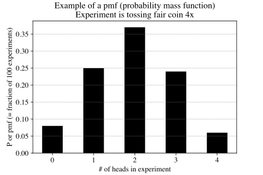
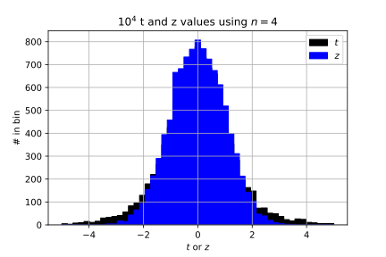

# General

* Population
* Census
* Sample
* Variable
* {uni,bi,multi}-variate
* Statistic
* Descriptive Statistics
* Inferential Statistics
* Probability Problem
* Statistics Problem
* Frequency of $X$ (or relative frequency of $X$)
* Experiment

# Probability

* Sample Space
* Event
* Mutually Exclusive (pairwise disjoint)
* Compliment
* Union
* Intersection
* Sampling with/without replacement
* Permutation
* Combination (un-ordered subset)

# Statistics

In the experiments done in the homework, the $X_i$ values are **random samples** from a **probability distribution** with **expectation values** for the mean and variance defined by $E[X]\equiv\mu$ and $E[(X-\mu)^2]\equiv\sigma^2$.

The probability distribution of the $\overline{X}$s, each computed using $n$ samples, is called the **sampling distribution**.

* **Population** - "All" of the data is called the population. A population can be finite or infinite. An example of a finite population is all US citizens. An example of an infinite population are values from a continuous probability density function. (Technically, when you draw a value from a continuous probability distribution, you are actually drawing from a discrete distribution, because there are finite number of values that can be represented as 64--bit floating point numbers.)

* **Sample statistic** - a computation based on a sample from a population that gives an estimate of the equivalent value that would be obtained if the same computation was performed on the population (see also Devore p214).

* **Population statistic** - a computation based on all values in a population.

* **Probability distribution** -- There are two types: discrete and continuous.

   **1\. Discrete**

   Devore (p97) calls the discrete case a "probability mass function" and I've been using the variable $P$. If $x$ is a discrete variable, then

   $$1 = \sum_{\text{all x}}P(x)$$

   and

   $$P(x)\ge 0$$

   An example probability mass function that we've used is $P(0)=0.5$, $P(1)=0.5$, which can be used to simulate the outcome of a fair coin toss, where $x=0$ represents tails and $x=1$ represents heads. The Binomial Distribution is another discrete probability distribution.

   To compute a probability mass function from a histogram, scale the histogram heights by the total number of observations.

   ```Python
   # src=code/pmf.py
   ```

   

   **2\. Continuous**

   See also the [lecture notes by Orloff and Bloom](https://ocw.mit.edu/courses/mathematics/18-05-introduction-to-probability-and-statistics-spring-2014/readings/MIT18_05S14_Reading5b.pdf)

   The discrete case is called the "probability density function", and I've been using the variable $p$. The requirements are

   $$1 = \int_{-\infty}^\infty p(x)dx$$

   and

   $$p(x)\ge 0$$

   In the continuous case, the probability that $x$ is a given value is $p(x)dx$, which is a differential. As a result, it only makes sense to talk about the probability that $x$ is in a range, e.g.,

   $$P(a\le x\le b) = \int_a^bp(x)dx$$

   An example of a continuous distribution is the Gaussian or Normal:
    
   $$p(x)=\frac{1}{\sigma\sqrt{2\pi}} e^{{-(x-\mu)^2}/{2\sigma^2}}$$
    
   which satisfies $p(x)\ge 1$ and

   $$\int_{-\infty}^\infty p(x)dx=1$$

   You are already familiar with statements such as "95% of the time a value of $x$ drawn a Gaussian will be in the range $[\mu-1.96\sigma,\mu+1.96\sigma]$, or

   $$P(\mu-1.96\sigma\le x\le \mu+1.96\sigma) = 0.95 = \int_{\mu-1.96\sigma}^{\mu+1.96\sigma}p(x)dx$$

   To compute a probability density from a histogram, divide the height of each histogram bar by the total number of obervations and the width of each bar. The sum of the resulting bar heights will be unity.

* **Sampling distribution** - When we take a sample from a population and compute a statistc, for example a mean, we want to know the uncertainty in the statistic. That is, we want to know what the probability distribution of the means would be if we took many samples and computed many means. The probability histogram of the test statistic is the sampling distribution. If the sampling distribution is known, we can easily put error bars on our test statistic.

   In [HW #1](hw.html#hw-1), we derived a sampling distribution numerically. It was found that when $n$ values of $X$ were drawn from a Gaussian distribution with mean $\mu$ and standard deviation $\sigma$ and the statistic 

   $$\overline{X} = \frac{1}{n}\sum_{i=1}^nX_i$$

   was computed $10,000$ times, 95% of the time the range

   $$\left[\overline{X}-1.96\frac{\sigma}{\sqrt{n}}\text{ },\text{ } \overline{X}+1.96\frac{\sigma}{\sqrt{n}}\right]$$

   included $\mu$. (We say that this range "traps" $\mu$ 95% of the time.) We actually did not need to do the numerical experiement when $n$ is large. We know the expected result from the Central Limit Theorem.

* **Expectation values**

   The general definition of the expectation operator $E[\cdot]$ is, for discrete $x$,

   $$E \left[X\right] = \sum_{\text{all }x}xP(x)$$

   or, for continuous $x,$

   $$E\left[X\right] = \int_{x}xp(x)dx$$

   By definition, $\mu=E\left[X\right]$. That is $\mu$ is the average of $X$ over the population. The variance of a population is defined as

   $$\sigma^2=E\left[(X-\mu)^2\right]$$

   When we invent a statistic (a quantity computed from a sample) that is intended to be used as an estimate of a similar quantity from a population, we want the statistic to be unbiased. That is, the expectation value of the statistic should equal the population value. Two statistics that were considered are the mean and variance.

* **Random samples** By random samples, we mean a value drawn from a population with a certain probability distribution. In general **random samples** implies "independent and identically distributed random variables" (often abbreviated iid). 

* **Law of Large Numbers**

   The _weak law of large numbers_ [Rozanov, p69]: given an arbitrarily small $\delta > 0$ and $\epsilon > 0$, there is an integer $n$ for which the quantity $\overline{X}\equiv (1/n)(X_1+...+X_n)$ (with $X$ iid) will be in a small window centered on $\mu$ with a probability near 1, that is,

   $$\mu-\epsilon\le \overline{X} \le \mu + \epsilon$$

   with a probability greater than $1-\delta$. This means we can choose very small $\epsilon$ and $\delta$ values and there will always be a value of $n$ for which the constraints are satisfied.

   It follows from _The Strong Law of Large Numbers_ that $\lim_{n\rightarrow\infty}\overline{X}$ exists and is equal to $\mu$ with a probability of 1 [Rosanov, p 70]. (The Strong Law may seem equivalent to the Weak Law, but their statements are not quite equivalent.)

* **Central Limit Theorem**

   The Law of Large Numbers tells use that if we require $\overline{X}$ to fall in range that we specify around $\mu$ with a probability that we specify, we can find an $n$ value to satisfy our requirement. The central limit theorem says that for large $n$, $\overline{X}$ is Gaussian-distributed with mean $\mu$ and standard deviation $\sigma$. With the Central Limit theorem, we can make statements such as "I took a sample of $n$ values and computed $\overline{X}$. If I took many samples and computed many $\overline{X}s$, 95\% of the time the range $[\overline{X}-1.96\sigma/\sqrt{n},\overline{X}+1.96\sigma/\sqrt{n}]$ would include ("trap") $\mu$.

* **Parametric bootstrap sample statistic distribution** -- A pmf or pdf created by simulating many experiments and the calculation of a sample statistic for each experiment. For example, suppose that we wanted to know the distribution of the sample statistic $Y=X_1^2 + X_2^2 + ... + X_n^2$, where an experiment consists of drawing $n$ values, $X$, which are Gaussian distribution with a known mean and standard deviation. We could use a random number generator so simulate many experiements and for each experiment compute $Y$. If a theoretical distribution for $Y$ is not known, this method can be used.

* **Non-parametric bootstrap sample statistic distribution**

   [The definition](https://www.oxfordlearnersdictionaries.com/us/definition/english/bootstrap_2?q=bootstrapping) of the idiom "bootstrapping" is "get (oneself or something) into or out of a situation using existing resources." If we don't know the sampling distribution of $X$, we can't use a random number generator to simulate many experiments. In this case, we use the only available resource: the measurments from one experiment. This done by drawing a sample of $n$ with replacement from the $n$ measurements. Each such draw is called a bootstrap sample (or experiment) and the test statistic computed from it is indicated by $Y_*$. The bootstrap pmf or pdf is computed from the histogram of the $Y^*$s.

# Distributions

Discrete distributions used thus far

- The Binomial Distribution, which follows from Bernoulii Trials.
- The Poisson Distribution, which is limiting case of Binomial Distribution (requires $n\gg 1$ and valid for $kp\ll 1$ and $k/n\ll 1$) (did derivation in class).
- The Exponential Distribution (aka "Waiting Time Distribution)", which is the distribution of the time between successes (aka "events") in a Poisson-distributed variable (derivation is not trivial).
- The Normal or Gaussian distribution (note Normal and Gaussian are used interchangeably), which is a limiting case of Binomial Distribution (and Poisson Distribution, but not Exponential distribution).

Three key distributions are

- The "Standard Normal" is the **sampling distribution** of the quantity

   $$z = \frac{\overline{X}-\mu}{\sigma/\sqrt{n}}$$

   **Constraint**: $X$ is a random variable with mean $\mu$ and standard deviation $\sigma$ **and $\boldsymbol{n}$ is large**.

   A standardized variable will have a histogram that is centered on the origin and a standard deviation of unity.

   If $X$ is a random variable from _almost any_ probability distribution with mean $\mu$ and standard deviation $\sigma$, the sampling distribution of $z$ is the Standard Normal.

- The "Student $t$" distribution is the **sampling distribution** of the quantity

   $$t = \frac{\overline{X}-\mu}{S/\sqrt{n}}$$

   where

   $$S = \sqrt{\frac{1}{n-1}\sum_{i=1}^n (X-\overline{X})^2}$$

   **Constraint**: $X$ is a Gaussian--distributed random variable. Both the numerator and denominator of $t$ will vary from sample to sample and so we expect that the histogram of 

   $$t=\frac{\overline{X}-\mu}{S/\sqrt{n}}$$

   to be "fatter" or have "fatter tails" than

   $$z=\frac{\overline{X}-\mu}{\sigma/\sqrt{n}}$$

   The $t$ distribution is actually a family of distributions that depend on $n$ and so "$t$ distribution" is ambiguous. We usually discuss "a $t$ distribution with $\nu$" degrees of freedom, where $\nu \equiv n-1$.

   

    ```Python
    import numpy as np
    from matplotlib import pyplot as plt
        
    n     = 5
    mu    = 10
    sigma = 20

    # n x 10,000 matrix
    X = mu + sigma*np.random.randn(n, 10000)

    # Compute 10,000 averages of n values
    Xbar = np.mean(X, axis=0)

    V = np.var(X, axis=0, ddof=1)
    S = np.sqrt(V)

    z = (Xbar - mu)/(sigma/np.sqrt(n))
    t = (Xbar - mu)/(S/np.sqrt(n))
    plt.figure()
    plt.grid()
    plt.hist(t, bins=np.linspace(-5,5,50), edgecolor='k', facecolor='k')
    plt.hist(z, bins=np.linspace(-5,5,50), edgecolor='b', facecolor='b')
    plt.xlabel('$t$ or $z$')
    plt.ylabel('# in bin')
    plt.title('$10^4$ t and z values using $n=4$')
    plt.legend(['$t$','$z$'])

    plt.savefig("figures/compare_gaussian_and_t.png", format="png", transparent=True)
    plt.savefig("figures/compare_gaussian_and_t.svg", format="svg", transparent=True)
    ```

- The Chi-square ($\chi^2$) distribution is the **sampling distribution** of the quantity $e$ (think "error") 

   $e^2_1 = X_1^2 + ... + X_n^2$

   $...$

   $e^2_{\infty} = X_1^2 + ... + X_n^2$

   **Constraint**: $X$ is a Gaussian--distributed random variable.

   Similar to the $t$ distribution, the $\chi^2$ distribution is actually a family of distributions that depends on $n$.

   We use the $\chi^2$ distribution deriving error bars and confidence intervals for mean-square errors and power spectra.

- Often we do not know the **sampling distribution**; in the examples given above, there was a severe constraint on the distribution of $X$. In general, given an arbitrary distribution of $X$ and an arbitrary statistic derived from it, we don't know the sampling distribution of the statistic.

   We can use the **boostrap** method to derive a **sampling distribution** using data from a single sample.

   Suppose we don't know that $X$ is Gaussian--distributed. Then we don't know how

   Suppose that we have a quantity $Y$

   $$Y_1 = X_1^2 + ... + X_n^2$$

   that we compute from a set of measurements $X_1, ..., X_n$ and we can assume the measurements are independently distributed random variables, but we don't know if their distribution is Gaussian. As a result, we don't know how $Y$ will be distributed -- it does not fit the constraint of the $\chi^2$ distribution and nobody has worked out the expected distribution of $e$ for this calculation.

   We can "bootrap" a sampling distribution by drawing $n$ values from the list $[X_1,...X_n]$ with replacement and computing $Y^{\*}_1$. We repeat $10,000$ times. The distribution of 10,000 $Y^{\*}$ values is a good approximation to the unknown sampling distribution of $Y$. See also page 251 of Devore.

# Counting

## Distinct ordered pairs (2-tuples)

Given $a_1$, $a_2$, ... $a_{n_a}$ and $b_1$, $b_2$, ... $b_{n_b}$, one can form $N=n_an_b$ distinct ordered pairs with one element from each list. Said another way, if slot $1$ is filled with a choice from $a$ and slot $2$ is filled with a choice from $b$, there are $n_an_b$ unique ways to fill the slots.

One can use a tree diagram, table, or $x$--$y$ plot to prove.

**Typical Example**:

Two teams of twelve players each. How many unique handshakes between members of opposing teams?

*Answer*: $n_a=12$, $n_b=12$, $N=12\cdot 12=144$.

Brute force calculation: [code/probability_brute_force_ordered_2_tuples.m](code/probability_brute_force_ordered_2_tuples.m)

## Distinct ordered $k$-tuples (Uniquely ordered groups of $k$)

Given $k$ lists

$L_1$: $a_1$, $a_2$, ... $a_{n_a}$

$L_2$: $b_1$, $b_2$, ... $b_{n_b}$ 

...

$L_k$: $x_1$, $x_2$, ... $x_{n_k}$ (where $x$ represents the $k$th letter of the alphabet)

one can form $N=n_an_b...n_k$ distinct ordered $k$--tuples containing one element from each list. Can use a tree diagram to prove. Said another way, ...

**Typical Example**:

What is the probability of getting three sixes in an experiment when three dice are thrown? 

*Answer*: $6\cdot 6\cdot 6=216$ is the number of unique experiment results. Of these experiments, only one will have three sixes, so $P=1/216$.

## Sampling with replacement to form distinct ordered $k$-tuples

Choose $k$ objects in succession from a population of $n$ distinct objects. The number, $N$ of distinct and ordered $k$-tuples is $N=n^k$. Each $k$-tuple is equiprobable.

Equivalent to given $k$ lists

$L_1$: $a_1$, $a_2$, ... $a_{n}$

$L_2$: $b_1$, $b_2$, ... $b_{n}$

...

$L_k$: $x_1$, $x_2$, ... $x_{n_k}$ (where $x$ represents the $k$th letter of the alphabet)

one can form $N=n^k$ distinct ordered $k$--tuples containing one element from each list.

## Permutations

Given a population of $a_1, a_2, ..., a_n$, sample without replacement to form distinct orderings of size $k$. The number of possible distinct $k$--tuples is

$N=n\cdot (n-1)\cdot ... (n-k+1)$

This can be rewritten as

$$N=\frac{n!}{(n-k)!}$$

This number is typically written as $P_n^k$, $_nP_k$, or $P_{n,k}$, where the $P$ means "number of permuations" and not "probability".

**Typical Example**:

You have stickers labled $1$, ..., $6$ that are used to form a license plate. How many unique license plates can you form?

*Answer*: $6!$

## Combinations (shuffled permutations)

Each permutation can be regarded as group of $k$. If we regard a group as equivalent if they have the same elements, then there are fewer groups than permuations. For example, if the two permutations

$(1,2)$

$(2,1)$

are regarded as equivalent, then there is only one group containing the numbers $1$ and $2$. To determine the number of possible orderings of each permutation, ask how many ways a set of $k$ elements can be arranged. The answer is $k!$.

So, to find the number of combinations, divide the number of permutations by $k!$.

$$C_{n,k}=\frac{P_{n,k}}{k!}=\frac{\ds\frac{n!}{(n-k)!}}{k!}=\frac{n!}{k!(n-k)!}$$

$C_{n,k}$ is often called a binomial coefficient and the denoted by $\ds{N\choose k}$ and referred to as "$n$ choose $k$".

**Typical Example**:
* How many unique ordered hands of size $5$ can be formed using a $52$-card deck?

   *Answer*: $52\cdot 51\cdot 50\cdot 49\cdot 48$.
* How many hands of size $5$ can be formed using a $52$-card deck?

   *Answer*: Each permutation can be rearranged in $5!$ ways. So the number of hands is $52\cdot 51\cdot 50\cdot 49\cdot 48/(5\cdot 4\cdot 3\cdot 2\cdot 1)$
