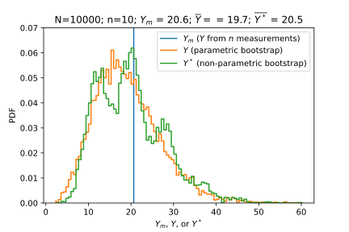
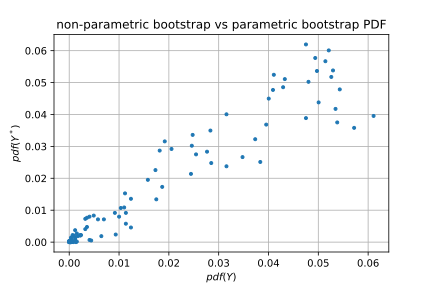
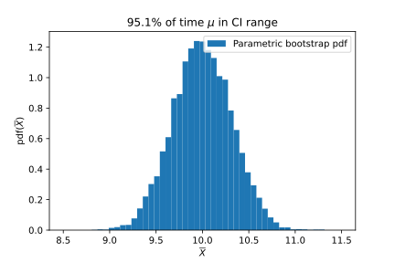
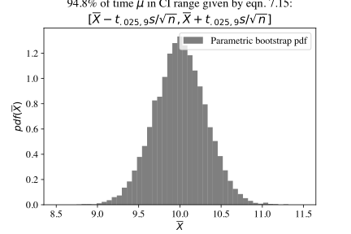
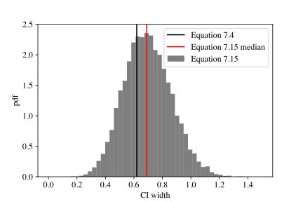
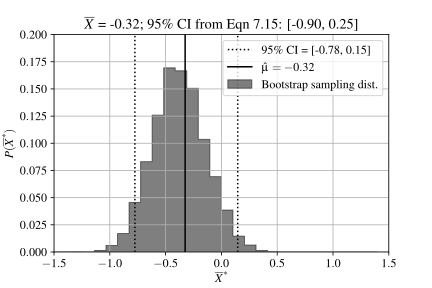
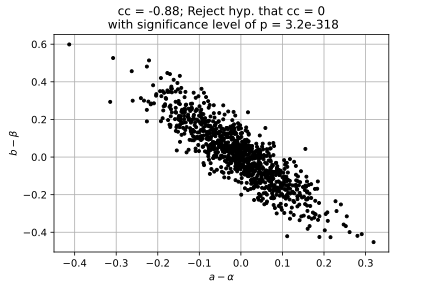
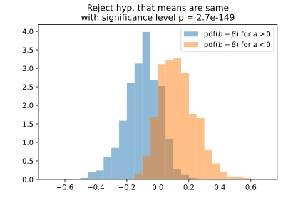

# HW 1

The first two problems of this homework are intended to primarily be a review of the programming techniques that you will need for this class. The problems mention the Law of Large Numbers, confidence intervals, and hypothesis testing. You do not need to know anything about the statistical theory behind them in order to solve these problems.

----

The Law of Large Numbers tells us that as $n\rightarrow \infty$ the sample average defined by

$$\overline{X}\equiv\frac{1}{n}\sum_{i=1}^n X_i$$

will be near the population average $\mu$ with a given probability. Given $n$ samples from a population, we don't expect $\overline{X}$ to exactly match $\mu$. The Law of Large Numbers allows us to make a statement about the difference $\overline{X}-\mu$. Specifically, the statement involves the probability that $|\overline{X}-\mu|$ is smaller that a certain value.

If you are interested, for a more formal definition of the Law of Large Numbers and proofs, see
* [Orloff and Bloom, Reading 6b](https://ocw.mit.edu/courses/mathematics/18-05-introduction-to-probability-and-statistics-spring-2014/readings/MIT18_05S14_Reading6b.pdf)
* Bulmer, Chapter 6 ([Piazza](https://piazza.com/gmu/spring2021/ce0c/resources))
* DeGroot, Chapter 6 ([Piazza](https://piazza.com/gmu/spring2021/ce0c/resources))

## Law of Large Numbers I

### a

1. Draw $n=100$ values from a population of numbers drawn from a gaussian distribution with mean $\mu=0$ and standard deviation $\sigma=1$.
2. Compute $\overline{X}$.
3. Repeat 1. and 2. $10,000$ times and plot a histogram of $\overline{X}$.

Save your program as `HW1_1a.py`. When I execute your program, I should see a histogram with _**the average of**_ $\overline{X}$ displayed in the title.

**Answer**

See [HW1_1a.py](https://github.com/rweigel/astrostats/blob/main/hws/HW1_1a.py). Several students turned in plots without axis labels 🤷. I should not have to ask and I should really give a zero to make the point that it is never acceptable to create a plot with missing or incorrect labels.


### b

1. For $n=100$, what fraction of the $10,000$ $\overline{X}$s were in the range $[-0.01, 0.01]$?
2. How does the fraction depend on $n$? <sup>+</sup>
3. For $n=100$, what is the range $[-\epsilon,\epsilon]$ for which $99$% of the $10,000$ $\overline{X}$s fall in?
4. How does $\epsilon$ depend on $n$? <sup>+</sup>
5. How does your answer change if the distribution changes?

<sup>+</sup> You may explain this using one or more of words, tables, and plots.

Save your program as `HW1_1b.py`. Save your answers in a file named `HW1_1b.md` or `HW1_1b.pdf`.

**Answer**

See [HW1_1b.py](https://github.com/rweigel/astrostats/blob/main/hws/HW1_1b.py)

1.  7.6%
2.  The following plot shows the dependence. As $n$ increases, the standard deviation of the histogram of $\overline{X}$ decreases so that more of the distribution is in the range $[-0.01, 0.01]$.

    
3.  25.8%
4.  The following plot shows the dependence.
  
    
5.  I accepted any answer to this question as it was not interpreted correctly. By "distribution", I mean the type of distribution, e.g., Gaussian, uniform, lognormal, etc. If you choose parameters for these distributions such that their mean is zero, the results are unchanged. This is a consequence of the Central Limit Theorem. It does not matter how the $n$ $X$s are distributed, the distribution of $\overline{X}$ is still Gaussian. In [HW1_1a.py](https://github.com/rweigel/astrostats/blob/main/hws/HW1_1a.py), there is a line with `np.random.uniform` commented out. Try running the code with it uncommented and notice that the histogram is still Gaussian even though a uniform distribution was used for the $n$ $\overline{X}$s.

## Prelude to Hypothesis Testing

This problem is a prelude to the frequentist interpretation of probability and hypothesis testing.

I select $n=100$ men at random from the U.S. population and compute the average of their heights. Using only the techniques used in the previous problem, make a statement about the likelihood that the actual U.S. population average is more than 1 inch larger or smaller than the average of the $n$ heights.

Briefly describe a program that you would write to determine the likelihood. If you have done hypothesis testing before, don't use any of its terminology or techniques. I am only interested in hearing ideas that you have about how the approach used in the previous problem could be used to give an answer.

Save your answer in a file named `HW1_2.md` or `HW1_2.pdf`.

**Answer**

In this problem, a single sample of $n=100$ was used to compute an average, $\overline{X}_o$ and standard deviation $s_o$. We do not know the population average $\mu$ but want to make a statement (or "inference") about it.

Now do many (say 10,000) experiments of drawing a sample of $100$ values from a gaussian distribution with mean $\overline{X}_o$ and sample standard deviation $s_o$. That is, assume that the actual unknown population distribution has a mean and standard deviation that is equal to that from the sample.

The percentage of $10,000$ experiments that had an $\overline{X}$ that was one inch larger or smaller than $\overline{X}_o$ is our estimate of the likelihood.

The above is the basic process of inferential statistics. However, instead of doing a simulation of 10,000 experiments, one can use a table to look up the expected percentage when an infinite number of experiments are performed.

## Basic Concepts in Probability

Read Chapter 2.1-2.2 of Devore, 2012 ([PDF available on Piazza](https://piazza.com/gmu/spring2021/ce0c/resources)). 

1. An experiment involves tossing a coin 3x. What is the sample space of this experiment?
2. How many of the outcomes in the sample space had two heads? 
3. Define event $A$ to be that the experiment yields two heads. Define event $B$ to be that the experiment yields two tails. What is $A \cup B$ and $A \cap B$?

Save your answers in a file named `HW1_3a.md` or `HW1_3a.pdf`.

**Answer**

1. The sample space has 8 elements ($2^3$). This list can be found using a tree diagram as shown below.

    ```
            H   => HHH
        H -
            T   => HHT
    H -        
            H   => HTH
        T -
            T   => HTT

            H   => THH
        H -
            T   => THT
    T -        
            H   => TTH
        T -
            T   => TTT

    ```
2. $3$ by inspection of the table above. Also, suppose that we have three unique coins $T$, $H_1$, and $H_2$. There are $3!$ unique permutations. If we drop the subscripts, then the number of unique permutations is divided by 2. So $3!/2=3$.
3. By inspection of the list from 1., $A \cup B = 6$ and  $A \cap B = \emptyset$.

In the above, I assumed "experiement yields two heads" to mean "the experiment yielded exactly two heads" and not "the experiement yielded two or more heads".

# HW 2

## Counting

1. By hand, solve problem 38. in Chapter 2. of Devore. See Piazza for a copy of this chapter. (Save as `HW2_1_1.pdf` or `HW2_1_1.md`)
2. Use Python to check your answer by simulating many experiments in which 3 bulbs are randomly selected and then computing the ratios requested in parts a.--d. of the problem statement. This will not be an exact answer, but as you increase the number of experiments, this approximate answer should become closer to your answers found by hand. (Save as `HW2_1_2.py`)

_Update_: Technically parts a.-c. ask for drawing three bulbs, so the inclusion of part d in the above does not make sense. So just use the simulation to check your answers to parts a.-c., but you are encouraged to use a simulation to check your answer to part d.

**Answer**

A box in a certain supply room contains four 40-W light-bulbs, five 60-W bulbs, and six 75-W bulbs. Suppose that three bulbs are randomly selected.

a.  What is the probability that exactly two of the selected bulbs are rated at 75-W?

Consider the number of ways of getting $[75,75,40]$. It is
$6\cdot 5\cdot 4$. There are three ways to order this list, so the total number of ways of getting two 75s and one 40 is $3(6\cdot 5\cdot 4)$. From similar reasoning, it follows that the number of ways of getting $[75,75,40]$ in any order is $3(6\cdot 5\cdot 5)$. The total probability is thus

$$\displaystyle \frac{3(6\cdot 5\cdot 4 + 6\cdot 5\cdot 5)}{15\cdot 14\cdot 13}\approx 0.297$$

b.  What is the probability that all three of the selected bulbs have the same rating?

The number of ways of getting "three of a kind" is the number of ways of getting three 75s plus the number of ways of getting three 60s plus the number of ways of getting three 40s, which is

$$6\cdot 5\cdot 4 + 5\cdot 4\cdot 3 + 4\cdot 3 \cdot 2$$

The requested probability is thus

$$\frac{6\cdot 5\cdot 4 + 5\cdot 4\cdot 3 + 4\cdot 3 \cdot 2}{15\cdot 14\cdot 13}\approx 0.075$$

c.  What is the probability that one bulb of each type is selected?

The number of ways of getting $[75,60,40]$ is $6\cdot 5\cdot 4$. There are ${3\cdot 2}=6$ arrangements of this list.

The requested probability is thus

$$\frac{6(6\cdot 5\cdot 4)}{15\cdot 14\cdot 13}\approx 0.26$$

d. Suppose now that bulbs are to be selected one by one until a 75-W bulb is found. What is the probability that it is necessary to examine at least 6 bulbs?

2. See [HW2_1_2.py](https://github.com/rweigel/astrostats/blob/main/hws/HW2_1_2.py)

## Bayes' Theorem

2% of people age 50--60 who participate in routine screening have colon cancer. 80% of people with colon cancer will test positive. 9.6% of those without colon cancer will also test positive. A person in this age group had a positive test in a routine screening. What is the probability that they actually have colon cancer?

Draw diagrams and be prepared to explain your answer to the class. If you do not know how to solve this analytically, come up with a simulation to give an approximate answer.

(Save as `HW2_2.pdf` or `HW2_2.md`)

**Answer**

*   $P(N) = 0.98$ (probability of **N**o cancer)
*   $P(C) = 0.02$ (probability of **C**ancer)
*   $P(T^+|\overline{C}) = 0.096$ (probability of false positive)
*   $P(T^+|C) = 0.80$ (probability of +**T**est given Cancer)
*   $P(C|T^+) = ?$ (probability of cancer given +Test)
  
We can't apply Bayes' rule                                                            
$$P(C) = P(T^+)\frac{P(C|T^+)}{P(T^+|C)}$$

rewritten as

$$P(C|T^+)=\frac{P(C)\cdot P(T^+|C)}{P(T^+)}$$

immediately, because we need $P(T^+)$.  To get this, first compute the number of patients that get a positive colon cancer test                                                     
$$n_{T^+}=n_{C}P(T^+|C)+n_{N}P(T^+|N)$$

where $n_{X}$ is the number of patients in category $X$.  Divide through by the total number of patients to get                                                                
$$P(T^+)=P(C)P(T^+|C)+P(N)P(T^+|N)$$

then

$$P(C|T^+)\frac{}{}=\frac{P(C)\cdot P(T^+|C)}{P(C)P(T^+|C)+P(N)P(T^+|N)}$$

inserting numbers gives

$$P(C|T^+) = \frac{0.02\cdot 0.8}{0.02\cdot 0.8+0.98 \cdot 0.096} = 0.145$$

So the probability of actually having colon cancer given a postive test is about $14.5\\%$. 

(Often students report their answer to many more than 2 significant digits.  How would you calculate the appropriate number of significant digits and the uncertainty in your reported answer, based on the numbers given?)

**Alternative Approach I**

The information given can be summarized in the following table. The first row contains the true positives (TPs) and false positives (FPs). For a population of 1000, there will be 20 people that have cancer, and 980 that do not. Of the 20 that have cancer, 16 will test positive. Of the 980 that do not have cancer, $980\cdot 0.96=94$ will test positive.

          Have Cancer (20)    Don't Have Cancer (980)
    T^+   16 (TP)             94 (FP)
    T^-   4 (FN)

The marginal probability of having cancer given a positive test is the fraction of the true positives to the false positives.

$$P(C|T^+) = \frac{16}{16+94} = 0.145$$

**Alternative Approach II**

To explain this calculation to someone, I would say:

Out of $1000$ people, $20$ will have cancer $(2\\%)$.  Sixteen of the $20$ $(80\\%)$ will have a positive test, the other four will have a negative test.

This leaves 980 without cancer.  However, $980\cdot 0.096 = 94$ of these cancer--free people will still have a positive test. This is a large number of false positives!

If you received a positive test, you are one of the checked boxes. The number of checked boxes is $94+16=110$ and $16$ of them have cancer. So given a positive test, your chances are $16/110$, or about a $1$ in $14$ 
chance.


See also [How to Improve Bayesian Reasoning Without Instruction:
Frequency Formats](http://library.mpib-berlin.mpg.de/ft/gg/GG_How_1995.pdf) for a discussion on how to explain problems involving Bayesian reasoning.

# HW 3

## Exact answer for coin flips

In HW 1.3, you considered the question of the probability of getting two heads when flipping a fair coin 3x. This question was easily answered by explicitly writing out the sample space (the set of all possible outcomes) using a tree diagram and counting the number of outcomes with two heads.

Write out the sample space for four flips of a fair coin using a tree diagram and then by inspection of the diagram determine the probability of getting exactly two heads.

Next, inspect the sample space and provide an argument for why, if the probability of heads is $\theta$, then the probability of $k$ heads in $N$ tosses is

$$P(k)={N \choose k}(1-\theta)^{N-k}\theta^k$$

Do this using counting techniques with an explanation at the level that I used to explain the number of possible license plates of length three using only numbers. I used this example to give answers to the number of 3-digit license plates that could be formed using stickers with a digit (0-9) on them under three different constraints:

1. An infinite supply of stickers: $10^3$;
2. A supply of 10 stickers, one for each digit: $10\cdot 9\cdot 8 = 10!/7!$;
3. Same as 2., but also a license plate with the same three numbers as another license plate (but in a different order) being counted as the same license plate: $10!/(7!3!) = {10 \choose 3}$. 

You do not need to use a license plate/sticker analogy -- use whatever you need to explain the equation at a fundamental level. Save your answer as `HW3_1.pdf` or `HW3_1.md` and be prepared to explain your answer to the class.

**Answer**

There are a number of ways of answering this that I went over in class that are outlined below. 

1. Start with $\theta=0.5$ and explain the ${N \choose k}$ and then state that the probability is ${N \choose k}$ divided by the number of possible sequences, which is $2^N$.
2. The case with $\theta\ne 0.5$ can be explained by a tree diagram with weights of $\theta$ and $1-\theta$ associated with each branch. The total probability of a path along a branch is the product of the branch weights (due to the product rule).

Based on the responses in class, I think most students understand the justification for this equation. I encourage you to always have an explanation like those described in class for any equation that you encounter. This invaribly makes explaining complex problems easier because you have a starting problem to build on.
 
## Bayes' Rule Derivation and Terminology

You only need the law of multiplication to derive Bayes' theorem. The law of multiplication is

$$P(A\text{ and }B)=P(A)P(B|A)$$

The labels $A$ and $B$ are arbitrary. Swapping them gives:

$$P(B\text{ and }A)=P(B)P(A|B)$$

$P(B\text{ and }A)$ means the same thing as $P(A\text{ and }B)$ (mathematically, the set intersection $A\text{ and }B$ is commutative). Equating the above two equations gives

$$P(B)P(A|B)=P(A)P(B|A)$$

Bayes' theorem ("theorem", "rule", and "law" are all used, seemingly arbitrarily) is

$$P(A|B)=P(B|A)\frac{P(A)}{P(B)}$$

In this form,

- $P(A|B)$ is called the posterior. It is a probability that we compute after (**post**) consideration of the other probabilities.
- $P(B|A)$ is called the likelihood (this is a poor choice of name)
- $P(A)$ is called the prior. If $B$ and $A$ are independent, then $P(A|B)=P(A)$, so $P(A)$ is the probability **prior** to knowing any relationship between $A$ and $B$.
- $P(B)$ is called a normalizing factor [Wall and Jenkins, p26] or, when $B$ is evidence and $A$ is a hypothesis, $P(B)$ is also referred to as the evidence.

Another form of Bayes' theorem, valid when the events $A_j$ are mutually exclusive and exhaustive, has the denominator re-written using the law of total probability, which is

$$P(B) = \sum_{j=1}^kP(A_j)P(B|A_j)\.$$

In this case, Bayes' theorem is

$$P(A_j|B)=P(B|A_j)\frac{P(A_j)}{\sum_{j=1}^kP(A_j)P(B|A_j)}\.$$

In class, a student noted that the equation $P(A\text{ and }B)=P(A)P(B|A)$ was not intuitively obvious and I gave an example to justify the equation that involved throwing darts at two overlapping circles labeled $A$ and $B$; then I drew 10 dots corresponding to dart tosses and computed each term in the equation $P(A\text{ and }B)=P(A)P(B|A)$ by inspection.

Come up with your own basic explanation/justification for the Law of Total Probability in a spirit similar to my dart-tossing example. Save your answer as <code>HW3_2.pdf</code> or <code>HW3_2.md</code> and be prepared to explain your answer to the class.

**Answer**

The responses to this question were not quite what I was looking for -- many students did not address the "exhaustive and exclusive" requirement.

My answer involved a square dartboard with partitions labeled $A_j$. Region $B$ was a shape that enclosed parts of at least two $A_j$ regions. Based on this diagram, it is fairly straightforward to see how the Law of Total Probability is related to geometric areas. This is something that is considered also in the book by Stone referenced in the next problem.

## Bayes' Rule for Statistical Inference

**References**

All of the following references describe the problem covered in this HW problem (see Piazza for PDFs). I've attempted to write this problem in a way that you won't need to study these references and I recommend attempting to solve this problem before reading them.

* Silva 2006, Chapter 2.1. In this problem, I am walking you through the steps needed to create Figures 1. and 2. This book uses a somewhat unconventional notation by explicitly including the variable $I$. You can safely ignore it in the equations written.
* The coin-tossing experiment is covered at a basic level in Chapters 1 and 4 of Stone.
* A much more mathematically advanced description of this problem is given in Liu and Wasserman 2014.

----

**I don't expect you to be able to solve these problems without questions! Please be active on Piazza and Discord.**

----

Let $\theta$ be a parameter, such as a length, or, as considered in this problem, a probability. For example, suppose a computer program is created that prints an $H$ with probability $\theta$ and a $T$ with probability $1-\theta$ or a coin is manufactured so that the probability of heads is exactly $\theta$. 

Let $\mathcal{D}$ be data from an experiment, for example the results of coin flips, e.g., $\mathcal{D}=[H,T,H,T]$. 
With these variables, Bayes' theorem is

$$P(\theta|\mathcal{D})=P(\mathcal{D}|\theta)\frac{P(\theta)}{P(\mathcal{D})}$$

Suppose that we don't know what $\theta$ is -- we are given a coin from a machine and we don't know if the machine produces a fair coin or not.

A typical Bayesian inference problem seeks to assign a probability of $\theta$ given a set of measurements (data). That is, to assign a value to $P(\theta|\mathcal{D})$. In class, I discussed the case where we only had one or two measurements from coin tosses, that is, $\mathcal{D}=[H]$, and $\mathcal{D}=[H, T]$, respectively. In this problem, you will consider these two cases in detail.

For $\mathcal{D}=[H]$,

1.  Use the equation in problem 3.1 to compute the probability of $\mathcal{D}$ given a probability of heads. That is, find an expression for the likelihood term $P(\mathcal{D}|\theta)$, which will be a function that depends on $\theta$.

The $P(\theta)$ term in Bayes theorem above is the so-called prior. Assume you are an alien and know nothing about coin manufacturing machines and have never seen a coin tossed. In this case, based on your lack of subjective prior knowledge, you would say all values of $\theta$ are equally likely and thus $P(\theta)=c$, where $c$ is a constant.

2.  In class, I mentioned that we often don't need to worry about the term $P(\mathcal{D})$ because it is a constant that will "cancel". To elaborate, we are often interested in a ratio of probabilities such as $P(\theta_1|\mathcal{D})/P(\theta_2|\mathcal{D})$. For example, given a sequence of coin tosses from a coin manufactured by a new machine, we would want to know the ratio of the probability that a coin has a probability of heads of $\theta_1$ to the ratio that the probability of heads is $\theta_2$. However, it is sometimes useful to compute this term explicitly. In this case, the law of total probability can be used:
    $$P(\mathcal{D})=\int_0^1P(\theta)P(\mathcal{D}|\theta)d\theta$$
    Compute $P(\mathcal{D})$ in terms of $c$.

3.  Plot of $P(\theta|\mathcal{D})$ vs $\theta$.

4.  Repeat parts 1.-3. for $\mathcal{D}=[H,T]$.

5.  You are not an alien. Suppose your subjective judgment is that it is difficult to manufacture a coin with a probability of heads that differs much from 0.5. In equation form, you decide to use a sharply peaked Gaussian to represent this experience. That is, $P(\theta) \propto e^{(\theta-0.5)^2/0.1}$. Using this, plot $P(\theta|\mathcal{D})$ vs. $\theta$ for $\mathcal{D}=[H,T]$.

Save your answers in a file named `HW3_3.pdf` or `HW3_3.md`. Save your code in a file named `HW3_3.py`.

**Answer**

As discussed in class and on Discord, I used sloppy notation for the Law of Total Probability. When $\theta$ is a parameter that can take on discrete values only, the Law of Total Proability is

$$P(\mathcal{D})=\sum_\theta P(\theta)P(\mathcal{D}|\theta)$$

When $\theta$ is a continuous parameter, replace $P(\theta)$ with $p(\theta)d\theta$ and integrate instead of sum

$$P(\mathcal{D})=\int_\theta p(\theta)d\theta P(\mathcal{D}|\theta)$$

where the $p(\theta)$ is a probability density, for which $\int_{\theta}p(\theta)=1$. To see the difference between the two, think back to my answer for the Law of Total Probability in the previous problem. Instead of a finite number of $A_j$, use an infinite number of areas of width $dA$ and associated probability of $p(A)dA$.

----

1.  In general, $P(\mathcal{D}|\theta)={N\choose k}\theta^k(1-\theta)^{N-k}$. With $N=1$ and $k=1$, $P(\mathcal{D}|\theta)=\theta$. This makes sense -- if $\theta=0$, the probability of getting $\mathcal{D}=[H]$ is zero; if $\theta=1$, the probability is 1.

2.  If $p(\theta)=c$, then by $\int_0^1p(\theta)d\theta=1$, $c=1$. Thus,

    $$P(\mathcal{D})=\int_0^1p(\theta)P(\mathcal{D}|\theta)d\theta=\frac{1}{2}$$

    ($c/2$ is also acceptable given the problem statement.)

3.  Inserting $P(\mathcal{D}|\theta)=\theta$, $P(\theta)=p(\theta)d\theta$, and $P(\mathcal{D})=1/2$ into

    $$P(\theta|\mathcal{D})=P(\mathcal{D}|\theta)\frac{P(\theta)}{P(\mathcal{D})}$$

    gives

    $$P(\theta|\mathcal{D})=2\theta d\theta$$

    or, in terms of a probability density, using $P(\theta|\mathcal{D})=p(\theta|\mathcal{D})d\theta$

    $$p(\theta|\mathcal{D})=2\theta$$

    Note that $\int_0^1 p(\theta|\mathcal{D})d\theta=1$ as expected based on inspection of Bayes' rule with the denominator written using the Law of Total Probability:

    $$P(\theta|\mathcal{D})=P(\mathcal{D}|\theta)\frac{P(\theta)}{P(\mathcal{D})}=\frac{P(\mathcal{D}|\theta)p(\theta)d\theta}{\int_{0}^1P(\mathcal{D}|\theta)p(\theta)d\theta}$$

    The plot is simply $2\theta$. The main thing to get out of this is the interpretation. We discussed in class why this curve is counterintuitive -- unlike the alien, we have subjective experience that tells us that most coins have $\theta\simeq 0.5$. However, we have not included this experience into our calculations.

4.  In general, $P(\mathcal{D}|\theta)={N\choose k}\theta^k(1-\theta)^{N-k}$. With $N=2$ and $k=1$, $P(\mathcal{D}|\theta)=2\theta(1-\theta)$. This makes sense -- if $\theta=0$ or $\theta=1$, the probability of getting $\mathcal{D}=[H,T]$ is zero according to this equation. The maximum of $P(\mathcal{D}|\theta)$ is at $0.5$, as expected -- we are most likely to get $\mathcal{D}=[H,T]$ if $\theta=0.5$. The final result is $p(\theta|\mathcal{D})=6\theta(1-\theta)$.

5.  If $P(\theta) \propto e^{-(\theta-0.5)^2/0.1}$, then $p(\theta) \propto e^{-(\theta-0.5)^2/0.1}$. To make this a proper probability density, the normalization constant is needed. We want

    $$1 = \int_0^1 Ce^{-(\theta-0.5)^2/0.1}d\theta$$

    Using an integration table or [Wolfram Alpha](https://www.wolframalpha.com/input/?i=integrate+e%5E%28%28x-a%29%5E2%2Fb%29+from+0+to+1), one can find this constant. In practice, this constant is not needed because we are generally interested in the shape of the curve of $p(\theta|\mathcal{D})$, so that we only need to compute the right-hand side of 

    $$p(\theta|\mathcal{D}) \propto P(\mathcal{D}|\theta)p(\theta)$$

    without regard to the proportionality constant. There are several things that you should observe. First, the Gaussian prior modifies the curve for $p(\theta|\mathcal{D})$ so that it has more weight near $0.5$ in comparison to the flat prior of $p(\theta)=const$. If the prior was a delta function centered at $0.5$, $p(\theta|\mathcal{D})$ will be independent of $\mathcal{D}$. In Silva 2006, Figure 2.1. shows how $p(\theta|\mathcal{D})$ changes as more trial results are added to $\mathcal{D}$. As the number of results in $\mathcal{D}$ increases, $p(\theta|\mathcal{D})$ becomes sharply peaked at the value $\theta=0.25$, which was used to generate $\mathcal{D}$.

    
    
    In Figure 2.2, $p(\theta|\mathcal{D})$ is shown for a uniform prior (solid line), a Gaussian prior centered on $\theta=0.5$ (dashed line), and a U-shaped prior (dotted line). As the number of results in $\mathcal{D}$ increases, $p(\theta|\mathcal{D})$ for all three priors becomes sharply peaked around $\theta=0.25$, which was used to generate $\mathcal{D}$.

        

    A key conclusion is that as the number of results in $\mathcal{D}$ increases, the influence of the prior decreases.

# HW 4

## Reading

Read chapter 2.4 of the textbook (titled "Probability Distributions" in the second edition) and also chapter 3 of Devore (see the ["Resources"](https://piazza.com/gmu/spring2021/ce0c/resources) link on Piazza for Devore).

## Bernoulli Trials

A Bernoulli Trial has 

* two possible outcomes;
* the probability of "success" is $p$ and the probability of "failure" is $1-p$;
* these probabilities don't change

For $N$ trials, the probability of $k$ successes is represented by the Binomial distribution:

$$P(k)={N \choose k}p^k(1-p)^{N-k}$$

See also Devore, Chapter 3.4 where an experiment that conforms to the Bernoulli Trial constraints is referred to as a "Binomial Experiment".

1.  Use a random number generator to simulate 10,000 Binomial Experiments with $N=100$ trials and $p=0.4$ and then plot $P(k)$. (You'll have to research how exactly to "use a random number generator" to do this".) On the same axes, plot $P(k)$ expected from the equation above using the given $N$ and $p$. 
2.  Suppose $p$ follows the rule: "If two trials in a row are a success, the probability of success on the next trial increases by 10%; otherwise, the probability of success is $p=0.4$". Plot $P(k)$ on the same axes as for part 1.

Save your code as `HW4_2.py` and save the plot as `HW4_2.pdf`. Be prepared to provide a justification in class for any differences between the two cases.

A follow-up question that I'll ask is if based on the two plots you can conclude that the second plot does not satisfy the constraints of a Binomial Experiment. Later in the semester, formal ways of answering this question will be covered. For now, I just want to hear your ideas about how you would approach the problem.

**Answer**

There was discussion on Discord about how the probability is to be changed. When writing the problem, I had in mind that the probability was either $0.4$ or $0.44$. But I think the problem statement is best interpreted as meaning that the $p$ can continue to grow by 10%.

The motivation for allowing $p$ to vary is that often you'll have a data set that does not quite conform to a certain set of assumptions. It is often useful to model the non--conformity to get an idea for how the non--conformity will change the results. In this problem, the varition in $p$ models "persistence". The most common form of persistence is that high--temperature days tend to follow high--temperature days. That is, the probability of a day having a high--temperature is larger if the previous day had a high temperature.

There are several other points to discuss:

1.  How do we know if the simulation values are significantly different than the values from the formula? Could you determine this using concepts covered in previous HW problems? (We'll cover how to do this formally later.)
2.  The distribution looks Gaussian. How different from a Gaussian is it?

My code is at [HW4_2.py](https://github.com/rweigel/astrostats/tree/main/hws/HW4_2.py). I solve the problem in two ways. In the first, I use a uniform probability distribution to generate a trial result with the given probabilities of success. In the second solution, I use `np.random.binomial()` to generate the trial results.


## The Poisson Distribution

In class, I mentioned that the Poisson distribution can be derived as a limit of the Binomial distribution. This is also discussed in Devore 3.6. 

If

1.  in a sufficiently short amount of time, $\Delta t$, only 0 or 1 event can occur (two or more simultaneous events are impossible);
2.  the probability of exactly 1 event occurring in $\Delta t$ is equal to $\lambda \Delta t$, where $\lambda$ is a constant; and
3.  any non-overlapping intervals of length $\Delta t$ are independent Bernoulli trials,

the probability of $k$ events occurring in the time interval $t=N\Delta t$ is

$$P(k)=\frac{(\lambda t)^k e^{-\lambda t}}{k!}$$

for sufficiently large $N$.

Use a random number generator to create a dataset that simulates the following result. Every hour, the number of x-ray flares is tabulated. It is found that over $1000$ days, $900$ flares occurred so that the average probability of a flare in a given hour is $900/(1000\cdot 24)$.

1.  Plot the probability of $k$ flare events occurring **per day** for your simulated dataset. Also, plot $P(k)$ expected from the equation above using the value of $\lambda$ computed based on the problem description.
2.  From your dataset, derive a new dataset that is the time between flares and plot a histogram of the time between flares.

**Answer**

There were quite a few questions about this problem. It may make more sense to derive it without reference to time and then insert the time dependence at the end. 

If $p$ is the probability of event in time $\Delta t$, and, by definition, $\lambda \equiv p/\Delta t$, then

$$P(k)=\frac{(p\frac{t}{\Delta t})^k e^{-p \frac{t}{\Delta t}}}{k!}$$

Next, using the definition $t\equiv N\Delta t$,

$$P(k)=\frac{(p N)^k e^{-p N}}{k!}$$

The interpretation is that if the probability of a success in a trial is $p$, then the probability of $k$ successes in $N$ trials is $P(k)$. 

A common use case for this equation is when an event takes a certain amount of time $\Delta t$ to occur (e.g., a hurricane or large solar flare). In this case, it makes sense to define a rate parameter which is the number events per unit time, which is $\lambda=p/\Delta t$, where $p$ is the probability of an event in $\Delta t$. This variable corresponds with how we would describe the probability of an event, e.g., on average 0.01 hurricanes occur per day or in 100 days, 1 hurricane will occur.

It also make sense to talk not about the number of "trials", but rather the number of $\Delta t$s, where each $\Delta t$ corresponds to a trial. In this case, we can define a time as $t=N\Delta t$. This definition allows us to say "given 0.01 hurricanes occur per day, what is the probability that 2 hurricanes occur in a month".

Note that the the Poisson distribution is a good approximation of the Binomial distribution if $N\gg 1$ and is valid for $kp\ll 1$ and $k/N\ll 1$.

My code is at [HW4_3.py](https://github.com/rweigel/astrostats/tree/main/hws/HW4_3.py).


## Solar Flare Data (590 only)

Only students registered in the graduate-level course (PHYS 590 or ASTR 590) need to turn in this assignment.

The zip file [SOLAR_FLARES.zip](https://piazza.com/gmu/spring2021/ce0c/resources) contains the time of solar flares in an ASCII file named `xray.txt`; this is the only file that you will need for this problem. See the README file for information on how this file was created if you are interested.

Plot the probability distribution of the number of solar flares per day using `xray.txt`.

1.  Is the probability distribution similar to that expected from a Binomial Experiment or the Poisson distribution? If so, plot the equation for a Binomial Experiment and/or the Poisson distribution on the same axes as the histogram.
2.  Is the probability density of the time between solar flares similar to the probability density of the exponential distribution (see 4.4 of Devore)?
3.  Do the data conform to the constraints of a Binomial Experiment or the assumptions for the Poisson distribution?

Save any code or plots that you use to answer these questions in files with the prefix `HW4_4`. Be prepared to discuss your results in class.

**Comments**

These data were considered in [Wheatland, 2000](https://iopscience.iop.org/article/10.1086/312739). The fit to both a binomial and Poisson distribution is poor. (I was glad to see that several students also plotted the binomial distribution because of concern that the assumptions Poisson approximation was not satisfied.) This is somewhat expected given that the probability that a flare occured in a given hour depends on whether a flare occured in the previous hour. From the data, I find (see [HW4_4.py](https://github.com/rweigel/astrostats/tree/main/hws/HW4_4.py))

$P(F_t)=0.27$

$P(F_t|F_{t-1})=0.08$, meaning that a flare is the least likely to occur in a given hour if one occured in the previous hour.

$P(F_t|\overline{F}_{t-1})=0.19$

$P(\overline{F}\_t|\overline{F}_{t-1})=0.54$

$P(\overline{F}\_t|F_{t-1})=0.19$

where $F_t$ indicates a flare in hour $t$ and $\overline{F}_t$ indicates no flare. The binomial distribution requires that these probabilities are all the same, which is clearly not the case. In addition, multiple flares occured in the same hour. If we define an event as a single flare, then the data are not consistent with the assumption that in each $\Delta t$, only one event can occur. (We can work around this by defining an event as when one or more flares occured in a given hour.)

In writing the rule for the previous problem, I had mis-remembered the above result. That is, I had recalled that $P(F_t|\overline{F}_{t-1}) > P(F_t|F_{t-1})$, which is opposite to what was observed.

# HW 5

##  Reading

Read Chapter 3 of Wall and Jenkins

##  Expectation Values

A summary (or descriptive) statistic is a quantity that summarize an aspect of a collection of data. Examples include the mean and standard deviation. Descriptive statistics are always based on a computation done on a **sample** (subset) of the population of data. 

Definitions

* **Population** - "All" of the data is called the population. A population can be finite or infinite. An example of a finite population is all US citizens. An example of an infinite population are values from a continuous probability density function.
* **Sample statistic** - a computation based on a sample from a population that gives an estimate of the equivalent value that would be obtained if the same computation was performed on the population. (Devore p214)

It is important that sample statistics are **unbiased**. If we compute a sample statistic based on a sample from a population and repeat this process many times we want the average of the sample statisic to be equal to the corresponding population statistic.

An example of an unbiased sample statistic is the average,

$$\overline{X}=\frac{1}{n}\sum_{i=1}^n X_i\$$

Suppose we have a list of 1000 numbers with a mean $\mu$. If we draw $n=100$ numbers at random, compute the average $\overline{X}_1$ and repeat $N\rightarrow \infty$ times, the average of these averages, will be $\mu$, the population average. Mathematically, this is

$$
\lim_{N\rightarrow \infty} \frac{1}{N}\sum_{i=1}^N\overline{X}_i = \mu
$$

The distribution of the $\overline{X}_i$ values is called the **sampling distribution** (Devore p214)

The general definition of the expectation operator $E[\cdot]$ is, for discrete $x$,

$$E \left[X\right] = \sum_{\text{all }x}xP(x)
$$

or, for continuous $x,$

$$
E\left[X\right] = \int_{x}xp(x)dx
$$

By definition, $\mu=E\left[X\right]$. That is $\mu$ is the average of $X$ over the population. The variance of a population is defined as

$$\sigma^2=E\left[(X-\mu)^2\right]$$

An example of a biased sample statistic is

$$S_{b}^2 = \frac{1}{n}\sum_{i=1}^n(X_i-\overline{X})^2$$

1.  Show that $S_{b}^2$ is biased by drawing $n=10$ values from at normal distribution with $\mu=0$ and $\sigma=1$, computing $S_{b}^2$ and repeating $N=10,000$ times. Plot the histogram of the $10,000$ $S_{b}^2$ values and in the title display their average and variance. Save your code as `HW5_2_1.py` and plot as `HW5_2_1.pdf`.
2.  (**590 only**) Show that $E[S^2_b]=\sigma^2(n-1)/n$. Save your answer in a file named `HW5_2_2.pdf`.


**Answer to 1.**:

My code is at [HW5_2.py](https://github.com/rweigel/astrostats/tree/main/hws/HW5_2.py)


**Answer to 2.**:

Page 245 of Devore has a briefer proof, which is described at the end of this answer.

$$E[S_{b}^2] = E\left[ \frac{1}{n} \sum_{i=1}^n(X_i-\overline{X})^2 \right]$$

expanding the square gives

$$E[S_{b}^2] = E\left[ \frac{1}{n} \sum_{i=1}^n(X_i^2-2X_i\overline{X}+\overline{X}^2) \right]$$

or, equivalently,

$$I.\qquad E[S_{b}^2] = E\left[ \frac{1}{n} \sum_{i=1}^nX_i^2-\frac{2}{n}\sum_{i=1}^nX_i\overline{X}+\frac{1}{n}\sum_{i=1}^n\overline{X}^2 \right]$$

The second term in the square braces in equation $I.$ is

$$\frac{2}{n}\sum_{i=1}^nX_i\overline{X}=2\overline{X}\left(\frac{1}{n}\sum_{i=1}^nX_i\right)=2\overline{X}^2$$

where the definition $\overline{X}\equiv (1/n)\sum_{i=1}^nX_i$ was used.

The third term is 
$$\frac{1}{n}\sum_{i=1}^n\overline{X}^2=\frac{1}{n}n\overline{X}^2=\overline{X}^2$$

Therefore, the second and third terms combine to be $-2\overline{X}^2+\overline{X}^2=-\overline{X}^2$ and Equation $I.$ simplifies to

$$E[S_{b}^2] = E\left[ \frac{1}{n} \sum_{i=1}^nX_i^2-\overline{X}^2\right]$$

Distributing the $E$ to each of the two terms and moving the $E$ inside the sum (both steps use $E[X+Y]=E[X]+E[Y]$) gives

$$II.\qquad E[S_{b}^2] =\frac{1}{n}\sum_{i=1}^nE\left[X_i^2\right]-E\left[\overline{X}^2\right]$$

Both of the terms in the above equation can be re-written using $\mu$, $\sigma$, and $n$.

Noting that $E[Y_i]$ and $E[Y]$ are equivalent, the expectation in the first term can be re-written using

$$E\left[X^2\right]=\mu^2+\sigma^2$$

which follows from the definition

$$\sigma^2 \equiv E\left[(X-\mu)^2\right],$$

which can be rewritten as

$$\sigma^2 = E\left[X^2-2\mu X+\mu^2\right] = E\left[X^2\right]-2\mu E[X]+E[\mu^2]$$

Using the definition $\mu \equiv E[X]$, this simplifies to

$$\sigma^2 = E[X^2]-\mu^2$$

giving

$$E\left[X^2\right]=\mu^2+\sigma^2$$

Therefore, the first term in equation $II.$ is

$$\frac{1}{n}\sum_{i=1}^n E\left[ X_i^2 \right]=\frac{1}{n}\sum_{i=1}^n (\mu^2+\sigma^2)=\frac{1}{n}n(\mu^2+\sigma^2)=\mu^2+\sigma^2$$

The second term in equation $II.$, $E[\overline{X}^2]$, can be rewritten

$$E\left[\overline{X}^2\right]=E\left[\left(\frac{1}{n}\sum_{i=1}^nX_i\right)^2\right]=\frac{1}{n^2}E\left[\left(\sum_{i=1}^nX_i\right)^2\right]$$

The square of the sum,

$$\left(\sum_{i=1}^nX_i\right)^2=(X_1+X_2+...)(X_1+X_2+...)$$

expands to 

$X_1^2+X_1(X_2+X_3+...)+$

$X_2^2+X_2(X_3+X_4+...)+$

$...$

$X_n^2+X_n(X_1+X_2+...)$

Let $X^\prime=X-\mu$ and note that

$E\left[X^\prime\right]=0$, 

$E\left[X^\prime_iX^{\prime}_j\right]=0 \quad(i\ne j)$, and 

$E\left[X^{\prime 2}\right]=\sigma^2$.

The above set of equations can now be written as 

$(X^{\prime}_1+\mu)^2+(X^{\prime}_1+\mu)(X^{\prime}_2+\mu+X^{\prime}_3+\mu+...)+$

$(X^{\prime}_2+\mu)^2+(X^{\prime}_2+\mu)(X^{\prime}_1+\mu+X^{\prime}_3+\mu+...)+$

$...$

$(X^{\prime}_n+\mu)^2+(X^{\prime}_n+\mu)(X^{\prime}_1+\mu+X^{\prime}_2+\mu+...)$

There are $n$ terms of the form $E[(X^{\prime}_i+\mu)^2]$ that evaluate to $\sigma^2+\mu^2$ because

$$E\left[(X^{\prime}_i+\mu)^2\right]=E\left[ X^{\prime 2}_i + 2X^{\prime}_i\mu + \mu^2 \right] = \sigma^2+0+\mu^2$$

There are $n$ terms of the a form similar to

$$(X^{\prime}_1+\mu)(X^{\prime}_2+\mu+X^{\prime}_3+\mu+...)$$

or

$$X^{\prime}_1(X^{\prime}_2+X^{\prime}_3+...)+\mu(\mu + \mu + ...)$$

In the second parenthesis, there are $n-1$ $\mu$ terms. Using this and multiplying through the terms in the first set of parenthesis by $X_1^\prime$ gives

$$X^{\prime}_1X^{\prime}_2+X_1^\prime X^{\prime}_3+...\mu(n-1)\mu$$

Becuase $E[X_i^\prime X_j^\prime] = 0$, 

$$E\big[X^{\prime}_1X^{\prime}_2+X_1^\prime X^{\prime}_3+...+\mu^2(n-1)\big]=\mu^2(n-1)$$

so finally we can conclude that

$$E\left[\overline{X}^2\right]=\frac{1}{n^2}\left[n(\sigma^2+\mu^2)+n\mu^2(n-1)\right]=\mu^2+\sigma^2/n$$

In summary, we have shown that $E[X^2]=\mu^2+\sigma^2$ and $E[\overline{X}^2]=\mu^2+\sigma^2/n$. As a result, Equation $II.$ simplifies to

$$E[S_{b}^2] = E\left[ X^2 \right] - E\left[ \overline{X}^2 \right] =\mu^2+\sigma^2-\left( \mu^2+\sigma^2/n\right) = \sigma^2-\sigma^2 /n$$

or,

$$E[S_{b}^2] = \frac{n-1}{n}\sigma^2$$

with the interpretation that $S_b^2$ is downward biased by a factor of $(n-1)/n$.

This equation makes sense in one limit - suppose we draw a single sample from a distribution with variance $\sigma^2$. $S_b^2$ will always be zero, which is less than $\sigma^2$ for any nonzero $\sigma$.

It follows from the calculation above that an unbiased estimate of the variance of a population is

$$S^2=\frac{1}{n-1}\sum_{i=1}^n(X_i-\overline{X})^2$$

because $E[S^2]=\sigma^2$. Recall that in contrast, an unbiased estimate of $\mu$ is

$$\overline{X}=\frac{1}{n}\sum_{i=1}^n X_i$$

which has $n$ and not $n-1$.

Note that when $n=1$, $S^2$ is $0/0$, which indeterminate; this makes sense as -- we don't expect to be able to estimate the variance of a population with only one sample.

----

Devore on pg 245 starts with the observation that for the variance of random variable $Y$, $V(Y)$, can be written 

$$V(Y)=E[Y^2]-(E[Y])^2$$

or, rearranging,

$$A.\qquad E[Y^2]=V(Y)+(E[Y])^2,$$

which is stated without proof. The formula is also given on page 112, but a proof is not given.

Next, he states that it follows from the definition

$$S^2 = \frac{1}{n-1}\sum_{i=1}^n(X_i-\overline{X})^2$$

that

$$S^2 = \frac{1}{n-1}\left[\sum_{i=1}^nX_i^2-\frac{1}{n}\left(\sum_{i=1}^nX_i\right)^2\right].$$

Taking the expectation and moving it inside of the sum in the first term gives

$$E[S^2] = \frac{1}{n-1}\left(\sum_{i=1}^nE[X_i^2]-\frac{1}{n}E\left[\left(\sum_{i=1}^nX_i\right)^2\right]\right)$$

Using equation $A.$, which is $E[Y^2]=V(Y)+(E[Y])^2$, with $Y=X$ is $E[X^2]=V(X)+(E[X])^2=\sigma^2+\mu^2$ using the definitions of $\sigma$ and $\mu$. Using this, the above equation can be re-written as

$$E[S^2] = \frac{1}{n-1}\left(\sum_{i=1}^n(\sigma^2+\mu^2)-\frac{1}{n}E\left[\left(\sum_{i=1}^nX_i\right)^2\right]\right)$$

Using equation $A.$ again, which is $E[Y^2]=V(Y)+(E[Y])^2$, this time with $Y=\sum_{i=1}^n X_i$ gives

$$E\left[\left(\sum_{i=1}^n X_i\right)^2\right]=V\left(\sum_{i=1}^n X_i\right)+\left(E\left[\sum_{i=1}^n X_i\right]\right)^2=n\sigma^2+(n\mu)^2$$

so now

$$E[S^2] = \frac{1}{n-1}\left(\sum_{i=1}^n(\sigma^2+\mu^2)-\frac{1}{n}\left[n\sigma^2+(n\mu)^2\right]\right)$$

or

$$E[S^2] = \frac{1}{n-1}\left(n(\sigma^2+\mu^2)-\frac{1}{n}(n\sigma^2+n^2\mu^2)\right)=\sigma^2$$

# HW 6

## Bootstraping a Sampling Distribution

Background Reading: Devore pages 251--252 (see [Piazza](https://piazza.com/gmu/spring2021/ce0c/resources)) and [my notes](notes.html#key-distributions).

1.  Draw $n=10$ values from a Gaussian distribution with $\mu=1$ and $\sigma=1$. Compute the test statistic $Y = \sum_{i=1}^n X_i^2$. Repeat this $10,000$ times. The probability density of these $N=10,000$ values is an approximation of the sampling distribution of $Y$ (if $N=\infty$, it would not be an approximation). This approximate distribution is also called a "parametric bootstrap" distribution -- the "parametric" means that we know the sampling distribution of $X$.

If we don't know the distribution of $X$, we can't use the parametric bootstrap to get the sampling distribution of $Y$. However, we can use the non--parametric bootstrap to obtain an approximation of the sampling distribution of $Y$ by drawing $n$ values with replacement from the list of $n$ measurements, computing $Y^{\*}_1$, and then repeating this $10,000$ times. The distribution of 10,000 $Y^{\*}$ values is a good approximation to the unknown sampling distribution of $Y$.

2.  Suppose your $n$ measurements were `[-0.546, -0.406, -0.115, -1.262, -1.386, -0.448,  0.829,  0.799, -1.100, 0.385]`. Compute $Y$. Next, draw $n$ values from the measurements with replacement and compute $Y$ and call it $Y^*_1$. Repeat this process $B=10,000$ times and compute the probability density of $Y^{*}$.

3.  Compare the two probability densities using a scatter plot. If `Y` is an array of the $10,000$ values from part 1. and `Ystar` is an array of the $10,000$ values from part 2., then `np.histogram` can be used as follows.

    ```Python
    # bin_edges = ... (do this yourself)
    pdf, _ = np.histogram(Y, bins=bin_edges, density=True)
    pdf_star, _ = np.histogram(Ystar, bins=bin_edges, density=True)
    plt.plot(pdf, pdf_star, '.')
    ```

    Be prepared to answer questions about the interpretation of this plot.

Save your code in a file named `HW6_1.py`. When executed, the scatter plot should be shown.

**Answer**

As noted in the extensive discussion on Discord, the results are difficult to interpret. The reason is that the given $n$ measurements were drawn from a distribution with $\mu=0$ and not $\mu=1$. In [HW6_1.py](hws/HW6_1.py) and in the figures below, I used a set of $n$ measurements drawn from a distribution with $\mu=1$.

Based on this plot, we can conclude that the non-parametric bootstrap provides a sampling distribution that has a standard deviation that is similar to that of the parametric bootstrap. For $N\rightarrow \infty$, the parametric bootstrap distribution will approach the actual sampling distribution. Here the non-parametric distribution does not closely match the parametric bootstrap distribution. The reason for this is that $n$ is small. In general, $n$ closer to 50 will yield similar distributions between the two. To determine the value of $n$ needed, an experiment of this form can be used. 

In general, you will use the non-parametric bootstrap to determine a confidence interval when the sampling distribution of the measurements is not known. In fact, this is the motivation for the non-parametric bootstrap. Often we don't know the sampling distribution (but almost as often, we assume to to be Gaussian or some other analytic equation). The advantage of the non-parametric bootstrap is that this assumption is not needed.



[A useful discussion on comparing histograms.](https://stats.stackexchange.com/questions/7400/how-to-assess-the-similarity-of-two-histograms)



## Confidence Intervals when Sampling Distribution Known

Background reading: Chapter 7 of Devore and [my notes](notes.html#key-distributions).

The simplest problem for computing a confidence interval is

1.  $n$ values are drawn from a Gaussian distribution;
2.  the population standard deviation, $\sigma$, is known;
3.  the statistic for which to compute a confidence interval is the mean. 

When $\sigma$ is not known (which is usually the case), we still know the sampling distribution of $\overline{X}$. However, for small $n$, it is not Gaussian -- it is $t_{n-1}$--distributed.

----

Draw $n=10$ values from a Gaussian with $\mu=10$ and $\sigma=1$. Compute the 95% confidence interval for the mean

1. using Equation 7.4 of Devore, and
2. using Equation 7.15 of Devore;

The confidence intervals for 1. and 2. are easy to compute because we know the sampling distribution. In the following, you are going to assume that you did not know the sampling distribution and derive it with a simulation.

3. Verify your answer for 1. by drawing $n=10$ values from a Gaussian with $\mu=10$ and $\sigma=1$ $10,000$ times. Compute $10,000$ confidence intervals. What fraction of these confidence intervals included $\mu$?
4.  Verify your answer for 2. by drawing $n=10$ values from a Gaussian with $\mu=10$ and $\sigma=1$ $10,000$. Compute $10,000$ confidence intervals. What fraction of these confidence intervals included $\mu$?
5.  Suppose some parameter $a$ was computed and its 95% confidence interval is $[0.9, 1.1]$. What is wrong with the claim "the probability that $a$ is in the range $[0.9, 1.1]$ is 0.95"? (Hint - see pages 270--271 of Devore).

Save the code for your answer in a file named `HW6_2.py` and text answers in `HW6_2.pdf`. When executed, the code should display the probability density of the sampling distribution for 3. and 4. along with $\overline{X}$ and its 95\% confidence interval from 1. and 2., respectively, in the title.

**Answer**

Equation 7.4 is the 95\% confidence interval for the average of $n$ values from a Gaussian distribution with a known standard deviation $\sigma$:

$$\left(\overline{x}-1.96\cdot\frac{\sigma}{\sqrt{n}}\text{ }\text{  ,  }\text{ }\overline{x}+1.96\cdot\frac{\sigma}{\sqrt{n}}\right)$$


Equation 7.15 is the 95\% confidence interval for the average of $n$ values drawn from a Gaussian distribution:

$$\left(\overline{x}-t_{\alpha/2,n-1}\cdot\frac{s}{\sqrt{n}}\text{ }\text{  ,  }\text{ }\overline{x}+t_{\alpha/2,n-1}\cdot\frac{s}{\sqrt{n}}\right)$$

Note that $n$ does not need to be large for either equation to apply. Both equations only require that the $n$ values are drawn from a Gaussian distribution. Because the conditions for each equation to apply were satisfied, we expect the the simulations in 3. and 4. to show that 95\% of the confidence intervals contained $\mu$. 

See [HW6_2.py](hws/HW6_2.py) for the calculations for parts 1.--4.

1. [9.58, 10.82] (but will vary)
2. [9.52, 10.88] (but will vary)

The answers to parts 3.--4. are in the titles of the following figures.





This fact that the fractions given in the titles are nearly equal is perhaps not expected --if you repeat parts 1. and 2. a few times and compare the fixed error bar width from Equation 7.4 with the variable error bar width of Equation 7.15, you will observe that the width from 7.15 is usually larger than that from 7.4. But not always. The histogram of the error bar widths computed using Equation 7.15 is shown in the following figure. Based on this, the near equality still seems unexpected because the error bar widths from Equation 7.15 are on average larger than the fixed width from 7.4.



The explanation for the near equality of the fractions in the titles of figures for parts 3. and 4. is in the following figure. $\mu$ falls outside of the CI from Equation 7.15 more often when the CI width from 7.15 is smaller than that from 7.4 in comparison to when the CI width from 7.15 is larger than that from 7.4. So even though the error bar widths from eqn 7.15 are on average larger than that from 7.4, $\mu$ is more frequently outside of the CI of 7.15 when its error bar widths are smaller than that of 7.4. In the figure, manifests by more black dots below the line of magneta dots than above it.


## Confidence Interval when Sampling Distribution is not Known

(**590 only**)

Given the measurements

```
[-0.546, -0.406, -0.115, -1.262, -1.3861,
 -0.448,  0.829,  0.799, -1.098,  0.385]
```

compute the 95\% confidence interval for $\mu$ by creating a non-parametric bootstrap sampling distribution.

Save the code for your answer in a file named `HW6_3.py`. When executed, the code should display the probability density of the non--parametric bootstrap sampling distribution along with $\overline{X}$ and the 95\% confidence for $\mu$ in the title. Be prepared to discuss the interpretation of this plot.

**Answer**

See [HW6_3.py](hws/HW6_3.py), which creates the following figure. In the legend, $\hat{\mu}$ is used to represent the average of the $\overline{X}^*$ values and $\overline{X}$ to represent the average of the measurements given in the problem statement. As a check, I computed a confidence interval using equation 7.15. Thus, confidence intervals were computed using the non-parametric bootstrap and a standard freqentist parametric method.

I used two methods because the number of measurements is smaller than what is typically recommended for the parametric bootstrap. Equation 7.15 is not ideal either - this equation requires the measurements to be drawn from a Gaussian. However, we are only given a set of measurements and we don't know if it is appropriate to assume they were drawn from a Gaussian (often this is assumed). This situation, where the assumptions for a given statistical method are not satisfied or not known to be satisfied, is common. This is why I recommend always using at least two methods.
 


# HW 7

References:

* Chapter 5.1 of Wall and Jenkins
* Chapter 8.1, 8.2, and 8.4 of Devore
* [Hypothesis testing playlist by Foltz on YouTube](https://www.youtube.com/playlist?list=PLIeGtxpvyG-IZRHcZcOy12jp7ywuRbE7l).

The terminology and concepts that you should be familiar following review of the references inlcude

1.  A "standardized" test statistic
2.  Null and alternative Hypotheses
2.  Type I and Type II errors; $\alpha$ and $\beta$
3.  The difference between rejecting a null hypothesis and mathematical statements. For example "the null hypotheis that $\mu\ne 0$ is rejected" vs. the mathematical statement "$\mu\ne 0$".
4.  Rejection region

## A Test on a Population Mean

In example 8.6 of Devore, a sample of $n=9$ systems yielded an activation temperature of $131.08$. The distribution of activation times was known (somehow) to be normal with a standard deviation of $1.5$.

The following program draws samples from a normal population with $\mu=130.0$ and $\sigma=1.5$. With the random seed set, the sample mean is $131.08$.

```Python
np.random.seed(623)
x = np.random.normal(130.0, 1.5, size=9)
print(np.mean(x)) #131.0812930740811
```

Suppose you were given the values of `x` that results from executing this code, but you did not know the population standard deviation $\sigma$ (that is, you did not know the code used to generate the list of 9 numbers). You were only told that the values in `x` were drawn from a Normal distribution. In this case, the _equations given_ <strike>appropriate test is given as Case II</strike> on page 314--315 of Devore. (See [Discord discussion](https://discord.com/channels/806626538782064670/806626538782064673/821087920302587925)).

Test the same hypothesis as that in Example 8.6 using the list of 9 values in `x` that results from executing the above code.

Save your answer in a file named `HW7_1.pdf`. Your answer should include the same steps as in Example 8.6 but using the Case II equations.

## $\beta$ and sample size determination

(**590 only**)

In this problem, you are to devise a simulation to help you understand statements about Type II errors. In the past, I've given you simulations to execute to better understand statistical concepts. In this problem, I want you to devise and implement the simulation.

After Example 8.6 in Devore, there are several paragraphs where mathematical statements are made and several equations are given.

Develop and implement a numerical experiement that tests any of these claims or experiments. Base your experiment on Example 8.6 (in the sense that those who read this example will easily see how your experiment applies to it.)

Feel free to ask for feedback on a proposed experiment on Discord before attempting to implement it.

Save your answers in a files named `HW7_2.pdf` and `HW7_2.py` (or the extension of the programming language used). Make sure that your plots have enough annotations so that when they are shown to the class, it is clear what was done to create the plot. Also add a caption if the annotations are not sufficient.

**Comments**

If the null hypothesis is that the $n=10$ values are drawn from a Gaussian distribution with $\mu_o=130$ and $\sigma=1.5$, we know the sampling distribution of the test statistic $\overline{X}$ -- it is a Gaussian with mean $\mu_o$ and variance $S^2$. In a hypothesis test, we formulate the hypothesis and then identify ranges of values for the test statistic. Then we compute the test statistic from experiment and see what region it falls into.

Based on the "sampling distribution of the null", we expect that 99% of all experiements will yield an $\overline{X}$ in the shaded region. If we do the experiment and its test statistic value is in that region, we do not reject the null hypothesis. Otherwise, we reject the null hypothesis.

In problem 7.1, the experiment yielded $131.08$, which is well within the "Don't reject" region. As a result, we can say "We do not reject the null hypothesis that $\mu=130.0$. The blue pdf was created by drawing $n=10$ values from a Gaussian with a mean of $130$ and a standard deviation of $1.5$, computing the mean, and then repeating $N=10,000$ times. The pdf is of these $10,000$ means. Out of these $10,000$ means, approximately 6% fell in the "reject" region. Even though the data were drawn from a distribution that is consistent with the null hypothesis, according to our rejection criteria, we rejected the hypothesis! This is the nature of a hypothesis test. What has occured is that we made a type I error -- we rejected the null hypothesis when it was true.`


# HW #8

## Posterior related to coin tosses

A coin is tossed 3x and then melted. The results of the toss were two heads and a tail, or $\mathcal{D}=[H,H,T]$. Given this data, we want to determine $\theta$ which is the probability of heads of the coin prior to it being melted. For this problem, assume that your prior knowledge about $\theta$ is "diffuse" and use an "uniformative prior"; that is, use $p(\theta)=1$ for $0\le \theta \le 1$. (In class, I used $p_H$ in place of $\theta$; here I have switched to $\theta$ as it is more common notation for an unknown parameter and will prevent confusion with the "p" in pdf and pmf discussed in the following paragraph.)

1. Create a plot of the posterior pdf, $p(\theta|\mathcal{D})$, using the analytical method described in [HW 3.3](#bayes-rule-for-statistical-inference). On the same axes plot the posterior pdf using the simulation method I discussed in class. (In the simulation method, I simulated coin tosses of coins with different $\theta$ to create histograms that are _related_ to $p(\theta|\mathcal{D})$. You may need to make additional calculations to create a pdf). On my [additional notes](notes.html), I have added some details about pdfs and pmfs that were not well-covered during class.
2. (**590 only**) The pdf $p(\theta|\mathcal{D})$ contains information that allows us to determine how confident we are that the coin had any value of $\theta$; it can also be used to determine how confident we are that the coin has a value over any range of $\theta$ (by integration of the pdf over that range). In frequentist analysis, this confidence is summarized by a confidence interval. In Bayesian analysis, a different term is used: a Credible Interval (CI), defined as the shortest interval that contains a certain fraction of the probability in the posterior pdf $p(\theta|\mathcal{D})$. In this problem, use a fraction of 0.95. Computation of the Credible Interval is not as simple as that for the confidence interval. Numerically, it can be computed by brute force by generating a list of lower boundary and interval length pairs and computing the integral of $p(\theta|\mathcal{D})$ for each pair. The pair that has an integral of $0.95$ and the shortest interval length form the Credible Interval. There are also software packages that can be used.

    Compute the 95% Credible Interval using the results from part 1. Display the credible interval in the title.

    The above description should be enough for you to compute the 95% Credible Interval. For background reading and additional context, I don't know of a single resource that covers Credible Intervals; in addition, there are many quantities that are related to Credible Intervals that are sometimes used instead. The earliest reference that I know of is [Jaynes 1976](https://bayes.wustl.edu/etj/articles/confidence.pdf), in which the term Bayesian Interval is used. See also [the documentation for the EasyStats package](https://easystats.github.io/bayestestR/articles/credible_interval.html#:~:text=Credible%20intervals%20are%20an%20important,to%20the%20frequentist%20Confidence%20Intervals), [a StackOverflow discussion](https://stackoverflow.com/questions/22284502/highest-posterior-density-region-and-central-credible-region), and [Kruschke and Liddel, 2018](https://link.springer.com/article/10.3758/s13423-016-1221-4).

Save you answer as `HW8_1.py`. When executed, it should show the pdf for part 1. and the CI in the title for part 2. (for 590 students).

## Posterior related to Gaussian distribution

You are given number, $x_o$ and and told is was generated by calling a Gaussian random number generator with a standard deviation of 1 and a mean of $\theta$, for example, by executing `np.random.normal(theta, 1, size=1)`.

Given the data $\mathcal{D}=[x_o] = [0.5]$, create a plot of the posterior pdf $p(\theta|\mathcal{D})$. You can do this analytically or using an experimental approach similar to the one I covered in class. (The experimental approach is actually more difficult.) Assume that the prior, $p(\theta)$, is zero if $|\theta|>1$ and $0.5$ for $|\theta|\le 1$. 

[Chapter 5 of Stone](https://piazza.com/gmu/spring2021/ce0c/resources) may provide some additional insight into how to approach this problem. Feel free to discuss ideas for how to approach this on Discord.

Save you answer as `HW8_2.py`. When executed, the pdf should be shown.

**Answer**


# Midterm

**<center>PHYS/ASTR 390/590 Midterm Exam; Spring 2021</center>**

You may not communicate with anyone else on these problems. You are free to ask me questions, however. Send questions via email or as a private message on Discord or Piazza.

Due Thursday, March 25th at 4:30 pm.

----

When fitting a straight line to data using the equation $y=bx + a$, we most often make the following assumption about the process that generated the data. First, we assume that each of the sampled $y_i$ ($i=1,...,n$) values were generated by drawing a value from a Gaussian distribution with $\mu=0$ and standard deviation $\sigma$ and then adding to it $\beta x_i + \alpha$, where $x_i$ are values that we choose. The values of $\alpha$ and $\beta$ are unknown quantities that we seek to estimate given a limited set of $n$ measurements of the population and equations for $b$ and $a$ that you typically first encounter in a physics lab.

To simulate the process of generating $y_i$ values described above, choose a value for $x_i$. Next, draw a value from a Gaussian distribution with mean of zero and standard deviation of $\sigma$, the value of which is represented by the variable $\epsilon_i$. Then solve for $y_i$ using

$$y_i = \beta x_i + \alpha + \epsilon_i$$

Repeating this process $n$ times will yield $n$ values of $y$ and $x$. When we do linear regression on a set of measurements, we are assuming that the system we took measurements from works in a way that is equivalent to the above process.

In this problem, you will create a poplulation of $N$ values using a linear relationship and then draw a sample of $n$ $(x,y)$ values. Then, you will compute $a$ and $b$, which are estimates of the respective population parameters $\alpha$ and $\beta$.

1. Create a population of $N=1000$ $(x,y)$ pairs using $\alpha=1$, $\beta=1$, and $\sigma=0.2$. For values of $x$, use $0, 1/N, 2/N, ..., (N-1)/N$. Create a scatter plot of these $N$ $(x,y)$ values.
2. Randomly draw $n=20$ $(x,y)$ pairs with replacement from the population and plot them on the same axis as the previous plot.
3. Use the equations used in your physics labs to compute $a$ and $b$ using the 20 values drawn in step 2. When your code is executed it should print out $a$ and $b$.
4. Find a Python library that will compute $a$ and $b$ for you. When your code is executed it should print out the values of $a$ and $b$ computed with the library.

In your physics labs, you were typically given an equation for the uncertainty (a confidence interval) in $a$ and $b$. In this problem, you will use the parametric bootstrap to obtain an estimate of the uncertainty.

5. Randomly draw $n=20$ $(x,y)$ pairs with replacement $B=10,000$ times. For each draw, compute $a$ and $b$. Use the histogram of $a$ and $b$ to estimate 95% confidence intervals for $a$ and $b$ computed using the method in step 3. (or 4).

Save your code as `Midterm_Part_I.py`. When executed, a plot should appear for part 1. and 2. and a separate plot for part 5. In addition, answers to parts 3. and 4. should be printed to the console.

(**Problems 6.-7. are required for 590 only**)

6.  Use a $t$ test to compute the 95% confidence interval for $a$ and $b$. (You'll have to do research to find the appropriate test statistic to perform the $t$ test on.) Provide brief justifications or references for any equations.

7. In your physics labs, you use the equation

    $$b = \frac{\displaystyle \sum_{i=1}^{n}x_iy_i-n\bar{x}\bar{y}}{\displaystyle\sum_{i=1}^{n}x_i^2-n\bar{x}^2} = \frac{\displaystyle\sum_{i=1}^{n}(x_i-\bar{x})(y_i-\bar{y})}{\displaystyle\sum_{i=1}^{n}(x_i-\bar{x})^2}$$

    as an estimate of the population parameter $\beta$ in the model equation
    
    $$y_i = \beta x_i + \alpha + \epsilon_i$$
    
    where $\epsilon_i$ are idependent and randomly distributed values from a Gaussian distribution with zero mean and standard deviation $\sigma$.

    Show analytically that $b$ is an unbiased estimate of $\beta$.

    Be prepared to explain the derivation of the equation for $b$ in class. (But you do not need to turn anything in.)

8.  In part 5., $B$ values for $a$ and $b$ were computed. Use the values to test the claim that the errors in the estimate $a$ and $b$, given by $a-\alpha$ and $b-\beta$, respectively, are not independent. (Take an observational/experimental approach to answering this question.)

Save your answers for parts 6.-8. as `Midterm_Part_II.pdf`. 

Save your code for part 8. as `Midterm_Part_II.py`.

**Answer**

1. See [Midterm.py](hws/Midterm.py).

2. Because we are drawing with replacement, there is a chance that a given draw have a repeated $(x,y)$ pair. It is highly unlikey, however (and the likelihood could be computed). Some people checked this, which was good to see.

3. and 4. Most students printed out the values, but I also checked the differences. The difference won't be exactly zero unless the library implemented the calculation in the same way as you did. Therefore, differences on the order of ["machine epsilon]("https://en.wikipedia.org/wiki/Machine_epsilon) are expected and this is what I checked for.

5. In this problem, you only needed to use the histogram to find the bounds for a region that encompassed 95% of the area around the mean. In my code, I did this using `np.percentile`. One could also sort the list of $a$ values and extract the $250$th element and $9750$th element. The same process would be used to find the confidence interval for $b$. Several students attempted to use the confidence intervals that involve the $z$ or $t$ distributions that were used on a previous homework problem. The confidence interval equations do not apply to $a$ and $b$, however. Both $a$ and $b$ have a sampling distribution that is more complex than the ones on the previous homework because the formulas for computing $a$ and $b$ are more complex (and problem 5. asked you to find them).

5. and 6. A number of students computed the confidence interval on $\overline{a}$ and $\overline{b}$ in this problem or the previous problem. That is, they answered the question of "if you were to take an average of many $a$ and $b$ calculations, what would be the error bars on the averages?" This is not the question of the error bar for a given value of $a$ or $b$ from a single sample of 20 $(x,y)$ pairs from the population. The motivation for me asking you to compute the error bars in part 5. (using the parametric bootstrap method) was so that you could use its answers to check your answer to part 6.
 
6. Bulmer p214 and many other references (e.g., [Wikipedia](https://en.wikipedia.org/wiki/Simple_linear_regression#Normality_assumption) and references therein) indicate that

    $$\frac{b - \beta}{s_b}\ \sim\ t_{n - 2}$$

    which means that the quantity on the left-hand side follows the $t$ distribution with $n-2$ degrees of freedom. In this equation, the definitions 

    $$s_{b} \equiv \sqrt{\frac{\frac{1}{n - 2}\sum_{i=1}^n(y_i-\hat{y}\_i)^2 }{{ \sum^n\_{i=1}} (x_i-\overline{x})^2}}$$

    and

    $$\hat{y}_i\equiv bx_i + a$$

    are used. As a result, the confidence interval for $\beta$ is

    $$\left(b-t_{\alpha/2,n-2}\cdot s_b\text{ }\text{  ,  }\text{ }b+t_{\alpha/2,n-2}\cdot s_b\right)$$
    
    A common error was to use the confidence interval used in [HW 6.2 or 6.3](#hw-6). These confidence interval applies only to a certain type of test statistic (mean) that is computed from data drawn from a population having a certain distribution (Gaussian) where the population varience is known (6.2) or unknown (6.3). In this problem, the test statistic is not a mean and so we expect that the sampling distribution will not be the same as that for a mean.

7. Most students got this one. Subsitution of

    $$y_i = \beta x_i + \alpha + \epsilon_i$$

    into
    
    $$b = \frac{\displaystyle\sum_{i=1}^{n}(x_i-\bar{x})(y_i-\bar{y})}{\displaystyle\sum_{i=1}^{n}(x_i-\bar{x})^2}$$

    gives
    
    $$b = \frac{\displaystyle\sum_{i=1}^{n}(x_i-\bar{x})( \beta x_i + \alpha + \epsilon_i-\bar{y})}{\displaystyle\sum_{i=1}^{n}(x_i-\bar{x})^2}$$

    Using
    
    $$\overline{y} = \alpha + \beta \overline{x}$$
    
    gives
    
    $$b = \frac{\displaystyle\sum_{i=1}^{n}(x_i-\bar{x})\left[\beta (x_i - \overline{x}) - \epsilon_i\right]}{\displaystyle\sum_{i=1}^{n}(x_i-\bar{x})^2}$$

    or
    
    $$b = \frac{\displaystyle\sum_{i=1}^{n}\left[\beta (x_i - \overline{x})^2 - (x_i-\overline{x})\epsilon_i\right]}{\displaystyle\sum_{i=1}^{n}(x_i-\bar{x})^2} = \beta - \frac{\displaystyle\sum_{i=1}^{n}(x_i-\overline{x})^2\epsilon_i}{\displaystyle\sum_{i=1}^{n}(x_i-\bar{x})^2}$$

    Finally, using
    
    $$E\left[\frac{\displaystyle\sum_{i=1}^{n}(x_i-\overline{x})\epsilon_i}{\displaystyle\sum_{i=1}^{n}(x_i-\bar{x})^2}\right]=\frac{\displaystyle\sum_{i=1}^{n}(x_i-\overline{x})^2E[\epsilon_i]}{\displaystyle\sum_{i=1}^{n}(x_i-\bar{x})^2}$$    

    because the $x$ values are fixed and can be treated as constants, we can conclude that $E[b]=\beta$.

8. There are many ways to test for statistical dependence. Previously we have used $P(A\text{ and } B)=P(A)P(B)$ (Wall and Jenkins pg 24), or equivalently, $P(B|A)=P(B)$. In [HW 4.4](#http://localhost:8080/hw.md!#solar-flare-data-590-only-), I showed that the conditional dependence of a flare was not constant. Linear correlation is another way of showing dependence (but note that zero correlation does not imply independence; for example, the plots on the bottom row of [this plot](https://upload.wikimedia.org/wikipedia/commons/thumb/d/d4/Correlation_examples2.svg/800px-Correlation_examples2.svg.png) have zero linear correlation, but clearly there is a dependence between the $x$ and $y$ variables.). Based on the correlation plot below, it is safe to conclude that $a-\alpha$ and $b-\beta$ have non-zero correlation and are not independent and I did not expect more than a basic plot like the one shown below.

    The function that I used to compute the correlation coefficient, `scipy.stats.pearsonr`, also outputs a $p$ value that "... roughly indicates the probability of an uncorrelated system producing datasets that have a Pearson correlation at least as extreme as the one computed from these datasets." (quote from the [`scipy.stats.pearsonr` documentation](https://docs.scipy.org/doc/scipy/reference/generated/scipy.stats.pearsonr.html)). Said another way, if you used a Gaussian random number generator to produce $N$ $(x,y)$ values with the these $x$ and $y$ having the same variances as the real $x$ and $y$ values, the probability that their correlation coefficient is as large in magnitude as the the one shown in the title is the value of $p$ shown in the title.
 
    

    As discussed in class, one student used the $\chi^2$ test to construct a hypothesis test, which is also valid.

    Another way of looking for a dependence is to ask if the probability of $a-\alpha > 0$ was different when $b-\beta > 0$ vs. when $b-\beta <0$. In the code you can see that I tested the hypothesis that the means of the two cases shown below are equal. The test statistic for this hypothesis test is covered in most textbooks, including Wall and Jenkins in Section 5.2.
   
    
