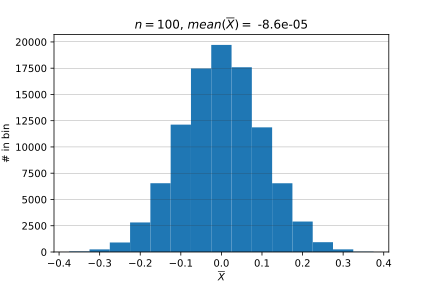
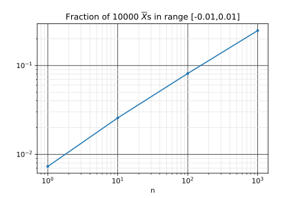
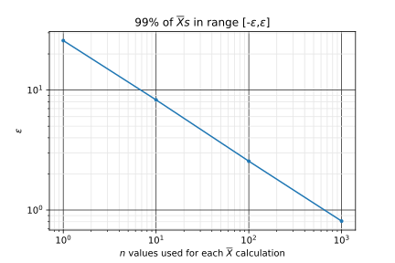

# HW 1

The first two problems of this homework are intended to primarily be a review of the programming techniques that you will need for this class. The problems mention the Law of Large Numbers, confidence intervals, and hypothesis testing. You do not need to know anything about the statistical theory behind them to solve these problems.

----

The Law of Large Numbers tells us that as $n\rightarrow \infty$, the sample average defined by

$$\overline{X}\equiv\frac{1}{n}\sum_{i=1}^n X_i$$

will be near the population average $\mu$ with a given probability. Given $n$ samples from a population, we don't expect $\overline{X}$ to exactly match $\mu$. The Law of Large Numbers allows us to make a statement about the difference $\overline{X}-\mu$. Specifically, the statement involves the probability that $|\overline{X}-\mu|$ is smaller than a particular value.

If you are interested, for a more formal definition of the Law of Large Numbers and proofs, see
* [Orloff and Bloom, Reading 6b](https://ocw.mit.edu/courses/mathematics/18-05-introduction-to-probability-and-statistics-spring-2014/readings/MIT18_05S14_Reading6b.pdf)
* Bulmer, Chapter 6 ([Piazza](https://piazza.com/gmu/spring2021/ce0c/resources))
* DeGroot, Chapter 6 ([Piazza](https://piazza.com/gmu/spring2021/ce0c/resources))

## Law of Large Numbers I

### a

1. Draw $n=100$ values from a population of Gaussian-distributed numbers drawn with mean $\mu=0$ and standard deviation $\sigma=1$.
2. Compute $\overline{X}$.
3. Repeat 1. and 2. $10,000$ times and plot a histogram of $\overline{X}$.

Save your program as `HW1_1a.py`. When I execute your program, I should see a histogram with _**the average of**_ $\overline{X}$ displayed in the title.

**Answer**

See [HW1_1a.py](https://github.com/rweigel/astrostats/blob/main/hws/HW1_1a.py).

From the following plot, it should be clear that when we draw $100$ values from a population with a mean of zero, the average of the $100$ values will not always be zero. The standard deviation appears to be approximately $0.1$, which is smaller than $\sigma$.



### b

1. For $n=100$, what fraction of the $10,000$ $\overline{X}$s were in the range $[-0.01, 0.01]$?
2. How does the fraction depend on $n$? <sup>+</sup>
3. For $n=100$, what is the range $[-\epsilon,\epsilon]$ for which $99$% of the $10,000$ $\overline{X}$s fall in?
4. How does $\epsilon$ depend on $n$? <sup>+</sup>
5. How does your answer change if the distribution changes?

<sup>+</sup> You may explain this using one or more words, tables, and plots.

Save your program as `HW1_1b.py`. Save your answers in a file named `HW1_1b.md` or `HW1_1b.pdf`.

**Answer**

See [HW1_1b.py](https://github.com/rweigel/astrostats/blob/main/hws/HW1_1b.py)

1.  7.6%
2. The following plot shows the dependence. As $n$ increases, the standard deviation of the histogram of $\overline{X}$ decreases so that more of the distribution is in the range $[-0.01, 0.01]$.

    
3.  25.8%
4. The following plot shows the dependence.
  
    
5. If you choose parameters for these distributions such that their mean is zero, the results are unchanged. This is a consequence of the Central Limit Theorem. It does not matter how the $n$ $X$s are distributed; the distribution of $\overline{X}$ is still Gaussian. In [HW1_1a.py](https://github.com/rweigel/astrostats/blob/main/hws/HW1_1a.py), there is a line with `np.random.uniform` commented out. Try running the code with it uncommented and notice that the histogram is still Gaussian even though a uniform distribution was used for the $n$ $\overline{X}$s.

## Prelude to Hypothesis Testing

This problem is a prelude to the frequentist interpretation of probability and hypothesis testing.

I select $n=100$ men at random from the U.S. population and compute the average and standard deviation of their heights. Assume that the distribution of the population is gaussian with a standard deviation equal to the sample's standard deviation. 

Using only the techniques used in the previous problem and these assumptions, make a statement about the likelihood that the actual U.S. population average is more than 1 inch larger or smaller than the average of the $n$ heights.

1. Briefly describe how you could do a calculation to estimate the likelihood. If you have done hypothesis testing before, don't use any of its terminology or techniques.
2. Implement the calculation. Assume the mean of the $100$ men was 72 inches and the standard deviation was 3 inches.

Save your answer to part 1. in a file named `HW1_2.md` or `HW1_2.pdf`. Save your answer to part 2. in a file named `HW1_2.py`.

**Answer**

In this problem, a single sample of $n=100$ was used to compute an average, $\overline{X}_o$ and standard deviation $s_o$. We do not know the population average $\mu$ but want to make a statement (or "inference") about it.

Now do many (say 10,000) experiments of drawing a sample of $100$ values from a gaussian distribution with mean $\overline{X}_o$ and sample standard deviation $s_o$. That is, assume that the actual unknown population distribution has a mean and standard deviation equal to that from the sample.

The percentage of $10,000$ experiments that had an $\overline{X}$ that was one inch larger or smaller than $\overline{X}_o$ is our estimate of the likelihood.

The above is the basic process of inferential statistics. However, instead of doing a simulation of 10,000 experiments, one can use a table to look up the expected percentage when an infinite number of experiments are performed.

## Basic Concepts in Probability

Read Chapter 2.1-2.2 of Devore, 2012. 

1. An experiment involves tossing a coin 3x. What is the sample space of this experiment?
2. How many of the outcomes in the sample space had two heads? 
3. Define event $A$ to be that the experiment yields two heads. Define event $B$ to be that the experiment yields two tails. What is $A \cup B$ and $A \cap B$?

Save your answers in a file named `HW1_3a.md` or `HW1_3a.pdf`.

**Answer**

1. The sample space has 8 elements ($2^3$). This list can be found using a tree diagram as shown below.

    ```
            H   => HHH
        H -
            T   => HHT
    H -        
            H   => HTH
        T -
            T   => HTT

            H   => THH
        H -
            T   => THT
    T -        
            H   => TTH
        T -
            T   => TTT

    ```
2. $3$ by inspection of the table above. Also, suppose that we have three unique coins $T$, $H_1$, and $H_2$. There are $3!$ unique permutations. If we drop the subscripts, then the number of unique permutations is divided by 2. So $3!/2=3$.
3. By inspection of the list from 1., $A \cup B = 6$ and  $A \cap B = \emptyset$.

In the above, I assumed "experiment yields two heads" to mean "the experiment yielded exactly two heads" and not "the experiment yielded two or more heads".

# HW 2

## Venn Diagrams, Unions, and Intersections

In class, I considered problem 12 in Chapter 2 of Devore 8th edition (slightly modified notation):

Consider randomly selecting a student at a certain university. Let $V$ denote the event the selected individual has a Visa credit card and $M$ be the analogous event for a MasterCard. Suppose that $P(V)=0.5$, $P(M)=0.4$, and $P(V \cap M)=0.25$.

1. Compute the probability that the selected individual has at least one of the two types of cards (i.e., the probability of the event $V\cup M$).

2. What is the probability that the selected individual has neither card type?

3. Find the probability that the student has a Visa but not MasterCard.

Develop a simulation to estimate answers to 1.-3.

Save your code in a file named `HW2_1.py` and have your code print a text file named `HW2_1.txt` with the estimates for 1.-3.

## Counting

1. $n_r$ red balls, $n_g$ green balls, and $n_b$ blue balls are in a box. Three balls are randomly selected. Assume $n_r=4$, $n_g=5$, and $n_b=6$.

   a. What is the probability that exactly two selected balls are red?

   b. What is the probability that all three selected balls have the same color?

   c. What is the probability that one ball of each type is
selected?

   Save your answer is a file named `HW2_2_1.pdf` or `HW2_2_1.md`.

2. Use Python to check your answer by simulating many experiments, corresponding to selecting three balls, and then computing the probabilities in parts 1a.--c (technically, you will compute relative frequencies and use them to estimate the probability).

   This will not be an exact answer, but as you increase the number of experiments, this approximate answer should approach the probabilities you found in part 1.

   Save as `HW2_2_2.py`

## Random Walk

A random walk is a process is analogous to the flipping of a fair coin. An example in physics is a cylinder constrained to move in one dimension being struck by air particles (and the cylinder moves without friction). Each strike sends the cylinder a small step to the left or right. The probability of a step to the left is the same as that of a step to the right. See also [Chapter 1 of Kittel and Kroemer](http://www.fulviofrisone.com/attachments/article/413/Kittel%20-%20Thermodynamics.pdf) for a description in the context of statistical physics.

1. After $3$ strikes, what are the probabilities the cylinder is one, two, and three steps to the right of its initial position?

2. After $4$ strikes, what are the probabilities the cylinder is one, two, three, and four steps to the right of its initial position?

3. What is the general formula for the probability that the cylinder is $k$ steps away from its initial position after $N$ steps?

4. Simulate $10,000$ steps and plot a histogram of the final position relative to its initial position. Add dots to show the values predicted from the formula found in part 3.

# HW 3

## Using Bayes' Rule

In a certain city, there are only two delivery companies, and their vehicle colors are yellow and orange. A witness saw a delivery vehicle run over a dog and leave the scene. In this city,

* 80% of the delivery vechicles are orange;
* 20% of the delivery vechicles are yellow; and
* the witness claimed they saw an orange delivery vechicle run over the dog. The witness was tested in recreations of the incident and it was found that 75% of the time they correctly identified the color of the delivery vechicle (no actual dogs were harmed in the recreation).

What is the probability that the delivery vechicle that ran over the dog was orange?

Save your answer in a file named `HW3_1.pdf` in your repository. Be prepared to explain your answer at the whiteboard in class.

## Formula Used in Class

When solving the cancer screening problem using Bayes' rule in class, I stated without proof that if a sample space can be partitioned into events $A_1$, $A_2,...,A_N$ that are

1. mutually exclusive (meaning if $A_i$ occurs, $A_j$ with $j\ne i$ cannot occur) and
2. exhaustive (if an event occurs, it must be one in the list of $A$ events), then

$\ds P(X) = \sum_{j=1}^{N}P(A_j)P(X|A_j)$

in which cases, Bayes' rule

$$A(A_i|X) = \frac{P(X|A_i)P(A_i)}{P(X)}$$

can be written as

$$A(A_i|X) = \frac{P(X|A_i)P(A_i)}{\sum_{j=1}^{N}P(A_j)P(X|A_j)}$$

Find a way of graphically justifying and explaining

$\ds P(X) = \sum_{j=1}^{N}P(A_j)P(X|A_j)$

assuming conditions 1. and 2. above. Save your answer in a file named `HW3_2.pdf` in your repository. Be prepared to explain your answer at the whiteboard in class.

## HW #2

Make corrections to your HW #2 problems that you think were not correct.

## Reading

Read [Chapters 1 and 2 of Sivia](https://drive.google.com/file/d/1jlcywhHQlfKGADki7yxuo5T55X15Rjpd★★★★remove★★★★). Be prepared to ask and answer questions in class.
