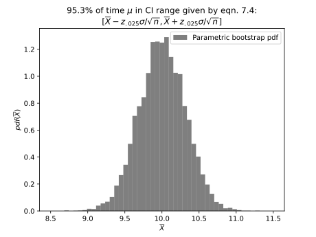
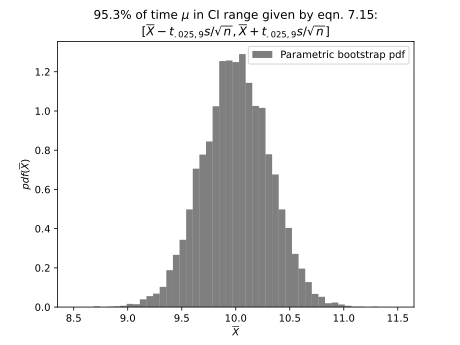
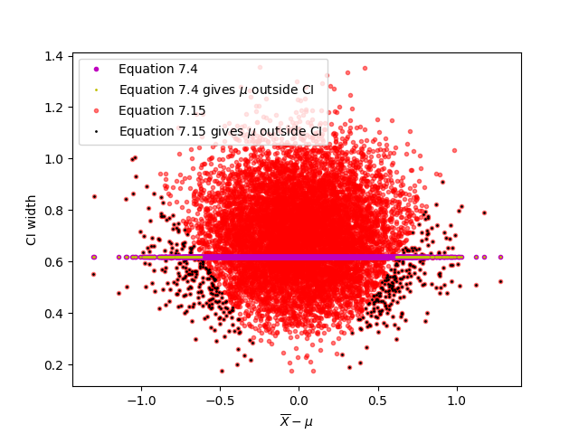
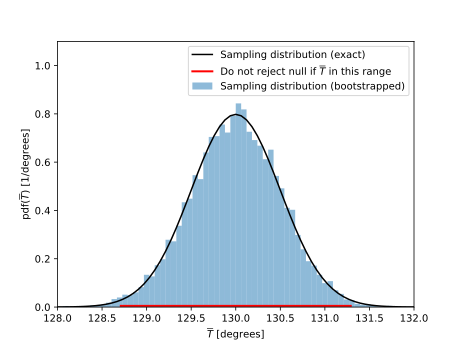
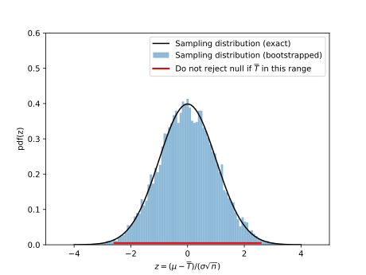
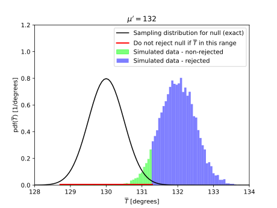

# HW 1

The first two problems of this homework are intended to primarily be a review of the programming techniques that you will need for this class. The problems mention the Law of Large Numbers, confidence intervals, and hypothesis testing. You do not need to know anything about the statistical theory behind them to solve these problems.

----

The Law of Large Numbers tells us that as $n\rightarrow \infty$, the sample average defined by

$$\overline{X}\equiv\frac{1}{n}\sum_{i=1}^n X_i$$

will be near the population average $\mu$ with a given probability. Given $n$ samples from a population, we don't expect $\overline{X}$ to exactly match $\mu$. The Law of Large Numbers allows us to make a statement about the difference $\overline{X}-\mu$. Specifically, the statement involves the probability that $|\overline{X}-\mu|$ is smaller than a particular value.

If you are interested, for a more formal definition of the Law of Large Numbers and proofs, see
* [Orloff and Bloom, Reading 6b](https://ocw.mit.edu/courses/mathematics/18-05-introduction-to-probability-and-statistics-spring-2014/readings/MIT18_05S14_Reading6b.pdf)
* [Bulmer, Chapter 6](https://drive.google.com/file/d/1B5y51uJ37jL_MYcoiS4TKiQQbo8wjKS7★★★★remove★★★★)
* [DeGroot, Chapter 6](https://drive.google.com/file/d/1L7daiOuSpyTJf8Zh76uSC7c7xQ7TpjwK★★★★remove★★★★)

## Law of Large Numbers I

### a

1. Draw $n=100$ values from a population of Gaussian-distributed numbers drawn with mean $\mu=0$ and standard deviation $\sigma=1$.
2. Compute $\overline{X}$.
3. Repeat 1. and 2. $10,000$ times and plot a histogram of $\overline{X}$.

Save your program as `HW1_1a.py`. When I execute your program, I should see a histogram with _**the average of**_ $\overline{X}$ displayed in the title.

**Answer**

See [HW1_1a.py](https://github.com/rweigel/astrostats/blob/main/hws/HW1_1a.py).

From the following plot, it should be clear that when we draw $100$ values from a population with a mean of zero, the average of the $100$ values will not always be zero. The standard deviation appears to be approximately $0.1$, which is smaller than $\sigma$.


### b

1. For $n=100$, what fraction of the $10,000$ $\overline{X}$s were in the range $[-0.01, 0.01]$?
2. How does the fraction depend on $n$? <sup>+</sup>
3. For $n=100$, what is the range $[-\epsilon,\epsilon]$ for which $99$% of the $10,000$ $\overline{X}$s fall in?
4. How does $\epsilon$ depend on $n$? <sup>+</sup>
5. How does your answer change if the distribution changes?

<sup>+</sup> You may explain this using one or more words, tables, and plots.

Save your program as `HW1_1b.py`. Save your answers in a file named `HW1_1b.md` or `HW1_1b.pdf`.

**Answer**

See [HW1_1b.py](https://github.com/rweigel/astrostats/blob/main/hws/HW1_1b.py)

1.  7.6%
2. The following plot shows the dependence. As $n$ increases, the standard deviation of the histogram of $\overline{X}$ decreases so that more of the distribution is in the range $[-0.01, 0.01]$.

    
3.  25.8%
4. The following plot shows the dependence.
  
    
5. If you choose parameters for these distributions such that their mean is zero, the results are unchanged. This is a consequence of the Central Limit Theorem. It does not matter how the $n$ $X$s are distributed; the distribution of $\overline{X}$ is still Gaussian. In [HW1_1a.py](https://github.com/rweigel/astrostats/blob/main/hws/HW1_1a.py), there is a line with `np.random.uniform` commented out. Try running the code with it uncommented and notice that the histogram is still Gaussian even though a uniform distribution was used for the $n$ $\overline{X}$s.

## Prelude to Hypothesis Testing

This problem is a prelude to the frequentist interpretation of probability and hypothesis testing.

I select $n=100$ men at random from the US population and compute the average and standard deviation of their heights. Assume that the distribution of the population is gaussian with a standard deviation equal to the sample's standard deviation. 

Using only the techniques used in the previous problem and these assumptions, make a statement about the likelihood that the actual US population average is more than 1 inch larger or smaller than the average of the $n$ heights.

1. Briefly describe how you could do a calculation to estimate the likelihood. If you have done hypothesis testing before, use its terminology and techniques sparingly.
2. Implement the calculation. Assume the mean of the $100$ men was 72 inches and the standard deviation was 3 inches.

Save your answer to part 1. in a file named `HW1_2.md` or `HW1_2.pdf`. Save your answer to part 2. in a file named `HW1_2.py`.

**Answer**

In this problem, a single sample of $n=100$ was used to compute an average, $\overline{X}_o$, and standard deviation $s_o$. We do not know the population average $\mu$ but want to make a statement (or "inference") about it.

Now do many (say $10,000$) experiments of drawing a sample of $100$ values from a gaussian distribution with mean $\overline{X}_o$ and sample standard deviation $s_o$. That is, assume that the actual unknown population distribution has a mean and standard deviation equal to that from the sample.

The percentage of $10,000$ experiments that had an $\overline{X}$ that was one inch larger or smaller than $\overline{X}_o$ is our estimate of the likelihood.

The above is the basic process of inferential statistics. However, instead of doing a simulation of $10,000$ experiments, one can use a table to look up the expected percentage when an infinite number of experiments are performed.

## Basic Concepts in Probability

Read Chapter [2.1-2.2 of Devore, 2012](https://drive.google.com/file/d/1XzI97l_QPpVpRb91CbcO1BYH7sqduZH1★★★★remove★★★★). 

1. An experiment involves tossing a coin 3x. What is the sample space of this experiment?
2. How many of the outcomes in the sample space had two heads? 
3. Define event $A$ to be that the experiment yields two heads. Define event $B$ to be that the experiment yields two tails. What is $A \cup B$ and $A \cap B$?

Save your answers in a file named `HW1_3a.md` or `HW1_3a.pdf`.

**Answer**

1. The sample space has 8 elements ($2^3$). This list can be found using a tree diagram as shown below.

    ```
            H   => HHH
        H -
            T   => HHT
    H -        
            H   => HTH
        T -
            T   => HTT

            H   => THH
        H -
            T   => THT
    T -        
            H   => TTH
        T -
            T   => TTT

    ```
2. $3$ by inspection of the table above. Also, suppose that we have three unique coins $T$, $H_1$, and $H_2$. There are $3!$ unique permutations. If we drop the subscripts, then the number of unique permutations is divided by 2. So $3!/2=3$.
3. By inspection of the list from 1., $A \cup B = 6$ and  $A \cap B = \emptyset$.

In the above, I assumed "experiment yields two heads" to mean "the experiment yielded exactly two heads" and not "the experiment yielded two or more heads".

# HW 2

## Venn Diagrams, Unions, and Intersections

In class, I considered [problem 12 in Chapter 2 on page 62 of Devore](https://drive.google.com/file/d/1XzI97l_QPpVpRb91CbcO1BYH7sqduZH1★★★★remove★★★★) (slightly modified notation):

Consider randomly selecting a student at a certain university. Let $V$ denote the event the selected individual has a Visa credit card and $M$ be the analogous event for a MasterCard. Suppose that $P(V)=0.5$, $P(M)=0.4$, and $P(V \cap M)=0.25$.

1. Compute the probability that the selected individual has at least one of the two types of cards (i.e., the probability of the event $V\cup M$).

2. What is the probability that the selected individual has neither card type?

3. Find the probability that the student has a Visa but not MasterCard.

Develop a simulation to estimate answers to 1.-3.

Save your code in a file named `HW2_1.py` and have your code print a text file named `HW2_1.txt` with the estimates for 1.-3.

**Answer**

The exact answers are 1. $0.35$, 2. $0.35$, and 3. $0.25$.

## Counting

1. $n_r$ red balls, $n_g$ green balls, and $n_b$ blue balls are in a box. Three balls are randomly selected without replacement. Assume $n_r=4$, $n_g=5$, and $n_b=6$.

   a. What is the probability that exactly two selected balls are red?

   b. What is the probability that all three selected balls have the same color?

   c. What is the probability that one ball of each type is
selected?

   Save your answer is a file named `HW2_2_1.pdf` or `HW2_2_1.md`.

2. Use Python to check your answer by simulating many experiments, corresponding to selecting three balls, and then computing the probabilities in parts 1a.--c (technically, you will compute relative frequencies and use them to estimate the probability).

   This will not be an exact answer, but as you increase the number of experiments, this approximate answer should approach the probabilities you found in part 1.

   Save as `HW2_2_2.py`

**Answer**

1. &nbsp;

   a. Consider the number of ways drawing, in this order $[r,r,g]$. It is $4\cdot 3\cdot 5$. There are three ways to order this list, so the total number of ways of getting two reds and one green is $3(4\cdot 3\cdot 5)$. From similar reasoning, it follows that the number of ways of getting $[r,r,b]$ in any order is $3(4\cdot 3\cdot 6)$. The total probability is thus

   $$\displaystyle \frac{3(4\cdot 3\cdot 5 + 4\cdot 3\cdot 6)}{15\cdot 14\cdot 13}\approx 0.145$$

   b. The number of ways of getting "three of a kind" is the number of ways of getting three reds plus the number of ways of getting three greens plus the number of ways of getting three blues, which is

   $$(4\cdot 3 \cdot 2) + (5\cdot 4\cdot 3) + (6\cdot 5\cdot 4)$$

   The requested probability is thus

   $$\frac{(4\cdot 3 \cdot 2) + (5\cdot 4\cdot 3) + (6\cdot 5\cdot 4)}{15\cdot 14\cdot 13}\approx 0.075$$

   c. The number of ways of getting $[r,g,b]$ is $4\cdot 5\cdot 6$. There are ${3\cdot 2}=6$ arrangements of this list.

   The requested probability is thus

   $$\frac{6(6\cdot 5\cdot 4)}{15\cdot 14\cdot 13}\approx 0.26$$

2. See [HW2_2_2.py](https://github.com/rweigel/astrostats/blob/main/hws/HW2_2_2.py)

## Random Walk

A random walk is a process analogous to flipping a fair coin. An example in physics is a cylinder constrained to move in one dimension being struck by air particles (and the cylinder moves without friction). Each strike sends the cylinder a small step to the left or right. The probability of a step to the left is the same as that of a step to the right. See also [Chapter 1 of Kittel and Kroemer](http://www.fulviofrisone.com/attachments/article/413/Kittel%20-%20Thermodynamics.pdf) for a description in the context of statistical physics.

1. After $3$ strikes, what are the probabilities the cylinder is one, two, and three steps to the right of its initial position?

2. After $4$ strikes, what are the probabilities the cylinder is one, two, three, and four steps to the right of its initial position?

3. What is the general formula for the probability that the cylinder is $k$ steps away from its initial position after $N$ steps?

4. Simulate $10,000$ steps and plot a histogram of the final position relative to its initial position. Add dots to show the values predicted from the formula found in part 3.

# HW 3

## Using Bayes' Rule

In a certain city, there are only two delivery companies, and their vehicle colors are yellow and orange. A witness saw a delivery vehicle run over a dog and leave the scene. In this city,

* 80% of the delivery vehicles are orange;
* 20% of the delivery vehicles are yellow; and
* the witness claimed they saw an orange delivery vehicle run over the dog. The witness was tested in recreations of the incident, and it was found that 75% of the time, they correctly identified the color of the delivery vehicle (no actual dogs were harmed in the recreation).

What is the probability that the delivery vehicle that ran over the dog was orange?

Save your answer in a file named `HW3_1.pdf` in your repository. Be prepared to explain your answer on the whiteboard in class.

**Answer**

Notice that this problem is identical in structure to the problem considered in class and the visual use for that problem could also be used here. As an alternative, consider 1000 recreations of the indident in which 800 vehicles are orange and 200 vehicles are red. Based on a correct identification of 75\% the expected number for each possible witness claim is shown in the last column.

```
              600 - Is orange, claims orange
       800  
              200 - Is orange, claims yellow
1000
              150 - Is yellow, claims yellow
       200
               50 - Is yellow, claims orange
```

In the last column, the witness claims orange when the vehicle is orange $600$ times. The witness claims orange $600 + 50$ times. So the probability is $600/650\approx 0.92$.

To use Bayes' theorem, we start by writing the given probabilities

* $P(O) = 0.8$
* $P(Y) = 0.2$
* $P(W_O|O) = 0.75$ 
* $P(W_O|Y) = 0.25$ (not given, but follows from probability axiom)

where $W_O$ means "witness claimed orange".

To solve using Bayes' rule, notice that this problem is identical in structure to the problem considered in class and the visual use for that problem could also be used here.

We want to know $P(O|W_O)$, that is, the probability that the vehicle was orange given the witness claimed they saw an orange vehicle strike the dog. Bayes' theorem is

$$P(O|W_O)=\frac{P(O)\cdot P(W_O|O)}{P(W_O)}$$

The denominator is $P(W_O)=P(O)P(W_O|O) + P(Y)P(W_O|Y)$, which comes from the next problem.

## Formula Used in Class

When solving the cancer screening problem using Bayes' rule in class, I stated without proof that if a sample space can be partitioned into events $A_1$, $A_2,...,A_N$ that are

1. mutually exclusive (meaning if $A_i$ occurs, $A_j$ with $j\ne i$ cannot occur) and
2. exhaustive (if an event occurs, it must be one in the list of $A$ events), then

$\ds P(X) = \sum_{j=1}^{N}P(A_j)P(X|A_j)$

in which cases, Bayes' rule

$$A(A_i|X) = \frac{P(X|A_i)P(A_i)}{P(X)}$$

can be written as

$$A(A_i|X) = \frac{P(X|A_i)P(A_i)}{\sum_{j=1}^{N}P(A_j)P(X|A_j)}$$

Find a way of graphically justifying and explaining

$\ds P(X) = \sum_{j=1}^{N}P(A_j)P(X|A_j)$,

assuming conditions 1. and 2. above. Save your answer in a file named `HW3_2.pdf` in your repository. Be prepared to explain your answer at the whiteboard in class.

## HW #2

Make corrections to your HW #2 problems that you think needed to be corrected.

## Reading

Read [Chapters 1 and 2 of Sivia](https://drive.google.com/file/d/1jlcywhHQlfKGADki7yxuo5T55X15Rjpd★★★★remove★★★★). Be prepared to ask and answer questions in class.

# HW 4

## Reading

Read [Chapter 3 of Devore](https://drive.google.com/file/d/1szqKzodtocD8sMhvx7SzGJgqG-PNd2vb★★★★remove★★★★).

##  Expectation Values

A summary (or descriptive) statistic is a quantity that summarizes an aspect of a collection of data. Examples include the mean and standard deviation. Descriptive statistics are always based on a computation done on a **sample** (subset) of the population of data. 

Definitions

* **Population** - "All" of the data is called the population. A population can be finite or infinite. An example of a finite population is all US citizens. An example of an infinite population is values from a continuous probability density function.
* **Sample statistic** - a computation based on a sample from a population that estimates the equivalent value that would be obtained if the same computation was performed on the population. (Devore p214)

It is important that sample statistics are **unbiased**. If we compute a sample statistic based on a sample from a population and repeat this process many times, we want the average of the sample statistic to be equal to the corresponding population statistic.

An example of an unbiased sample statistic is the average,

$$\overline{X}=\frac{1}{n}\sum_{i=1}^n X_i\$$

Suppose we have a list of 1000 numbers with a mean $\mu$. If we draw $n=100$ numbers at random, compute the average $\overline{X}_1$, and repeat $N\rightarrow \infty$ times, the average of these averages will be $\mu$, the population average. Mathematically, this is

$$
\lim_{N\rightarrow \infty} \frac{1}{N}\sum_{i=1}^N\overline{X}_i = \mu
$$

The distribution of the $\overline{X}_i$ values is called the **sampling distribution** (Devore p214)

The general definition of the expectation operator $E[\cdot]$ is, for discrete $x$,

$$E \left[X\right] = \sum_{\text{all }x}xP(x)
$$

By definition, the average of $X$ over the population is defined as

$\mu\equiv E\left[X\right]$.

The variance of a population is defined as

$$\sigma^2\equiv E\left[(X-\mu)^2\right]$$

An example of a biased sample statistic is

$$S_{b}^2 = \frac{1}{n}\sum_{i=1}^n(X_i-\overline{X})^2$$

In part 1., you will numerically demonstrate that $E[S^2_b]$ is related to $\sigma^2$. In part 2., you will fill in the details of the proof I started in class to find the relationship.

1. Show that $S_{b}^2$ is biased by drawing $n=10$ values from at normal distribution with $\mu=0$ and $\sigma=1$, computing $S_{b}^2$ and repeating $N=10,000$ times. Plot the histogram of the $10,000$ $S_{b}^2$ values and display their average and variance in the title. Save your code as `HW4_2_1.py` and plot as `HW4_2_1.pdf`.
2. Show that $E[S^2_b]=\sigma^2(n-1)/n$. Save your answer in a file named `HW4_2_2.pdf`.

**Solution**


Page 245 of Devore has a briefer proof, which is described at the end of this answer.

$$E[S_{b}^2] = E\left[ \frac{1}{n} \sum_{i=1}^n(X_i-\overline{X})^2 \right]$$

expanding the square gives

$$E[S_{b}^2] = E\left[ \frac{1}{n} \sum_{i=1}^n(X_i^2-2X_i\overline{X}+\overline{X}^2) \right]$$

or, equivalently,

$$I.\qquad E[S_{b}^2] = E\left[ \frac{1}{n} \sum_{i=1}^nX_i^2-\frac{2}{n}\sum_{i=1}^nX_i\overline{X}+\frac{1}{n}\sum_{i=1}^n\overline{X}^2 \right]$$

The second term in the square braces in equation $I.$ is

$$\frac{2}{n}\sum_{i=1}^nX_i\overline{X}=2\overline{X}\left(\frac{1}{n}\sum_{i=1}^nX_i\right)=2\overline{X}^2$$

where the definition $\overline{X}\equiv (1/n)\sum_{i=1}^nX_i$ was used.

The third term is 
$$\frac{1}{n}\sum_{i=1}^n\overline{X}^2=\frac{1}{n}n\overline{X}^2=\overline{X}^2$$

Therefore, the second and third terms combine to be $-2\overline{X}^2+\overline{X}^2=-\overline{X}^2$ and Equation $I.$ simplifies to

$$E[S_{b}^2] = E\left[ \frac{1}{n} \sum_{i=1}^nX_i^2-\overline{X}^2\right]$$

Distributing the $E$ to each of the two terms and moving the $E$ inside the sum (both steps use $E[X+Y]=E[X]+E[Y]$) gives

$$II.\qquad E[S_{b}^2] =\frac{1}{n}\sum_{i=1}^nE\left[X_i^2\right]-E\left[\overline{X}^2\right]$$

Both of the terms in the above equation can be re-written using $\mu$, $\sigma$, and $n$.

Noting that $E[Y_i]$ and $E[Y]$ are equivalent, the expectation in the first term can be re-written using

$$E\left[X^2\right]=\mu^2+\sigma^2$$

which follows from the definition

$$\sigma^2 \equiv E\left[(X-\mu)^2\right],$$

which can be rewritten as

$$\sigma^2 = E\left[X^2-2\mu X+\mu^2\right] = E\left[X^2\right]-2\mu E[X]+E[\mu^2]$$

Using the definition $\mu \equiv E[X]$, this simplifies to

$$\sigma^2 = E[X^2]-\mu^2$$

giving

$$E\left[X^2\right]=\mu^2+\sigma^2$$

Therefore, the first term in equation $II.$ is

$$\frac{1}{n}\sum_{i=1}^n E\left[ X_i^2 \right]=\frac{1}{n}\sum_{i=1}^n (\mu^2+\sigma^2)=\frac{1}{n}n(\mu^2+\sigma^2)=\mu^2+\sigma^2$$

The second term in equation $II.$, $E[\overline{X}^2]$, can be rewritten

$$E\left[\overline{X}^2\right]=E\left[\left(\frac{1}{n}\sum_{i=1}^nX_i\right)^2\right]=\frac{1}{n^2}E\left[\left(\sum_{i=1}^nX_i\right)^2\right]$$

The square of the sum,

$$\left(\sum_{i=1}^nX_i\right)^2=(X_1+X_2+...)(X_1+X_2+...)$$

expands to 

$X_1^2+X_1(X_2+X_3+...)+$

$X_2^2+X_2(X_3+X_4+...)+$

$...$

$X_n^2+X_n(X_1+X_2+...)$

Let $X^\prime=X-\mu$ and note that

$E\left[X^\prime\right]=0$, 

$E\left[X^\prime_iX^{\prime}_j\right]=0 \quad(i\ne j)$, and 

$E\left[X^{\prime 2}\right]=\sigma^2$.

The above set of equations can now be written as 

$(X^{\prime}_1+\mu)^2+(X^{\prime}_1+\mu)(X^{\prime}_2+\mu+X^{\prime}_3+\mu+...)+$

$(X^{\prime}_2+\mu)^2+(X^{\prime}_2+\mu)(X^{\prime}_1+\mu+X^{\prime}_3+\mu+...)+$

$...$

$(X^{\prime}_n+\mu)^2+(X^{\prime}_n+\mu)(X^{\prime}_1+\mu+X^{\prime}_2+\mu+...)$

There are $n$ terms of the form $E[(X^{\prime}_i+\mu)^2]$ that evaluate to $\sigma^2+\mu^2$ because

$$E\left[(X^{\prime}_i+\mu)^2\right]=E\left[ X^{\prime 2}_i + 2X^{\prime}_i\mu + \mu^2 \right] = \sigma^2+0+\mu^2$$

There are $n$ terms of the a form similar to

$$(X^{\prime}_1+\mu)(X^{\prime}_2+\mu+X^{\prime}_3+\mu+...)$$

or

$$X^{\prime}_1(X^{\prime}_2+X^{\prime}_3+...)+\mu(\mu + \mu + ...)$$

In the second parenthesis, there are $n-1$ $\mu$ terms. Using this and multiplying through the terms in the first set of parenthesis by $X_1^\prime$ gives

$$X^{\prime}_1X^{\prime}_2+X_1^\prime X^{\prime}_3+...\mu(n-1)\mu$$

Becuase $E[X_i^\prime X_j^\prime] = 0$, 

$$E\big[X^{\prime}_1X^{\prime}_2+X_1^\prime X^{\prime}_3+...+\mu^2(n-1)\big]=\mu^2(n-1)$$

so finally we can conclude that

$$E\left[\overline{X}^2\right]=\frac{1}{n^2}\left[n(\sigma^2+\mu^2)+n\mu^2(n-1)\right]=\mu^2+\sigma^2/n$$

In summary, we have shown that $E[X^2]=\mu^2+\sigma^2$ and $E[\overline{X}^2]=\mu^2+\sigma^2/n$. As a result, Equation $II.$ simplifies to

$$E[S_{b}^2] = E\left[ X^2 \right] - E\left[ \overline{X}^2 \right] =\mu^2+\sigma^2-\left( \mu^2+\sigma^2/n\right) = \sigma^2-\sigma^2 /n$$

or,

$$E[S_{b}^2] = \frac{n-1}{n}\sigma^2$$

with the interpretation that $S_b^2$ is downward biased by a factor of $(n-1)/n$.

This equation makes sense in one limit - suppose we draw a single sample from a distribution with variance $\sigma^2$. $S_b^2$ will always be zero, which is less than $\sigma^2$ for any nonzero $\sigma$.

It follows from the calculation above that an unbiased estimate of the variance of a population is

$$S^2=\frac{1}{n-1}\sum_{i=1}^n(X_i-\overline{X})^2$$

because $E[S^2]=\sigma^2$. Recall that in contrast, an unbiased estimate of $\mu$ is

$$\overline{X}=\frac{1}{n}\sum_{i=1}^n X_i$$

which has $n$ and not $n-1$.

Note that when $n=1$, $S^2$ is $0/0$, which indeterminate; this makes sense as -- we don't expect to be able to estimate the variance of a population with only one sample.

----

Devore on pg 245 starts with the observation that for the variance of random variable $Y$, $V(Y)$, can be written 

$$V(Y)=E[Y^2]-(E[Y])^2$$

or, rearranging,

$$A.\qquad E[Y^2]=V(Y)+(E[Y])^2,$$

which is stated without proof. The formula is also given on page 112, but a proof is not given.

Next, he states that it follows from the definition

$$S^2 = \frac{1}{n-1}\sum_{i=1}^n(X_i-\overline{X})^2$$

that

$$S^2 = \frac{1}{n-1}\left[\sum_{i=1}^nX_i^2-\frac{1}{n}\left(\sum_{i=1}^nX_i\right)^2\right].$$

Taking the expectation and moving it inside of the sum in the first term gives

$$E[S^2] = \frac{1}{n-1}\left(\sum_{i=1}^nE[X_i^2]-\frac{1}{n}E\left[\left(\sum_{i=1}^nX_i\right)^2\right]\right)$$

Using equation $A.$, which is $E[Y^2]=V(Y)+(E[Y])^2$, with $Y=X$ is $E[X^2]=V(X)+(E[X])^2=\sigma^2+\mu^2$ using the definitions of $\sigma$ and $\mu$. Using this, the above equation can be re-written as

$$E[S^2] = \frac{1}{n-1}\left(\sum_{i=1}^n(\sigma^2+\mu^2)-\frac{1}{n}E\left[\left(\sum_{i=1}^nX_i\right)^2\right]\right)$$

Using equation $A.$ again, which is $E[Y^2]=V(Y)+(E[Y])^2$, this time with $Y=\sum_{i=1}^n X_i$ gives

$$E\left[\left(\sum_{i=1}^n X_i\right)^2\right]=V\left(\sum_{i=1}^n X_i\right)+\left(E\left[\sum_{i=1}^n X_i\right]\right)^2=n\sigma^2+(n\mu)^2$$

so now

$$E[S^2] = \frac{1}{n-1}\left(\sum_{i=1}^n(\sigma^2+\mu^2)-\frac{1}{n}\left[n\sigma^2+(n\mu)^2\right]\right)$$

or

$$E[S^2] = \frac{1}{n-1}\left(n(\sigma^2+\mu^2)-\frac{1}{n}(n\sigma^2+n^2\mu^2)\right)=\sigma^2$$

## The Poisson Distribution

The Poisson distribution can be derived as a limit of the Binomial distribution. This is also discussed in [Devore 3.6](https://drive.google.com/file/d/1szqKzodtocD8sMhvx7SzGJgqG-PNd2vb★★★★remove★★★★).

If

1. in a sufficiently short amount of time, $\Delta t$, only 0 or 1 event can occur (two or more simultaneous events are impossible);
2.  the probability of exactly 1 event occurring in $\Delta t$ is equal to $\lambda \Delta t$, where $\lambda$ is a constant; and
3.  any non-overlapping intervals of length $\Delta t$ are independent Bernoulli trials,

the probability of $k$ events occurring in the time interval $t=N\Delta t$ is

$$P(k)=\frac{(\lambda t)^k e^{-\lambda t}}{k!}$$

for sufficiently large $N$. Another way of writing this equation is, if $p$ is the probability of event in time $\Delta t$, and, by definition, $\lambda \equiv p/\Delta t$, then

$$P(k)=\frac{\ds\left(p\frac{t}{\Delta t}\right)^k e^{-p\large\frac{t}{\Delta t}}}{k!}$$

Next, using the definition $t\equiv N\Delta t$,

$$P(k)=\frac{(p N)^k e^{-p N}}{k!}$$

The interpretation is that if the probability of a success in a trial is $p$, then the probability of $k$ successes in $N$ trials is $P(k)$. 
Use a random number generator to create a dataset that simulates the following result. Every hour, the number of x-ray flares is tabulated. It is found that over $10,00$ days, $900$ flares occurred so that the average probability of a flare in a given hour is $900/(1000\cdot 24)$.

1. Plot

   a. $P_S(k)$, the probability of $k$ flare events occurring **per day** for the **S**imulated dataset,

   b. $P_P(k)$ expected from the equation above using the value of $\lambda$ computed based on the **P**oisson distribution equation above, and

   c. $P_B(k)$ expected from the **B**inomial distribution, from which the Poisson distribution was derived.

2.  From your dataset, derive a new dataset, the time between flares, and plot a histogram of the time between flares.

Save your code as `HW4_3.py` and save the plot as `HW4_3.pdf`. Spend time on thinking about the best way to label axes, the title, the legend, colors, and annotations. As discussed, you want to have enough detail on the plot so that a reader can start to make interpretations without having to read or hear a long description. 

Be prepared to justify any differences between the three cases in class.

**Solution**

See [HW4_3.py](https://github.com/rweigel/astrostats/blob/main/hws/HW4_3.py)


# HW 5

## Bernoulli Trials

A Bernoulli Trial has 

* two possible outcomes,
* the probability of "success" is $p$ and the probability of "failure" is $1-p$, and
* these probabilities don't change.

For $N$ trials, the probability of $k$ successes is given by the Binomial distribution:

$$P(k)={N \choose k}p^k(1-p)^{N-k}$$

See also [Devore 3.4](https://drive.google.com/file/d/1szqKzodtocD8sMhvx7SzGJgqG-PNd2vb★★★★remove★★★★), where an experiment that conforms to the Bernoulli Trial constraints is referred to as a "Binomial Experiment".

1.  Use a random number generator to simulate 10,000 Binomial Experiments with $N=100$ trials and $p=0.4$ and then plot $P(k)$. (You'll have to research how exactly to "use a random number generator" to do this".) On the same axes, plot $P(k)$ expected from the equation above using the given $N$ and $p$. 
2.  Suppose $p$ follows the rule: "If two trials in a row are a success, the probability of success ($p$) on the next trial is $0.3$; otherwise, $p=0.4$". Plot $P(k)$ on the same axes as for part 1.

Save your code as `HW5_1.py` and save the plot as `HW5_1.pdf`. Be prepared to provide a justification in class for any differences between the two cases.

A follow-up question that I'll ask is if based on the two plots you can conclude that the second plot does not satisfy the constraints of a Binomial Experiment. Later in the semester, formal ways of answering this question will be covered. For now, I just want to hear your ideas about how you would approach the problem.

**Answer**

The motivation for allowing $p$ to vary is that often you'll have a data set that does not quite conform to a certain set of assumptions. It is often useful to model the non--conformity to get an idea for how the non--conformity will change the results. In this problem, the varition in $p$ models "persistence". The most common form of persistence is that high--temperature days tend to follow high--temperature days. That is, the probability of a day having a high--temperature is larger if the previous day had a high temperature.

There are several other points to discuss:

1. How do we know if the simulation values are significantly different than the values from the formula? Could you determine this using concepts covered in previous HW problems? (We'll cover how to do this formally later.)
2. The distribution looks Gaussian. How different from a Gaussian is it?

My code is at [HW5_1.py](hws/HW5_1.py). I solved the problem in two ways. In the first, I use a uniform probability distribution to generate a trial result with the given probabilities of success. In the second solution, I use `np.random.binomial()` to generate the trial results.


## Solar Flare Data

The zip file [SOLAR\_FLARES-revised3.zip](http://mag.gmu.edu/git-data/astrostats/SOLAR\_FLARES-revised3.zip) contains the time of solar flares in an ASCII file named `xray.txt`; this is the only file that you will need for this problem. See the README file for information on how this file was created if you are interested.

Plot the probability distribution of the number of solar flares per day using `xray.txt`.

1. Is the probability distribution similar to that expected from a Binomial Experiment or the Poisson distribution? If so, plot the equation for a Binomial Experiment and/or the Poisson distribution on the same axes as the histogram.
2. Is the probability density of the time between solar flares similar to the probability density of the exponential distribution?
3. Do the data conform to the constraints of a Binomial Experiment or the assumptions for the Poisson distribution?

Save any code or plots that you use to answer these questions in files with the prefix `HW5_2`. Be prepared to discuss your results in class.

**Comments**

These data were considered in [Wheatland, 2000](https://iopscience.iop.org/article/10.1086/312739). The fit to both a binomial and Poisson distribution is poor. (I was glad to see that several students also plotted the binomial distribution because of concern that the assumptions Poisson approximation was not satisfied.) This is somewhat expected given that the probability that a flare occured in a given hour depends on whether a flare occured in the previous hour. From the data, I find (see [HW5_2.py](https://github.com/rweigel/astrostats/tree/main/hws/HW5_2.py))

$P(F_t)=0.27$

$P(F_t|F_{t-1})=0.08$, meaning that a flare is the least likely to occur in a given hour if one occured in the previous hour.

$P(F_t|\overline{F}_{t-1})=0.19$

$P(\overline{F}\_t|\overline{F}_{t-1})=0.54$

$P(\overline{F}\_t|F_{t-1})=0.19$

where $F_t$ indicates a flare in hour $t$ and $\overline{F}_t$ indicates no flare. The binomial distribution requires that these probabilities are all the same, which is clearly not the case. In addition, multiple flares occured in the same hour. If we define an event as a single flare, then the data are not consistent with the assumption that in each $\Delta t$, only one event can occur. (We can work around this by defining an event as when one or more flares occured in a given hour.)

In writing the rule for the previous problem, I had mis-remembered the above result. That is, I had recalled that $P(F_t|\overline{F}_{t-1}) > P(F_t|F_{t-1})$, which is opposite to what was observed.

## Confidence Intervals when Sampling Distribution Known

Background reading: [Chapter 7 of Devore](https://drive.google.com/file/d/11Ggp-RNoknu7ARu95s54hvOsQMv0AgR-/★★★★remove★★★★)

The simplest problem for computing a confidence interval is

1. $n$ values are drawn from a Gaussian distribution;
2. the population standard deviation, $\sigma$, is known;
3. the statistic for which to compute a confidence interval is the mean.

When $\sigma$ is not known (which is usually the case), we still know the sampling distribution of $\overline{X}$. However, for small $n$, it is not Gaussian -- it is $t_{n-1}$--distributed.

----

Draw $n=10$ values from a Gaussian with $\mu=10$ and $\sigma=1$. Compute the 95\% confidence interval for the mean

1. using Equation 7.4 of Devore, and
2. using Equation 7.15 of Devore.

The confidence intervals for 1. and 2. are easy to compute because we know the sampling distribution. In the following, you are going to assume that you did not know the sampling distribution and derive it with a "parametric bootstrap" simulation. (The "parametric" corresponds to the fact that you are doing a simulation with knowledge of parameters, in this case $\mu$ and $\sigma$, of the population.)

3. Verify your answer for 1. by drawing $n=10$ values from a Gaussian with $\mu=10$ and $\sigma=1$ $10,000$ times. Compute $10,000$ confidence intervals using Equation 7.4 of Devore What fraction of these confidence intervals included $\mu$?
4.  Verify your answer for 2. by drawing $n=10$ values from a Gaussian with $\mu=10$ and $\sigma=1$ $10,000$. Compute $10,000$ confidence intervals using Equation 7.15 of Devore. What fraction of these confidence intervals included $\mu$?
5.  Suppose some parameter $a$ was computed and its 95% confidence interval is $[0.9, 1.1]$. What is wrong with the claim "the probability that $a$ is in the range $[0.9, 1.1]$ is 0.95"? Think about this first, but you are stumpted, see pages 270--271 [of Devore](https://drive.google.com/file/d/11Ggp-RNoknu7ARu95s54hvOsQMv0AgR-/★★★★remove★★★★).

Save the code for your answer in a file named `HW5_3.py` and text answers in `HW5_3.pdf`. When executed, the code should display the probability density of the sampling distribution for 3. and 4. along with $\overline{X}$ and its 95\% confidence interval from 1. and 2., respectively, in the title.

**Answer**

Equation 7.4 is the 95\% confidence interval for the average of $n$ values from a Gaussian distribution with a known standard deviation $\sigma$:

$$\left(\overline{x}-1.96\cdot\frac{\sigma}{\sqrt{n}}\text{ }\text{  ,  }\text{ }\overline{x}+1.96\cdot\frac{\sigma}{\sqrt{n}}\right)$$

Equation 7.15 is the 95\% confidence interval for the average of $n$ values drawn from a Gaussian distribution:

$$\left(\overline{x}-t_{\alpha/2,n-1}\cdot\frac{s}{\sqrt{n}}\text{ }\text{  ,  }\text{ }\overline{x}+t_{\alpha/2,n-1}\cdot\frac{s}{\sqrt{n}}\right)$$

Note that $n$ does not need to be large for either equation to apply. Both equations only require that the $n$ values are drawn from a Gaussian distribution. Because the conditions for each equation to apply were satisfied, we expect the the simulations in 3. and 4. to show that 95\% of the confidence intervals contained $\mu$. 

See [HW6_2.py](hws/HW5_4.py) for the calculations for parts 1.--4.

1. [9.58, 10.82] (but will vary)
2. [9.52, 10.88] (but will vary)

The answers to parts 3.--4. are in the titles of the following figures.





This fact that the fractions given in the titles are nearly equal is perhaps not expected --if you repeat parts 1. and 2. a few times and compare the fixed error bar width from Equation 7.4 with the variable error bar width of Equation 7.15, you will observe that the width from 7.15 is usually larger than that from 7.4. But not always. The histogram of the error bar widths computed using Equation 7.15 is shown in the following figure. Based on this, the near equality still seems unexpected because the error bar widths from Equation 7.15 are on average larger than the fixed width from 7.4.


The explanation for the near equality of the fractions in the titles of figures for parts 3. and 4. is in the following figure. $\mu$ falls outside of the CI from Equation 7.15 more often when the CI width from 7.15 is smaller than that from 7.4 in comparison to when the CI width from 7.15 is larger than that from 7.4. So even though the error bar widths from eqn 7.15 are on average larger than that from 7.4, $\mu$ is more frequently outside of the CI of 7.15 when its error bar widths are smaller than that of 7.4. In the figure, this corresponds to more black dots below the line of magneta dots than above it.



# HW 6

## Linear Regression

When fitting a straight line to data using the equation $y=bx + a$, we most often make the following assumptions about the process that generated the data. First, we assume that each of the sampled $y_i$ ($i=1,...,n$) values were generated by drawing a value from a Gaussian distribution with $\mu=0$ and standard deviation $\sigma$ and then adding to it $\beta x_i + \alpha$, where $x_i$ are values that we choose. The values of $\alpha$ and $\beta$ are unknown quantities that we seek to estimate given a limited set of $n$ measurements of the population and equations for $b$ and $a$ that you typically first encounter in a physics lab.

To simulate the process of generating $y_i$ values described above, choose a value for $x_i$. Next, draw a value from a Gaussian distribution with a mean of zero and standard deviation of $\sigma$, the value of which is represented by the variable $\epsilon_i$. Then solve for $y_i$ using

$$y_i = \beta x_i + \alpha + \epsilon_i$$

Repeating this process $n$ times will yield $n$ values of $y$ and $x$. When we do linear regression on a set of measurements, we assume that the system we took measurements from works in a way that is equivalent to the above process -- we give the system an input of $x_i$ and it returns an output $y_i$ based on this process.

In this problem, you will create a population of $N$ values using a linear relationship and then draw a sample of $n$ $(x,y)$ values. Then, you will compute $a$ and $b$, which are estimates of the respective population parameters $\alpha$ and $\beta$.

1. Create a population of $N=1000$ $(x,y)$ pairs using $\alpha=1$, $\beta=1$, and $\sigma=0.2$. For values of $x$, use $0, 1/N, 2/N, ..., (N-1)/N$. Create a scatter plot of these $N$ $(x,y)$ values.
2. Randomly draw $n=20$ $(x,y)$ pairs with replacement from the population and plot them on the same axis as the previous plot.
3. Use the equations used in your physics labs to compute $a$ and $b$ using the 20 values drawn in step 2. When your code is executed, it should print out $a$ and $b$.
4. Find a Python library that will compute $a$ and $b$ for you. When your code is executed it should print out the values of $a$ and $b$ computed with the library.

In your physics labs, you were typically given an equation for the uncertainty (a confidence interval) in $a$ and $b$. In this problem, you will use the non--parametric bootstrap to obtain an estimate of the uncertainty.

5. Randomly draw $n=20$ $(x,y)$ pairs with replacement $N_B=10,000$ times. For each draw, compute $a$ and $b$. Use the histogram of $a$ and $b$ to estimate 95% confidence intervals for $a$ and $b$ computed using the method in step 3. (or 4).

Save your code for parts 1.-5. in `HW6_I.py`. When executed, a plot should appear for parts 1. and 2. and a separate plot for part 5. In addition, answers to parts 3. and 4. should be printed to the console.


For parts 6. and 7., see [Bulmer, 1979, Chapter 12](https://drive.google.com/file/d/1B5y51uJ37jL_MYcoiS4TKiQQbo8wjKS7/★★★★remove★★★★).

6. Use a $t$ test to compute the 95% confidence interval for $b$. (You'll have to research the appropriate test statistic to perform the $t$ test on.) Provide brief justifications or references for any equations.

7. In your physics labs, you use the equation

    $$b = \frac{\displaystyle \sum_{i=1}^{n}x_iy_i-n\bar{x}\bar{y}}{\displaystyle\sum_{i=1}^{n}x_i^2-n\bar{x}^2} = \frac{\displaystyle\sum_{i=1}^{n}(x_i-\bar{x})(y_i-\bar{y})}{\displaystyle\sum_{i=1}^{n}(x_i-\bar{x})^2}$$

    as an estimate of the population parameter $\beta$ in the model equation
    
    $$y_i = \beta x_i + \alpha + \epsilon_i$$
    
    where $\epsilon_i$ are independent and randomly distributed values from a Gaussian distribution with zero mean and standard deviation $\sigma$.

    Show analytically that $b$ is an unbiased estimate of $\beta$.

8.  In part 5., $N_B$ values for $a$ and $b$ were computed. Use the values to test the claim that the errors in the estimate $a$ and $b$, given by $a-\alpha$ and $b-\beta$, respectively, are not independent. (This lack of independence was mentioned in Bulmer; take an observational/experimental approach to answer this question.)

Save your answers for parts 6.-8. as `HW6_II.pdf`.

Save your code for part 8. as `HW6_II.py`.

## Exploratory Data Analysis on Solar Flare Data

Before performing statistical analysis on a dataset, one typically performs exploratory data analysis. This can involve visual explorations using plots such as time series, histograms, scatter plots, autocorrelations, power spectra, etc. It can also involve calculations such as means and variances.

There is no set rule for what analysis should be performed -- it depends on the question you want to answer, the type of data, and your previous experience. The general idea is to look at your dataset from many perspectives before performing formal statistical analysis and attempting to draw any conclusions. You will often use the results of your exploratory analysis to determine if your answers make sense or to convince others that your answers and conclusions make sense.

Based on the solar flare data problem given in the last homework, I suggested

1. a time series plot of events (0 = no event, 1 = event);
2. a calculation and plot showing if or how the rate of flares changes on a month-to-month basis; and
3. a calculation of $P(F_t|F_{t-1})$, $P(F_t|\overline{F}_{t-1})$, $P(\overline{F}\_t|\overline{F}_{t-1})$, and $P(\overline{F}\_t|F_{t-1})$, where $F_t$ indicates a flare in hour $t$ and $\overline{F}_t$ indicates no flare.

Do this analysis and then come up with your own exploratory analysis of this dataset, and be prepared to discuss the motivation and interpretation of your results. For inspiration, review papers and websites that cover this topic.

# HW 7

## $\beta$ and sample size determination

After Example 8.6 [of Devore](https://drive.google.com/file/d/11Ggp-RNoknu7ARu95s54hvOsQMv0AgR-/★★★★remove★★★★), there are several paragraphs where formulas related to $\beta$ are given. Use one or more of them to determine $\beta$ for $\mu'=132^\circ$.

Suppose that you did not have a formula for computing $\beta$. Develop and implement a simulation in the style used for previous homework problems to compute $\beta$ for $\mu'=132^\circ$.

Save your code as `HW7_1.py` and figure showing relevant data from the simulation as `HW7_1.{pdf,svg,png}`. Your code should print the answer from the formula and your simulation when executed. Make sure that your plots have enough annotations so that when they are shown to the class, it is clear what was done to create the plot. Also, add a caption if more than the annotations is needed.

**Answer**

Preliminary calculations are made in [HW7_1.py](hws/HW7_1.py).

The following plots and text were generated using [HW7_2.py](hws/HW7_2.py).

```
P(type I)  = 0.0100 (exact)
P(type I)  = 0.0089 (simulation)
P(type II) = 0.0778 (exact) μ' = 132.0
P(type II) = 0.0816 (simulation) μ' = 132.0
```







# HW 8

## Project

Perform exploratory data analysis on your project data.

Save the code and plots as `Project_I.py` and `Project_I{a,b,c}.{svg,pdf,png}`. You are expected to present at least three plots in class. If your data are time series, the first plot should be a time series of all of the data. (The notation `Project_{a,b,c}` means files named `Project_a`, `Project_b`, and `Project_c`. Similar for `{svg,pdf,png}`.)

## Autocorrelation

The lag $k$ autocovariance of a sequence $z_t$ with $t$ integer is defined as

$\gamma_k=\text{acov}[z_t,z_{t+k}]=E[(z_t-\mu)(z_{t+k}-\mu)]$

where $E[\cdot]$ is the expectation operator. The autocorrelation at lag $k$ is

$$\rho_k=\text{acorr}[z_t,z_{t+k}]=\frac{\gamma_k}{\gamma_0}=\frac{E[(z_t-\mu)(z_{t+k}-\mu)]}{\sigma_z^2}$$

where $\mu$ is the population mean of $z$ and $\sigma_z$ is the population standard deviation.

For a finite sequence of length $n$ with $t=1,...,n$, according to [Box, Jenkins, and Reinsel (p31; 1994)](http://bobweigel.info/csi763/images/Box_1994_Time_Series_Analysis-pages_1-44.pdf), "... the most satisfactory estimate of the lag $k$th [population] autocorrelation $\rho_k$ is"

$$r_k=\frac{c_k}{c_0}$$

where

$$c_k=\frac{1}{n}\sum_{t=1}^{N-k}(z_t-\bar{z})(z_{t+k}-\bar{z})$$

### Computing $r_k$

Create a sequence of $N=1000$ measurements using

$z_{t} = a_1z_{t-1} + a_2z_{t-2} + \epsilon_t$

where $\epsilon_t$ are drawn from a gaussian distribution with zero mean and unit variance. Use $a_1=0.7$ and $a_2=-0.2$.

1. Compute and plot $r_k$.
2. The values of the population autocorrelation $\rho_k$ (which Wilks calls the "theoretical autocorrelation") can be computed using Equations 10.33a and b and 10.25 of [Wilks, 2019; pg 504](https://drive.google.com/file/d/1-XO5xXqBC4vwlNlve525shF9hihoR6F0/★★★★remove★★★★). Compute $\rho_k$ and plot it on the same axes as $r_k$.
3. Use the parametric bootstrap to estimate the sampling distribution of $r_1$. Use this sampling distribution to estimate a 99% confidence interval for $r_1$ computed in part 1.
4. Use equation 2.1.11 of [Box, Jenkins, and Reinsel (p31; 1994)](http://bobweigel.info/csi763/images/Box_1994_Time_Series_Analysis-pages_1-44.pdf) and $\rho_k$ from part 2. to compute $\text{var}[r_1]$. Compare this variance with the variance of the sampling distribution found in part 3.

### Estimating $a_1$ and $a_2$

Using the same sequence of $z_t$ values used for part 1. of the previous problem, use equations 10.29a and b of [Wilks, 2019](https://drive.google.com/file/d/1-XO5xXqBC4vwlNlve525shF9hihoR6F0/★★★★remove★★★★) to compute $a_1$ and $a_2$. Use either the parametric or non--parametric bootrap to estimate a 99\% confidence interval for the computed $a_1$ and $a_2$.

### Estimating $\sigma_\epsilon$

In class, a student asked if given a sequence of $z_t$ values if we can estimate properties of the driver function (assuming the model is correct). Equation 10.26 of [Wilks, 2019](https://drive.google.com/file/d/1-XO5xXqBC4vwlNlve525shF9hihoR6F0/★★★★remove★★★★) is an estimate of the variance of $\epsilon_t$ in terms of $a_1$, $a_2$, and the population autocorrelations. Use this formula to estimate $\sigma_\epsilon$ using $a_1=0.7$, $a_2=-0.2$ and the values of $\rho_k$ found earlier.
