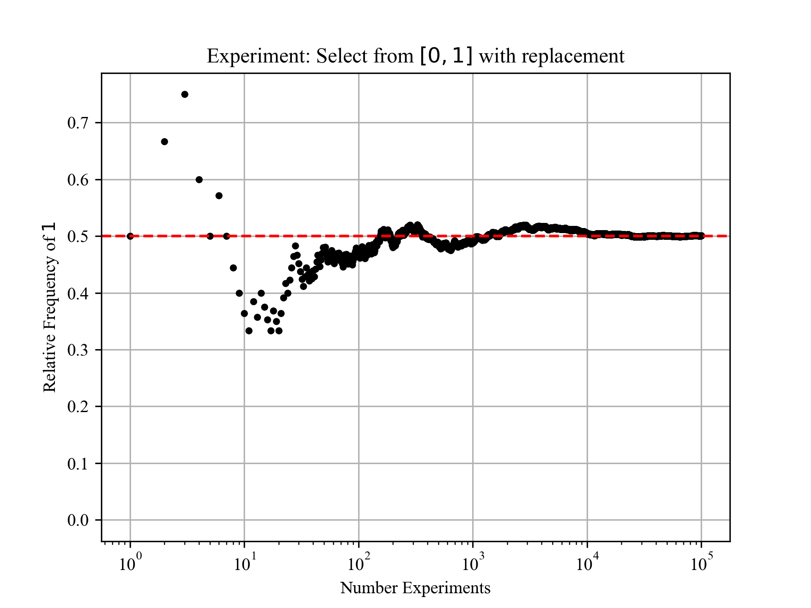
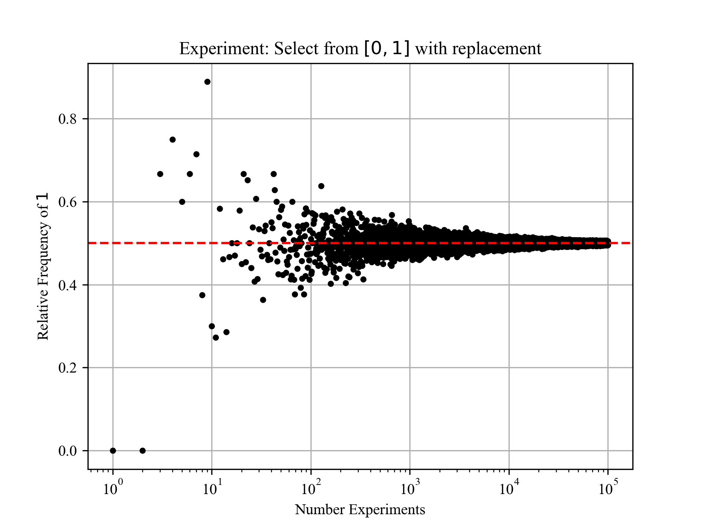
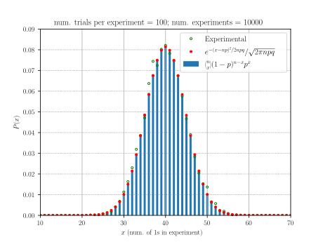

# HW 1

Due Thursday, September 3rd at 11:59 pm.

1. Save your answers in a GitHub repository named `stats`. Under `Setting` in the GitHub repository, set me (`rweigel`) as a collaborator.
2. Save your answers in the following format:
   1. Save code as `HW1_X.ext`, where `X` is the problem number and `ext` is the extension (e.g., `py` or `m`).
   2. Save scanned hand-written answers as `HW1_X.pdf`. Use a scanner app to create the document (don't take a photo and convert it to PDF).
   3. Save plots as `HW1_X.png`. If there are multiple plots for a problem, save them as `HW1_Xa.png`, `HW1_Xb.png`
3. Guess the relative frequency that instructions 1. and 2. above are followed precisely.

If you have difficulty with any of the above, we can discuss it at the end of class.

## Objective Interpretation of Probability

The _objective interpretation of probability_ is that the the probability of event $A$ is the limit of the relative frequency of $A$, $R_f=n(A)/n$, as the number of experiments, $n$, used to compute the relative frequency approaches $\infty$:

$$P(A) = \lim_{n\rightarrow \infty}\frac{n(A)}{n}$$

The following program computes the relative frequency of heads for an experiment of $n$ tosses where a zero or 1 is randomly selected with equal probability. Each experiment corresponds to a list of $n$ heads or tails.

1\.

Save your code as `HW1_1.py`. Save your plot as `HW1_1.png`.

Modify this program so that it computes the relative frequency for trials of size $n=1, 2, ..., 1000$ and plot $R_f$ vs $n$. See also Figure 2.2 of [Devore](https://drive.google.com/file/d/1MB1aYqKonKjNiSYy1vNWMqm6MZqRuMe6/view?usp=drive_link★★★★remove★★★★).

```python
import random

a = [0, 1]

# Experiment: Randomly select an element from the list a
result = random.choice(a)

# Repeat the experiment n times
n = 2
results = []
for exp in range(1, n+1):
  result = random.choice(a)
  results.append(result)

print(f"n = {n} experiments:")
print(f"  Results: {results}")
# rf = relative frequency
print(f"  rf(0) = {results.count(0) / n}")
print(f"  rf(1) = {results.count(1) / n}")
```

2\. For a trial of size $n=3$, how many possible outcomes are there? That is, how many elements are in the sample space? (You do not need to list them.) Put your answer in a comment in in `HW1_1.py`.

3\. (590 only)

Modify this program so a loop is not required by using a NumPy function. Save your answer in `HW1_1.py`.

4\.

In class, I will raise the following questions (you don't need to turn anything in):

* How would you characterize the decreasing variation around $0.5$ as a function of $n$? What calculation would you do and what plot would you make?

* Suppose that you wanted to know the probability of getting three heads in $n=3$ tosses _and_ you don't know the formula for computing this. How you you use a computer program to _estimate_ this probability?

<details>
<summary>Answer</summary>
See [solns/HW1_1.py](https://github.com/rweigel/stats/tree/main/solns). Problem is solved with and without using NumPy.



There is another way to answer this question. You can perform independent experiments of size $n=1, 2, ...$ and report the relative frequency for each independent experiment. The result is shown in the following plot.



</details>

## Random Walk Simulation

A random walk is a process analogous to flipping a fair coin. An example in physics is a cylinder constrained to move in one dimension being struck by air particles (and the cylinder moves without friction). Each strike sends the cylinder a small step to the left or right. The probability of a step to the left is the same as that of a step to the right. See also [Chapter 1 of Kittel and Kroemer](http://www.fulviofrisone.com/attachments/article/413/Kittel%20-%20Thermodynamics.pdf) for a description in the context of statistical physics.

Suppose we want to know the probability that after three strikes, the cylinder is one step the right of its initial position using a simulation (we will cover an exact answer later).

We could do an experiment where we randomly select values of $-1$ or $1$ with equal probability using `random.choice([-1, 1])` three times (`np.random.choice()` can also be used for efficiency). A result could be `[1, 1, -1]`. The final position after these steps is `sum([1, 1, -1]) = 1`. To compute the probability that the final position is $1$, we can repeat this experiment many times and count the number of times the final position is $1$.

1. How many possible step configurations are possible? That is, what is the sample space of the experiment of taking three steps to right or left, with equal probability for each direction?
2. Write a program for a simulation that gives an estimate the probability that the cylinder is one step to the right of its initial position after three steps.

Save your code in a file named `HW1_2.py`.

<details>
<summary>Answer</summary>
1. $2^3=8$.

2. See [HW1_2.py](https://github.com/rweigel/stats/tree/main/solns), which has the following output.

   ```
   From 10000 experiments:
     P(sum = -3) = 0.1264
     P(sum = -2) = 0.0
     P(sum = -1) = 0.3649
     P(sum =  0) = 0.0
     P(sum =  1) = 0.3782
     P(sum =  2) = 0.0
     P(sum =  3) = 0.1305
   ```
</details>

## Sample Space

1. An experiment involves tossing a coin 3x. What is the sample space of this experiment?
2. How many of the outcomes in the sample space had two heads? 
3. Define event $A$ to be that the experiment yields two heads. Define event $B$ as the experiment yielding two tails. What is $A \cup B$ and $A \cap B$?

Save your answer in a file named `HW1_3.pdf`.

<details>
<summary>Answer</summary>

1. The sample space has 8 elements ($2^3$). This list can be found using a tree diagram as shown below.

    ```
            H       HHH
        H -
            T       HHT
    H -        
            H       HTH
        T -
            T       HTT

            H       THH
        H -
            T       THT
    T -        
            H       TTH
        T - 
            T       TTT

    ```
2. $3$ by inspection of the table above. Also, suppose that we have three unique coins $T$, $H_1$, and $H_2$. There are $3!$ unique permutations. If we drop the subscripts, then the number of unique permutations is divided by 2. So $3!/2=3$.

3. By inspection of the list from 1., $A \cup B = 6$ and  $A \cap B = \emptyset$.

In the above, I assumed "experiement yields two heads" to mean "the experiment yielded exactly two heads" and not "the experiement yielded two or more heads".
</details>

## Law of Addition and Set Notation

Suppose 55\% of people exercise and 45\% drink alcohol. Also, 70\% do at least one of these.

What is the probability that a randomly selected person:
1. exercises and drinks alcohol?
2. does not do at least one of the two activities?

Use a Venn diagram (or any visual method) in the way that was used in class to demonstrate your answers.

Save your answer in a file named `HW1_4.pdf`.

<details>
<summary>Answer</summary>

Given: $P(E) = 0.55$, $P(A) = 0.45$, and $P(E\cup A) = 0.7$

1. $P(E \cap A) = P(E) + P(A) - P(E \cup A) = 0.3$
2. $P\big( (E \cup A)' \big) = 1 - P(E \cup A) = 1 - 0.7 = 0.3$
</details>

# HW 2

Due Thursday, September 10th at 11:59 pm.

## Bayes' Rule

2\% of the population has cancer. A screening test claims cancer in people with cancer 80\% of the time and it claims cancer in people without cancer 9.6\% of the time.

You take a test and it claims cancer.

1. What is actual probability that you have cancer?
2. Why is this answer different from the answer to Quiz 1?

<details><summary>Answer</summary>
1. $\simeq 0.145$

   $$P(C|T^+) = \frac{ P(T^+|C)P(C)}{P(C)P(T^+|C) + P(C')P(T^+|C')}$$

   $$P(C|T^+) = \frac{0.02\cdot 0.8}{0.02\cdot 0.8 + 0.98\cdot 0.096}\simeq 14.5{\%}$$

   See also a [solution using a visual method](https://docs.google.com/spreadsheets/d/1a3ty9V5bsDWKugk02zNPkO8LDG5FKQ-Mzs_Cxc-_S5o/edit?gid=1074592884#gid=1074592884)


2. In Quiz 1, the rate of false detection was 20\%. In this problem, the rate is lower, 9.6\%. The difference in the calculation is in bold below.

   Quiz 1 solution:

   $$\frac{0.02\cdot 0.8}{0.02\cdot 0.8 + 0.98\cdot \mathbf{0.2}}\simeq 7.5{\%}$$

   This problem:

   $$\frac{0.02\cdot 0.8}{0.02\cdot 0.8 + 0.98\cdot \mathbf{0.096}}\simeq 14.5{\%}$$

   To see this more clearly, re--write the denominator

   $$\frac{0.02\cdot 0.8}{0.02\cdot 0.8(1 + \frac{0.98}{0.8\cdot 0.2}\cdot P(T^+|C'))}$$
   
   This simplifies to
   
   $$\frac{1}{1 +6.1\cdot P(T^+|C')}$$
   
</details>

Save your answer as `HW2_1.pdf` and upload it to your GitHub account.

## Counting Problems

Find a problem in a textbook involving permutations and/or combinations (cite your source unless you made up the problem) and provide a solution. Be prepared to explain the problem and its solution in class.

Try to find a problem that is challenging and find a way to explain your solution in multiple ways (e.g., table, tree diagram, code, etc.).

If the problem is complex and difficult to explain, make up a similar but simpler problem first so that the full problem's solution is easier to understand.

Save your answer as `HW2_2.pdf` and upload it to GitHub. I'll randomly select students to explain their answer at the whiteboard during class.

## Expectation Values

The binomial probability mass function is 

$$P(X=x)={n \choose x}p^x(1-p)^{n-x}$$

(sometimes the simpler but equivalent notation $P(x)$ is used).

The expectation value of $h(X)$ is

$$E[h(X)] = \sum_{\text{all vals of }X} h(x) p(x)$$

1. By hand, compute $E[X]$ when $n=3$ and $p=1/2$. That is, compute $E[h(X)]$ when $h(X)=X$.

2. (590 only) Prove that $E[X]=np$.

   Hint: Rewrite so that you can use the fact that
   
   $$(p+q)^n = \sum_{x=0}^n{n\choose x} p^x q^{n-x} = 1$$
   
   because $p+q=1$.

<details><summary>Answer</summary>
1.

$$E[X] = \sum_{x=0}^3 x P(x) = \sum_{x=0}^3 x {n\choose x} p^{1/2}q^{1/2}$$

$$E[X] = 0\cdot \frac{3!}{0!3!}\left(\frac{1}{2}\right)^3 + 1\cdot\frac{3!}{1!2!}\left(\frac{1}{2}\right)^3 + 2\cdot\frac{3!}{2!1!}\left(\frac{1}{2}\right)^3 + 3\cdot\frac{3!}{3!0!}\left(\frac{1}{2}\right)^3$$

$$E[X] = 0 + 3\left(\frac{1}{2}\right)^3 + 2\cdot 3\left(\frac{1}{2}\right)^3 + 3\cdot 1\left(\frac{1}{2}\right)^3$$

$$E[X] = 0 + 3/8 + 6/8 + 3/8 = 12/8 = 1.5$$

2.

$$P(X=x)={n \choose x}p^x(1-p)^{n-x}$$

$$E[X] = \sum_{\text{all vals of }X} x {n \choose x}p^x(1-p)^{n-x} = \sum_{n=0}^n x {n \choose x}p^x(1-p)^{n-x}$$

Expanding the sum gives

$$E[X] = (1)\frac{n!}{1!(n-1)!}p^1q^{n-1} + (2)\frac{n!}{2!(n-2)!}p^2q^{n-2} + ... + (n)\frac{n!}{n!0!}p^nq^{0}$$

We are told that the answer is $np$, so factor it out.

$$E[X] = np\left[(1)\frac{(n-1)!}{1!(n-1)!}p^0q^{n-1} + (2)\frac{(n-1)!}{2!(n-2)!}p^1q^{n-2} + ... + (n)\frac{(n-1)!}{n!0!}p^{n-1}q^{0}\right]$$

Now simplify by combining the terms $(1), (2), ...$ with the first factorial in the denominators.

$$E[X] = np\left[\frac{(n-1)!}{1!(n-1)!}p^0q^{n-1} + \frac{(n-1)!}{1!(n-2)!}p^1q^{n-2} + ... + \frac{(n-1)!}{(n-1)!0!}p^{n-1}q^{0}\right]$$

Let $m=n-1$. Then

$$E[X] = np\left[\frac{m!}{1!m!}p^0q^{m} + \frac{m!}{1!(m-1)!}p^1q^{m-1} + ... + \frac{m!}{m!0!}p^mq^{0}\right]$$

The term in brackets is almost what we need. The only problem is the $1!$ term should be $0!$. However, $1!=0!$, so we have

$$E[X] = np\left[\frac{m!}{0!m!}p^0q^{m} + \frac{m!}{1!(m-1)!}p^2q^{m-1} + ... + \frac{m!}{m!0!}p^mq^{0}\right]$$

$$E[X] = np\sum_{i=0}^m{m \choose x}p^x(1-p)^{m-x}$$

Using the identiy given as a hint gives the answer.

$$E[X] = np(p+q)^m = np(1)^m=np$$
</details>

Save your answer as `HW2_3.pdf` and upload to GitHub.

## Binomial Distribution

In Devore 3.4, an experiment that conforms to the Bernoulli trials constraints is referred to as a "Binomial Experiment."

A Bernoulli trial has 

* two possible outcomes;
* the probability of "success" is $p$ and the probability of "failure" is $1-p$;
* these probabilities don't change

For $n$ trials, the probability of $x$ successes is given by the Binomial distribution:

$$P(x)={n \choose x}p^x(1-p)^{n-x}$$

1. Use a random number generator to simulate 10,000 Binomial experiments with $n=100$ and $p=0.4$ and plot $P(x)$. That is, execute 10,000 experiments in which the experiment is selecting 100 values from the list `[0, 1]` with the probability of selecting a $1$ being $p$. On the same axes, plot $P(x)$ expected from the equation above using the given $n$ and $p$. 

2. In the next class, I'll show that as $n\rightarrow \infty$, and for $x \ll np$,

   $$P(x)\rightarrow \frac{1}{\sqrt{2\pi n p q}} e^{-(x-np)^2/2npq}$$

    where $q \equiv 1-p$ (the symbol $\equiv$ means "is defined to be").

    Plot this $P(x)$ on the same axes as $P(x)$ in part 1.

Save your code as `HW2_4.py` and the plot as `HW2_4.png`.

4. Discussion questions for class (you do not need to turn anything in for this).
   * What is an interpretation of the meaning of the constraint $x \ll np$?
   * You are given a list of $10,000$ `0`s and `1`s and a claim that the values were generated by Bernoulli trials. How would you test this claim?

**Partial Answer**



# HW 3

Due on Friday, September 11th at noon. (Extra time because I posted late.)

## Poisson Distribution

The Poisson distribution can be derived as a limit of the Binomial distribution; see Devore 3.6 and your class notes.

If

1. in a sufficiently short amount of time, $\Delta t$, only 0 or 1 event can occur (two or more simultaneous events are impossible); and
2. the probability of exactly one event occurring in $\Delta t$ is equal to $\lambda \Delta t$, where $\lambda$ is a constant.

the probability of $x$ events occurring in the time interval $t=n\Delta t$ is

$$P(x)=\frac{(\lambda t)^x e^{-\lambda t}}{x!}$$

for sufficiently large $n$. Said another way, if you measure events with a recording device, choose the sampling rate of the recording device to be small enough that two events never occur in the same $\Delta t$, and let the device record for a time of $t=n\Delta t$, the probability of recording $x$ events in a recording time of $t$ is given by the above formula. To estimate $\lambda$, one can use $p$ using $x/n$ and $\lambda = p/\Delta t$.

Use a random number generator to create a dataset that simulates the following result. Every hour, the number of x-ray flares is tabulated. It is found that over $1,000$ days, $900$ flares occurred so that the average probability of a flare in a given hour is $900/(1000\cdot 24)$.

On previous homework problems, many of you have used `math.choice()` or `np.random.choice()` to create create a value or values by drawing a `0` with a probability `p` and a `1` with probability `q`. There is an alternative that I recommend from now on: [np.random.binomial()](https://numpy.org/doc/2.1/reference/random/generated/numpy.random.binomial.html).

1. Plot

   a. $P_S(x)$, the probability of $x$ flare events occurring **per day** for the **S**imulated dataset,

   b. $P_P(x)$ expected from the equation above using the value of $\lambda$ computed based on the **P**oisson distribution equation above, and

   c. $P_B(x)$ expected from the **B**inomial distribution, from which the Poisson distribution was derived.

   Note that in class, we computed by hand $P_P(2)$ and $P_B(2)$, so use these values to check your plots for b. and c.

2. From your dataset, derive a new dataset, the time between flares, and plot a histogram of the time between flares.

Save your code as `HW3_1.py` and the plot as `HW3_1.png`. Spend time thinking about the label axes, title, legend, colors, and annotations. As discussed, you want to have enough detail on the plot so that a reader can start to make interpretations without having to read or hear a long description. 

Be prepared to justify any differences between the three cases in class.

## Law of Large Numbers

The Law of Large Numbers tells us, roughly, that as $n\rightarrow \infty$ the sample average defined by

$$\overline{X}\equiv\frac{1}{n}\sum_{i=1}^n X_i$$

will be near the population average $\mu$ with a given probability. Given $n$ samples from a population, we don't expect $\overline{X}$ to exactly match $\mu$. The Law of Large Numbers allows us to make a statement about the difference $\overline{X}-\mu$. Specifically, the statement involves the probability that $|\overline{X}-\mu|$ is smaller that a certain value.

To answer the following questions, you do not need to understand the Law of Large Numbers. However, if you are interested, more formal definitions and proofs are given in [Orloff and Bloom, Reading 6b](https://ocw.mit.edu/courses/mathematics/18-05-introduction-to-probability-and-statistics-spring-2014/readings/MIT18_05S14_Reading6b.pdf), [DeGroot, Chapter 6](https://drive.google.com/file/d/1FtvQS1303P_GA4aM3ZbQIGPbThTXmfpq/view?usp=sharing★★★★★remove★★★★★), and [Rozanov, p 69](https://drive.google.com/file/d/1ROIF0mLquDcoMGJtj5Oz93On_ATCcfmc/view?usp=drive_link★★★★★remove★★★★★). Note that there the definition of the law of large numbers is not consistent in these references.

###

1. Draw $n=100$ values from a population of Gaussian-distributed numbers with mean $\mu=0$ and standard deviation $\sigma=1$.
2. Compute $\overline{X}$.
3. Repeat 1. and 2. $10,000$ times and plot a probability density function of $\overline{X}$.

Save your program as `HW2_3_1.py` and the associated plot as `HW2_3_1.png`. When I execute your program, I should see a histogram with _**the average of**_ $\overline{X}$ displayed in the title and it should write the file `HW2_3_1.png`.

###

1. For $n=100$, what fraction of the $10,000$ $\overline{X}$s were in the range $[-0.01, 0.01]$?
2. How does the fraction depend on $n$? <sup>+</sup>
3. For $n=100$, what is the range $[-\epsilon,\epsilon]$ for which $99$% of the $10,000$ $\overline{X}$s fall in? 
4. How does $\epsilon$ depend on $n$? <sup>+</sup>
5. How does your answer change if the distribution changes (that is, if you draw values from a distribution other than Gaussian)?

<sup>+</sup> You may explain this using one or more of words, tables, and plots.

Save your program as `HW2_3_2.py`. Save your answers in a file named `HW2_3_2.pdf`, `HW2_3_2.txt`, or `HW2_3_2.md`. 

**590 students**: Be prepared to discuss in class at the whiteboard how this experiement is related to the Weak Law of Large Numbers and the Central Limit Theorem. You'll need to find resources that define and explain these.

## Sampling Distribution

A **statistic** is a quantity that is calculated from a sample of a population. An example is the sample mean, usually denoted as $\overline{X}$.

A **point estimate** is a statistic that is compute from a sample that is an estimate of a population parameter. If the population mean is $\mu$, then we use $\overline{X}$ as a point estimate of $\mu$.

When we draw a sample from a population and compute a point estimate such as $\overline{X}$, we won't get exactly $\mu$. Each sample will vary a bit. A **sampling distribution** characterizes the distribution of values (histogram or probability distribution) of $\overline{X}$ that we would get if we took many independent samples and computed many $\overline{X}$s.

We compute error bars based on the sampling distribution of point estimates.

For these problems, I recommend using

```
mu, sigma = 0, 0.1 # mean and standard deviation
sample = np.random.normal(mu, sigma, n)
```

Optionally, if you read through the documentation for [`np.random.normal()`](https://numpy.org/doc/2.1/reference/random/generated/numpy.random.normal.html), you should see that you can create a $(n, ne)$ matrix with columns that correspond to a sample and rows that correspond to the values within a sample. If this is used, you can avoid using a `for` loop.

### Sampling Distribution of $\overline{X}$

1. Draw $n=10$ values from a normal distribution with $\mu=0$ and $\sigma^2=1$ and compute $\overline{X}$. Repeat this 10,000 times and plot the probability density function of $\overline{X}$. On the plot title, show the average value of the 10,000 $\overline{X}$ values.

2. Of the 10,000 $\overline{X}$ values, what fraction was above $1/\sqrt{n}$? Add this fraction to the title of your previous plot.

3. (590 only) Think of a numerical experiment that you can perform to determine how the fraction computed in part 2. depends on $n$. Create a plot that demonstrates the result of your experiment.

4. (590 only) Repeat parts 1. and 2. using a uniform distribution in the range $[0,1]$ (use the `np.random.uniform()` function).


### Sampling Distribution of $S_b^2$

You may have guessed that if a population of $N$ values has a variance of $\sigma^2$, where

$$\sigma^2=\frac{1}{N}\sum_{i=1}^N(x_i-\mu)^2$$

that a reasonable point estimate of $\sigma^2$ for a sample of $n$ values from the population is

$$S_b^2=\frac{1}{n}\sum_{i=1}^n(x_i-\overline{X})^2$$

To determine if this is the case, sample $n=10$ values from a normal distribution with $\mu=0$ and $\sigma=1$, computing $S_{b}^2$, and repeating $N_e=10,000$ times. Plot the histogram of the $10,000$ $S_{b}^2$ values, and, in the title, display the average and variance of the $10,000$ $S_{b}^2$ values. Save your code as `HW3_3_2.py` and plot as `HW3_3_2.png`.

Draw $n=10$ values from a normal distribution with $\mu=0$ and $\sigma^2=1$ and compute  $S_{b}^2$. Repeat this 10,000 times and plot the probability density function of $S_{b}^2$.
On the plot title, show the average value of the 10,000 $S_{b}^2$ values (it should be slightly less than $\sigma^2$).

The motivation for the subscript $b$ in $S_b^2$ is that $S_b^2$ is a **biased estimator** or $\sigma^2$. This concept will be discussed in the next class.

# Quiz 1

Study the cab example in the [Bayes' rule section of the notes](notes.html).

At the start of the Sept. 3rd class, I will ask you to solve a similar problem without notes. This will be the first quiz. This quiz will not be graded. If you attend class, you'll get full credit.

Problem given:

* 2\% of the population has cancer
* A screening test for cancer is correct 80\% of the time.
* Your screening test claimed cancer.

What is the probability that you actually have cancer?

<details>
<summary>Answer</summary>

$$\frac{16}{196+16} = \frac{0.02\cdot 0.8}{0.02\cdot 0.8 + 0.98\cdot 0.2}\simeq 7.5{\%}$$

where the first fraction is determined using Method II in the cab problem and the second using Method III.
</details>

# Quiz 2

The quiz on Sept 10th will be on of the problems on counting that I covered in class (recall that there were three types: product rule, permutations, and combinations). The quiz will is closed book, closed notes, and closed computer and will be graded.

# Quiz 3

The quiz on September 17th will involve sample code that uses `np.random.normal()` and other basic functions that have been used on homework problems to do a calculation. You will be expected to explain what the program is doing. The objective of this quiz is to ensure that you understand and can explain code that has been used in your solutions and my solutions.

Examples

1. Given

    ```python
    import numpy as np
    sample = np.random.normal(0, 1, 10)
    print(np.mean(sample))
```

    1. How many elements are in `sample`?
    2. Modify this program so that you repeat the calculation of `sample` 10,000 times and store the mean of each sample in an `list` or `np.array`.


2. What is printed when the following is executed?

    ```python
    import numpy as np
    arr = np.array([[1, 1, 1], [2, 2, 2]])
    print(np.mean(arr, axis=0))
    print(np.mean(arr, axis=1))
    ```

3. Given

    ```python
    import numpy as np
    xbars = []
    nbig = 0
    for i in range(0, 1000):
      sample = np.random.normal(0, 1, 10)
      xbar = np.mean(sample)
      xbars.append(xbar)
      if xbar > 0.5:
        nbig = nbig + 1
    print(nbig)
```

    1. Modify this program so that it prints the number of times `|xbar| > 0.1`.
    2. Given the list `xbars`, write a single command that prints the number of elements that are above `0.5`. That is, suppose the `if` statement was not used. What would you write in place of `print(nbig)` to get the same printed value.