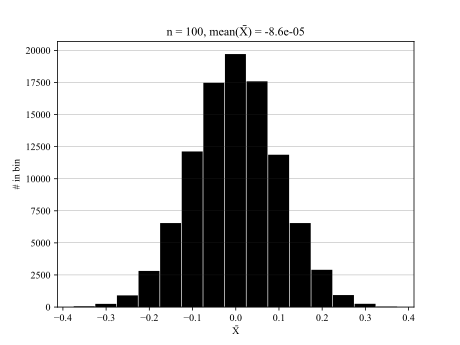
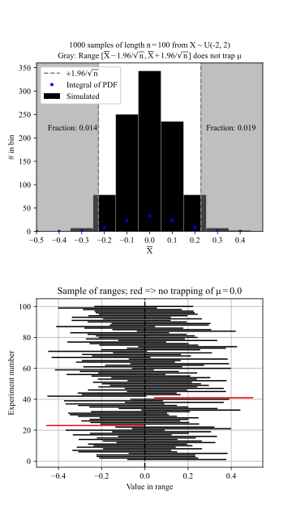

# HW 1

Due Thursday, January 30th at 11:59 pm.

1. Save your answers in a GitHub repository named `astrostats`. Under `Setting` in the GitHub repository, set me (`rweigel`) as a collaborator.
2. Save your answers in the following format:
   1. Save code as `HW1_X.ext`, where `X` is the problem number and `ext` is the extension (e.g., `py` or `m`).
   2. Save scanned hand-written answers as `HW1_X.pdf`. Use a scanner app to create the document (don't take a photo and convert it to PDF).
   3. Save plots as `HW1_X.png`. If there are multiple plots for a problem, save them as `HW1_Xa.png`, `HW1_Xb.png`
3. Guess the relative frequency that instructions 1. and 2. above are followed precisely.

If you have difficulty with any of the above, we can discuss it at the end of class.

## Objective Interpretation of Probability

The _objective interpretation of probability_ is that the the probability of event $A$ is the limit of the relative frequency of $A$, $n(A)/n$ as the number of experiments, $n$, used to compute the relative frequency approaches $\infty$:

$$P(A) = \lim_{n\rightarrow \infty}\frac{n(A)}{n}$$

The following program computes the relative frequency of heads for an experiment where a zero or 1 is randomly selected.

Modify this program so that it computes the relative frequency for $n=1, 2, ..., 1000$ and plot $\text{rf}$ vs $n$. See also Figure 2.2 of Devore.

```python
import random

a = [0, 1]

# Experiment: Randomly select an element from the list a
result = random.choice(a)

# Repeat the experiment n times
n = 2
results = []
for exp in range(1, n+1):
  result = random.choice(a)
  results.append(result)

print(f"n = {n} experiments:")
print(f"  Results: {results}")
# rf = relative frequency
print(f"  rf(0) = {results.count(0) / n}")
print(f"  rf(1) = {results.count(1) / n}")
```

In class, I will raise the following questions (you don't need to answer this on what you turn in):
* Can `np.random.choice()` be used to simplify the program?
* How would you characterized the decreasing variation around $0.5$ as a function of $n$? What calculation would you do and what plot would you make?
* In class, I generated a plot by tossing a coin $n$ times and then recording the relative frequency for that $n$. I did this for $n=1, .... 1000$, so I did $1000$ independent coin tossing trials. Another student tossed a coin $1000$ times (one trial) and used the first $n$ numbers to compute the relative frequency for that $n$ (it also appears that this is how [Devore](https://drive.google.com/file/d/1szqKzodtocD8sMhvx7SzGJgqG-PNd2vb★★★★remove★★★★) generated Figure 2.2). Be prepared to discuss the difference in interpreation of the results from the two approaches.

**Solution**

See [HW1_1.py](https://github.com/rweigel/stats/tree/main/solns). Problem is solved with and without using NumPy.


Comments on in--class discussion questions:

* How would you characterized the decreasing variation around $0.5$ as a function of $n$? What calculation would you do and what plot would you make?

  **Answer**: We can repeat the process used to create the figure $N$ times. Then we could compare the histogram of the values at, say, $n=100$ and $n=1000$ and characterized the difference in their variation by the histogram's standard deviation.

* In class, I generated a plot by tossing a coin $n$ times and then recording the relative frequency for that $n$. I did this for $n=1, .... 1000$, so I did $1000$ independent coin tossing trials. Another student tossed a coin $1000$ times (one trial) and used the first $n$ numbers to compute the relative frequency for that $n$ (it also appears that this is how [Devore](https://drive.google.com/file/d/1szqKzodtocD8sMhvx7SzGJgqG-PNd2vb★★★★remove★★★★) generated Figure 2.2). Be prepared to discuss the difference in interpreation of the results from the two approaches.

  **Answer**: In the second method, the result at $n+1$ depends on the result at $n$: $P_H^{n+1} = \frac{n}{n+1}P_H^n + \frac{x}{n+1}$, where $x=0$ or $1$. My opinion is that the plot associated with this method appears artifically smooth. 

**Comments on Student Submissions**

Please follow submission instructions. I am able to look at solutions in more detail if I don't have to spend time finding things or running your code to see the results.

## Sample Space

1. An experiment involves tossing a coin 3x. What is the sample space of this experiment?
2. How many of the outcomes in the sample space had two heads? 
3. Define event $A$ to be that the experiment yields two heads. Define event $B$ as the experiment yielding two tails. What is $A \cup B$ and $A \cap B$?

**Answer**

1. The sample space has 8 elements ($2^3$). This list can be found using a tree diagram as shown below.

    ```
            H   => HHH
        H -
            T   => HHT
    H -        
            H   => HTH
        T -
            T   => HTT

            H   => THH
        H -
            T   => THT
    T -        
            H   => TTH
        T -
            T   => TTT

    ```
2. $3$ by inspection of the table above. Also, suppose that we have three unique coins $T$, $H_1$, and $H_2$. There are $3!$ unique permutations. If we drop the subscripts, then the number of unique permutations is divided by 2. So $3!/2=3$.

3. By inspection of the list from 1., $A \cup B = 6$ and  $A \cap B = \emptyset$.

In the above, I assumed "experiement yields two heads" to mean "the experiment yielded exactly two heads" and not "the experiement yielded two or more heads".

## Set Notation

The law of addition for any three events $A$, $B$, and $C$, is

$P(A\cup B\cup C) = P(A) + P(B) + P(C) - P(A\cap B) - P(A\cap C) - P(B\cap C) + P(A\cap B\cap C)$

Provide a visual way of justifying this. Be prepared to present your answer in class.

**Answer**


From the figure on the left, we can count all of the dots that are in $A$ or $B$ (or both) by counting all the dots in $A$ and adding this to the number of dots in $B$ and then subtracting the dots that were counted twice, which are shown highlighted. The result is

$n(A\cup B) = n(A) + n(B) - n(A\cap B)$

(Dividing by $N$ and taking the limit gives probability.)

The figure on the right shows a new region, $C$. To also count dots in $C$, we add all of the dots in $C$, $n(C)$ and then remove double--counted dots.

The region of the two left--most highlighted dots is $n(A\cap C)$ must be subtracted out. The region of the right--most highighted dot must be subtracted out, but $n(B\cap C)$ includes the middle highlighted dot, so $n(A\cap B)-n(A\cap B\cap C)$ must be subtracted. Thus

$n(A\cup B) = n(A) + n(B) - n(A\cap B) + \Big[n(C) - n(A\cap C) - n(B\cap C) + n(A\cap B\cap C)\Big]$

or, dividing by $N$ and re--arranging,

$P(A\cup B\cup C) = P(A) + P(B) + P(C) - P(A\cap B) - P(A\cap C) - P(B\cap C) + P(A\cap B\cap C)$

The general formula for an arbitrary number of regions is given on [p 99 of Feller](https://drive.google.com/file/d/1lJv7o3TPLyZK7r5ad1IDVtkcaMpuaf5N/view?usp=drive_link★★★★★remove★★★★★)

## Law of Addition and Set Notation

Suppose 55\% of people exercise and 45\% drink alcohol. Also, 70\% do at least one of these.

What is the probability that a randomly selected person:
1. exercises and drinks alcohol?
2. does not do at least one of the two activities?

Use a Venn diagram (or any visual method) in the way that was used in class to demonstrate your answers.

**Answer**

Given: $P(E) = 0.55$, $P(A) = 0.45$, and $P(E\cup A) = 0.7$

1. $P(E \cap A) = P(E) + P(A) - P(E \cup A) = 0.3$
2. $P\big( (E \cup A)' \big) = 1 - P(E \cup A) = 1 - 0.7 = 0.3$

## Set Operations in Python

My basic [Python notes](python.html#sets) has examples of methods that can be used for sets in Python.

In class, we solved the Visa/Mastercard problem using the Law of Addition and also a Venn Diagram. We can also solve this using Python set operations. We were given that the probability of a student having a Visa is 0.5. So we suppose there are 100 students and students 1 through 50 have a Visa: $V =$ {$1, 2, ..., 50$}. We were given that the probability of a student having a MasterCard is 0.4 and also the probability that they have both is 0.25. We can codify this by saying students 26 through 65 have a MasterCard: $M =$ {$26, 27, ..., 65$}. The remaining students we label as $X =$ {$66, 67, ..., 100$}.

Generate sets `V`, `M`, and `X` in Python. They use set operations and the `len()` function to answer the following.

1. What is the probability that the selected individual has at least one of the two types of cards.

2. What is the probability that the selected individual has neither card type?

3. Find the probability that the student has a Visa but not MasterCard.

(Hint: For 2. and 3., you will need to create a set $M'$ using the the sample space $S={1, 2, ..., 100}$, $M$, and a set operation.)

**Solution**:

See [HW1_5.py](https://github.com/rweigel/stats/tree/main/solns). Problem is solved with and without using NumPy, which prints

```
1. 0.65 = Prob. selected student has at least one of the two types of cards
2. 0.35 = Prob. selected student has neither card type
3. 0.25 = Prob. selected student has a Visa but not MasterCard
```

## Random Walk Simulation

A random walk is a process analogous to flipping a fair coin. An example in physics is a cylinder constrained to move in one dimension being struck by air particles (and the cylinder moves without friction). Each strike sends the cylinder a small step to the left or right. The probability of a step to the left is the same as that of a step to the right. See also [Chapter 1 of Kittel and Kroemer](http://www.fulviofrisone.com/attachments/article/413/Kittel%20-%20Thermodynamics.pdf) for a description in the context of statistical physics.

Suppose we want to know the probability that after three strikes, the cylinder is one step the right of its initial position using a simulation (we will cover an exact answer later).

We could do an experiment where we randomly select values of $-1$ or $1$ with equal probability using `random.choice([-1, 1])` three times (`np.random.choice()` can also be used for efficiency). A result could be `[1, 1, -1]`. The final position after these steps is `sum([1, 1, -1]) = 1`. To compute the probability that the final position is $1$, we can repeat this experiment many times and count the number of times the final position is $1$.

1. How many possible step configurations are possible? That is, what is the sample space of the experiment of taking three steps to right or left, with equal probability for each direction?
2. Write a program for a simulation that gives an estimate the probability that the cylinder is one step to the right of its initial position after three steps.

**Answer**:

1. $2^3=8$. See problem 1.2.1 and replace $H$ with $L$ (for left step) and $T$ with $R$ (for left step).

2. See [HW1_6.py](https://github.com/rweigel/stats/tree/main/solns), which has the following output.

   ```
   From 10000 experiments:
     P(sum = -3) = 0.1264
     P(sum = -2) = 0.0
     P(sum = -1) = 0.3649
     P(sum =  0) = 0.0
     P(sum =  1) = 0.3782
     P(sum =  2) = 0.0
     P(sum =  3) = 0.1305
   ```

# HW 2

Due Thursday, February 6th at 11:59 pm.

Save all files in your repository in the same directory as HW #1 (don't use subdirectories or branches).

## Permutations and Combinations

Find a problem in a textbook involving permutations and/or combinations (cite your source unless you made up the problem) and provide a solution. Be prepared to explain the problem and its solution in class.

Try to find a way to explain your solution in multiple ways (e.g., table, tree diagram, code, etc.).

If the problem is complex and difficult to explain, make up a similar but simpler problem first so that the full problem's solution is easier to understand.

Save your answer as `HW2_1.pdf`.

## Bayes' Rule

A cab was involved in a hit-and-run accident at night. Two cab companies, the Green and the Blue, operate in the city. You are given the following data:

   * 85% of the cabs in the city are Green and 15% are Blue. A witness identified the cab as Blue. The court tested the reliability of the witness under the circumstances that existed on the night of the accident and concluded that the witness correctly identified each one of the two colors 80% of the time and failed 20% of the time.

What is the probability that the cab involved in the accident was Blue rather than Green?  Use the two approaches (equation- and diagram- based) employed in the example problem related to the breast cancer problem covered in class.

Save your answer as `HW2_2.pdf`.

**590 Students**: Create a plot that answers the question: How does the answer depend on the witness's reliability (ability to correctly identify)? We will critique these plots with regard to how clearly they answer the question during class (I won't show the names of those who created the plot). Save your plot as `HW2_2.png`.

**Answer**


**Method 1**

Consider 1000 recreations of the indident in which 850 vehicles are Green and 150 vehicles are Blue. Based on a correct identification of 80\% the expected number for each possible witness claim is shown in the last column.

```
                        850*0.80 = 680 - Is Green, claims Green
       850 Are Green 
                        850*0.20 = 170 - Is Green, claims Blue
1000
                        150*0.80 = 120 - Is Blue, claims Blue
       150 Are Blue
                        150*0.20 = 30  - Is Blue, claims Green
```

We want to know the probability the cab is Blue when the witness claimed Blue. The number of times in the last column where the witness claimed Blue is $170+120$ (middle two rows). The number of times this claim is correct is $120$.

So the probability the cab is Blue given the witness claimed Blue is

$$P(B|W_B) = \frac{120}{120+170}\approx 0.41$$

**Method 2**

The following [spreadsheet](https://docs.google.com/spreadsheets/d/1a3ty9V5bsDWKugk02zNPkO8LDG5FKQ-Mzs_Cxc-_S5o/edit?usp=sharing) is an alternative visualization of the tree diagram of **Method 1**.


**Method 3**

To use Bayes' theorem, we start by writing the given probabilities

* $P(G) = 0.85$ (Probability a cab is Green)
* $P(B) = 0.15$ (Probability a cab is Blue)
* $P(W_B|B) = 0.80$ (Probability witness claims Blue when Blue)
* $P(W_B|G) = 0.20$ (Probability witness claims Blue when Green)

$$
P(B|W_B) = P(W_B|B)\frac{P(B)}{P(W_B)}
$$

The denominator is $P(W_B)=P(B)P(W_B|B) + P(G)P(W_B|G) = 0.15\cdot 0.80 + 0.85\cdot 0.20 = 0.12 + 0.17$. Thus,

$$
P(B|W_B) = 0.80\frac{0.15}{0.15\cdot 0.80 + 0.85\cdot 0.20} = \frac{0.12}{0.12 + 0.17}
$$

Multiplying the numerator and the denominator by $1000$ gives the same equation for **Method 1**.

$$
P(B|W_B) = \frac{120}{120 + 170} \approx 0.41
$$

A plot of $P(B|W_B)$ vs reliability is given below. If the witness is less than 50% reliably, $P(B|W_B)$ is less than the $P(B)$, meaning that the probability that they are correct is less than the fraction of cabs that are Blue; in this case, the witness testimony is not useful and a better estimate of the probability that the cab was Blue is the faction of Blue cabs in the city. What should the threshold for witness reliability be for "reasonable doubt" if the jury only had the witness testimony?

    

## Law of Large Numbers

The Law of Large Numbers tells us that as $n\rightarrow \infty$ the sample average defined by

$$\overline{X}\equiv\frac{1}{n}\sum_{i=1}^n X_i$$

will be near the population average $\mu$ with a given probability. Given $n$ samples from a population, we don't expect $\overline{X}$ to exactly match $\mu$. The Law of Large Numbers allows us to make a statement about the difference $\overline{X}-\mu$. Specifically, the statement involves the probability that $|\overline{X}-\mu|$ is smaller that a certain value.

To answer the following questions, you do not need to understand the Law of Large Numbers. However, if you are interested, more formal definitions and proofs are given in

* [Orloff and Bloom, Reading 6b](https://ocw.mit.edu/courses/mathematics/18-05-introduction-to-probability-and-statistics-spring-2014/readings/MIT18_05S14_Reading6b.pdf)
* [Bulmer, Chapter 6](https://drive.google.com/file/d/1IuANm_ZxtuY75c9Caguv3cdG8JbmkADi/view?usp=sharing★★★★★remove★★★★★)
* [DeGroot, Chapter 6](https://drive.google.com/file/d/1FtvQS1303P_GA4aM3ZbQIGPbThTXmfpq/view?usp=sharing★★★★★remove★★★★★)
* [Rozanov, p 69](https://drive.google.com/file/d/1ROIF0mLquDcoMGJtj5Oz93On_ATCcfmc/view?usp=drive_link★★★★★remove★★★★★)

**a**

1. Draw $n=100$ values from a population of Gaussian-distributed numbers with mean $\mu=0$ and standard deviation $\sigma=1$.
2. Compute $\overline{X}$.
3. Repeat 1. and 2. $10,000$ times and plot a histogram of $\overline{X}$.

Save your program as `HW2_3a.py` and the associated plot as `HW2_3a.png`. When I execute your program, I should see a histogram with _**the average of**_ $\overline{X}$ displayed in the title and it should write the file `HW2_3a.png`.

**Answer**

See [HW2_3a.py](https://github.com/rweigel/astrostats/blob/main/hws/HW2_3a.py).

From the following plot, it should be clear that when we draw $100$ values from a population with a mean of zero, the average of the $100$ values will not always be zero. The standard deviation appears to be approximately $0.1$, which is smaller than $\sigma$ by a factor of $10$.



**b**

1. For $n=100$, what fraction of the $10,000$ $\overline{X}$s were in the range $[-0.01, 0.01]$?
2. How does the fraction depend on $n$? <sup>+</sup>
3. For $n=100$, what is the range $[-\epsilon,\epsilon]$ for which $99$% of the $10,000$ $\overline{X}$s fall in?
4. How does $\epsilon$ depend on $n$? <sup>+</sup>
5. How does your answer change if the distribution changes (that is, if you draw values from a distribution other than Gaussian)?

<sup>+</sup> You may explain this using one or more of words, tables, and plots.

Save your program as `HW2_3b.py`. Save your answers in a file named `HW2_3b.pdf`.

**590 students**: Be prepared to discuss in class how this experiement is related to the Weak Law of Large Numbers.

**Answer**

See [HW2_3b.py](https://github.com/rweigel/astrostats/blob/main/hws/HW2_3b.py)

1. 7.6%
2. The following plot shows the dependence (four $n$ values were used). As $n$ increases, the standard deviation of the histogram of $\overline{X}$ decreases so that more of the distribution is in the range $[-0.01, 0.01]$. A fit was given because the scaling seemed to be a power law (for larger $n$, it won't be).

   
3. `[-0.258, 0.258]`
4. The following plot shows the dependence (four $n$ values were used).

   
5. In [HW2_3a.py](https://github.com/rweigel/astrostats/blob/main/solns/HW2_3a.py), there is a line with `np.random.uniform` commented out. Try running the code with it uncommented and notice that the histogram is still Gaussian--ish even though a uniform distribution was used for the $n$ $X$s.

## Central Limit Theorem

The Central Limit Theorem says that as $n\rightarrow\infty$, the sampling distribution of $\overline{X}\equiv\frac{1}{n}\sum_{i=1}^n X_i$ is a Gaussian with mean $\mu$ and standard deviation $\sigma/\sqrt{n}$. (A key limitation of this statement is that the limiting distribution is a delta function and the CLT does not tell us what $n$ is required to give use a sampling distribution that is Gaussian within some tolerance; the answer depends on the distribution of $X$. The statement also required $\sigma$ to be finite.)

Important: this theorem (usually) applies even if the distribution of the values used in computing $\overline{X}$ are not Gaussian--distributed (this statement assumes that $n$ is large enough that the sampling distribution of $\overline{X}$ is close enough to Gaussian so as not to affect our results).

With the Central Limit theorem, and if
* the sampling distribution of $X$ is not Gaussian, but $n$ is large enough so that the Gaussian approximation applies (this would need to be justified analytically or via simulation), or
* the sampling distribution of $X$ is Gaussian
 
we can make statements such as "I took a sample of $n$ values and computed $\overline{X}$. If I took many samples and computed many $\overline{X}s$, 95\% of the time the range $[\overline{X}-1.96\sigma/\sqrt{n},\overline{X}+1.96\sigma/\sqrt{n}]$ would include ("trap") $\mu$.

In the previous problem, you computed a histogram of $10,000$ $\overline{X}$. Based on the Central Limit Theorem

1. This histogram should be approximately Gaussian;
2. The mean of $\overline{X}$ should be approximately $\mu$, which is the population mean; and
3. This standard deviation of $\overline{X}$ should be approximately $\sigma/\sqrt{n}$, where $\sigma$ is the population standard deviation.
4. 95\% of the time the range $[\overline{X}-1.96\sigma/\sqrt{n},\overline{X}+1.96\sigma/\sqrt{n}]$ should include ("trap") $\mu$

Create one or two plots that demonstrate these points. Pay careful attention to your annotations. Save your code as `HW2_4.py` and plots as `HW2_4.png` (use subplots).

**Answer**

See [HW2_4.py](solns/HW2_4.py)




## Reading

Background reading on Discrete Probability Distributions: [Devore Chapter 3]((https://drive.google.com/file/d/1bN68ELL0DBrgVwbE0m74LPuTwoHqXw2M/view?usp=sharing★★★★★remove★★★★★)

Alternatives: [Bulmer Chapters 1 and 2](https://drive.google.com/file/d/1IuANm_ZxtuY75c9Caguv3cdG8JbmkADi/view?usp=sharing★★★★★remove★★★★★), [Bonamente Chapter 3](https://drive.google.com/file/d/1Z4uN1ReMXAUMZck_UmavM3lIGrbE1U-C/view?usp=sharing★★★★★remove★★★★★), [Rozanov Chapter 5](https://drive.google.com/file/d/1ROIF0mLquDcoMGJtj5Oz93On_ATCcfmc/view?usp=drive_link★★★★★remove★★★★★), [Larson Chapter 4](https://drive.google.com/file/d/1Cc65FWiptQLqtXiKHpB2JJDLe-dh7WtX/view?usp=drive_link★★★★★remove★★★★★) and [DeGroot Chapter 5.1-5.6](https://drive.google.com/file/d/1FtvQS1303P_GA4aM3ZbQIGPbThTXmfpq/view?usp=sharing★★★★★remove★★★★★).

# HW 3

Due Thursday, February 13th at 11:59 pm.

Save all files in your repository in the same directory as HW #1 (don't use subdirectories or branches).

In problem 1, a part is shown in a box that is due before class starts (this part is only graded as complete or incomplete). I want you to save your answers to these in a plain text file because it is easiest for me to cut and paste all answers into a single document.

Also, do the reading given in item 4. before class starts.

See [pmf.py](https://github.com/rweigel/stats/tree/main/notes/code) for suggesting on creating a plot of a probability mass function (aka discrete probability distribution function) in Python.

## Binomial Distribution

A Bernoulli trial has 

* two possible outcomes;
* the probability of "success" is $p$ and the probability of "failure" is $1-p$;
* these probabilities don't change

For $n$ trials, the probability of $k$ successes is given by the Binomial distribution:

$$P(k)={n \choose k}p^k(1-p)^{n-k}$$

In [Devore](https://drive.google.com/file/d/1szqKzodtocD8sMhvx7SzGJgqG-PNd2vb★★★★remove★★★★) 3.4, an experiment that conforms to the Bernoulli trials constraints is referred to as a "Binomial Experiment."

(As noted in class, sometimes we write $P(k; n,p)$ to indicate that we are interested in the function $P(k)$, which has parameters $n$ and $p$ that affect its shape. Also, I am using $k$ here, but in class, I used $x$; I think $k$ is a better choice because we usually think of $k$ as an integer and $x$ as a real number.)

1. Use a random number generator to simulate 10,000 Binomial experiments with $n=100$ and $p=0.4$ and plot $P(k)$. That is, execute 10,000 experiments in which the experiment is selecting 100 values from the list `[0, 1]` with the probability of selecting a $1$ being $p$. On the same axes, plot $P(k)$ expected from the equation above using the given $n$ and $p$. 

2. In the next class, I'll show that as $n\rightarrow \infty$, and for $k \ll np$,

    $$P(k)\rightarrow \frac{1}{\sqrt{2\pi n p q}} e^{-(k-np)^2/2npq}$$

    where $q \equiv 1-p$ (the symbol $\equiv$ means "is defined to be"). Plot this on the same axes as $P(k)$ in part 1.

3. Suppose $p$ follows the rule: "If two trials in a row are a success, the probability of success on the next trial is $0.44$; otherwise, the probability of success is $p=0.4$". Modify your code for 1. to do this, and plot the resulting $P(k)$ on the same axes as $P(k)$ in part 1.

Save your code as `HW3_1.py` and the plot as `HW3_1.png`.

> In a file named `HW3.txt`, provide brief answers to the following questions (post to your GitHub repository before class):
>
> 1. How is part 1. related to problem HW #1, problem 6?
> 1. What is an interpretation of the meaning of the constraint $k \ll np$?
> 1. You are given a list of $10,000$ `0's and `1's and the claim that the values were generated by Bernoulii trials. How would you test this claim?

**Answer**

[HW3_1.py](solns/HW3_1.py)


## Poisson Distribution

The Poisson distribution can be derived as a limit of the Binomial distribution; see [Devore 3.6](https://drive.google.com/file/d/1szqKzodtocD8sMhvx7SzGJgqG-PNd2vb★★★★remove★★★★).

If

1. in a sufficiently short amount of time, $\Delta t$, only 0 or 1 event can occur (two or more simultaneous events are impossible); and
2. the probability of exactly one event occurring in $\Delta t$ is equal to $\lambda \Delta t$, where $\lambda$ is a constant.

the probability of $k$ events occurring in the time interval $t=n\Delta t$ is

$$P(k)=\frac{(\lambda t)^k e^{-\lambda t}}{k!}$$

for sufficiently large $n$. Said another way, if you measure events with a recording device, choose the sampling rate of the recording device to be small enough that two events never occur in the same $\Delta t$, and let the device record for a time of $t=n\Delta t$, the probability of recording $k$ events in a recording time of $t$ is given by the above formula. To estimate $\lambda$, one can use $p$ using $k/n$ and $\lambda = p/\Delta t$.

In class, I derived the formula

$$P(k)=\frac{\mu^k e^{-\mu}}{k!}$$

where $\mu \equiv pn$.

The two forms for $P(k)$ are related by using $t\equiv n\Delta t$, to give

$$P(k)=\frac{\ds\left(p\frac{t}{\Delta t}\right)^k e^{-p\large\frac{t}{\Delta t}}}{k!}$$

and $\lambda \equiv p/\Delta t$, which is the average number of events per $\Delta t$ to give

$$P(k)=\frac{(\lambda t)^k e^{-\lambda t}}{k!}$$

Use a random number generator to create a dataset that simulates the following result. Every hour, the number of x-ray flares is tabulated. It is found that over $1,000$ days, $900$ flares occurred so that the average probability of a flare in a given hour is $900/(1000\cdot 24)$.

1. Plot

   a. $P_S(k)$, the probability of $k$ flare events occurring **per day** for the **S**imulated dataset,

   b. $P_P(k)$ expected from the equation above using the value of $\lambda$ computed based on the **P**oisson distribution equation above, and

   c. $P_B(k)$ expected from the **B**inomial distribution, from which the Poisson distribution was derived.

2. From your dataset, derive a new dataset, the time between flares, and plot a histogram of the time between flares.

Save your code as `HW3_2.py` and the plot as `HW3_2.png`. Spend time thinking about the label axes, title, legend, colors, and annotations. As discussed, you want to have enough detail on the plot so that a reader can start to make interpretations without having to read or hear a long description. 

Be prepared to justify any differences between the three cases in class.

**Solution**

See [HW3_2.py](https://github.com/rweigel/astrostats/blob/main/solns/HW3_2.py)


Same as above but semilogy.


**Student Solution Comments**

Many students presented their solution in the following form. For the first plot, the bin edge less than zero is potentially confusing. In my plot for HW3_1, I used bars and made them a bit thinner; this too may be misleading and very thin bar may be argued to be more appropriate. The connected lines are inappropriate because all x--values are integer. 

For the second plot, the bin width is not integer, but should be because the data are integer. One could again use thin bars. In my case, thin bars or stems made the plot look too cluttered, so I went with dots.

Note that I generally don't take points off for minor presentation issues like this. However, I do comment on them in the hopes that you make improvements in future homeworks. (Quite often I find myself revising my plots because I think something is not clear enough. It is much like revising writing -- you revise until you run out of ideas for improvement.)


## Expectation Values and Biased Estimator

A summary (or descriptive) statistic is a quantity that summarizes an aspect of a collection of data. Examples include the mean and standard deviation. Descriptive statistics are always based on a computation done on a **sample** (subset) of the population of data. 

Definitions

* **Population** - "All" of the data is called the population. A population can be finite or infinite. An example of a finite population is all US citizens. An example of an infinite population is values from a continuous probability density function.
* **Sample statistic estimator** - a computation based on a sample from a population that gives an estimate of the equivalent value that would be obtained if the same computation was performed on the population. ([Devore](https://drive.google.com/file/d/1szqKzodtocD8sMhvx7SzGJgqG-PNd2vb★★★★remove★★★★) p214)

   It is important that sample statistic estimators are **unbiased**. If we compute a sample statistic based on a sample from a population and repeat this process many times, we want the average of the sample statisic to be equal to the corresponding population statistic.

An example of an unbiased sample statistic estimator is the sample average defined by

$$\overline{X}=\frac{1}{n}\sum_{i=1}^n X_i\$$

We usually used this to estimate the population mean without thought. 

Suppose we have a population of $1000$ numbers with a mean $\mu$. If our experiment is drawing $n$ numbers at random with replacement, compute the average $\overline{X}_1$, and repeat this experiment $N_e\rightarrow \infty$ times, it can be shown that the average of these averages will be $\mu$, the population average. Mathematically, this is

$$
\lim_{N_e\rightarrow \infty} \frac{1}{N_e}\sum_{i=1}^{N_e}\overline{X}_i = \mu
$$

The distribution of the $\overline{X}$ values in the sum is called the **sampling distribution** ([Devore](https://drive.google.com/file/d/1szqKzodtocD8sMhvx7SzGJgqG-PNd2vb★★★★remove★★★★) p214). If the limit is satisfied, we can state that $\overline{X}$ is an unbiased estimator of $\mu$.

Given that we estimate $\mu$ from a sample of $n$ values from the population using 

$$\overline{X}=\frac{1}{n}\sum_{i=1}^n X_i$$

and the definition of the variance of a population of $N$ is

$$\sigma^2= \frac{1}{N}\sum_{i=1}^N(X_i-\mu)^2$$

It seems that we should estimate $\sigma^2$ using

$$S_{b}^2 = \frac{1}{n}\sum_{i=1}^n(X_i-\overline{X})^2$$

Demonstrate using a simulation that $S_{b}^2$ is biased by drawing $n=10$ values from at normal distribution with $\mu=0$ and $\sigma=1$, computing $S_{b}^2$, and repeating $N_e=10,000$ times. Plot the histogram of the $10,000$ $S_{b}^2$ values, and, in the title, display the average and variance of the $10,000$ $S_{b}^2$ values. Save your code as `HW3_3.py` and plot as `HW3_3.png`.

In class, I'll show how to prove that $S_b^2$ is a biased estimator mathematically.

**Solution**

See [HW3_3.py](https://github.com/rweigel/astrostats/blob/main/solns/HW3_3.py)


## Reading

[Devore](https://drive.google.com/file/d/1szqKzodtocD8sMhvx7SzGJgqG-PNd2vb★★★★remove★★★★) Ch 6 and 7.1-7.2.

# HW 4

## Proof that $S_b^2$ is a Biased Estimator of $\sigma^2$

(Note that Devore p 245 has a briefer proof with many steps skipped; I'd prefer you fill in the gaps in my proof outlined below, but if you use Devore's method, justify the steps he skipped. I prefer use of this longer proof initially, because it forces one to understand the details in some of the short--cuts.)

In class, I gave part of the proof that $E\left[S^2_b\right] = \sigma^2(n-1)/n$, where $S_b^2=\frac{1}{n} \sum_{i=1}^n(X_i-\overline{X})^2$, which was

$$E\left[S^2_b\right] = E\left[ \frac{1}{n} \sum_{i=1}^n(X_i-\overline{X})^2 \right]$$

expanding the square gives

$$E\left[S^2_b\right] = E\left[ \frac{1}{n} \sum_{i=1}^n(X_i^2-2X_i\overline{X}+\overline{X}^2) \right]$$

or, equivalently,

$$I.\qquad E\left[S^2_b\right] = E\left[ \frac{1}{n} \sum_{i=1}^nX_i^2-\frac{2}{n}\sum_{i=1}^nX_i\overline{X}+\frac{1}{n}\sum_{i=1}^n\overline{X}^2 \right]$$

The second term in the square braces in Equation $I.$ can be simplified by noting that $\overline{X}$ does not depend on $i$, so it can be factored out:

$$\frac{2}{n}\sum_{i=1}^nX_i\overline{X}=2\overline{X}\left(\frac{1}{n}\sum_{i=1}^nX_i\right)$$

Using this and the definition $\overline{X}\equiv (1/n)\sum_{i=1}^nX_i$, the second term in Equation $I.$ is

$$\frac{2}{n}\sum_{i=1}^nX_i\overline{X}=2\overline{X}^2$$

The third term is 

$$\frac{1}{n}\sum_{i=1}^n\overline{X}^2=\frac{1}{n}n\overline{X}^2=\overline{X}^2$$

Therefore, the second and third terms combine to be $-2\overline{X}^2+\overline{X}^2=-\overline{X}^2$ and Equation $I.$ simplifies to

$$E\left[S^2_b\right] = E\left[ \frac{1}{n} \sum_{i=1}^nX_i^2-\overline{X}^2\right]$$

Distributing the $E$ to each of the two terms by using $E[a+b]=E[a]+E[b]$ gives

$$E\left[S^2_b\right] = E\left[ \frac{1}{n} \sum_{i=1}^nX_i^2\right]-E\left[\overline{X}^2\right]$$

or

$$E\left[S^2_b\right] = \frac{1}{n}\left( E[X_1^2] + E[X_2]^2 + ...\right)-E\left[\overline{X}^2\right]$$

Note that $E[X_1^2]$ means "the expectation of the first value of the sample". The first value drawn can take on any value in the population, so $E[X_1^2]=E[X^2]$. Using this, we have

$$II.\qquad E\left[S^2_b\right] = E\left[X^2\right]-E\left[\overline{X}^2\right]$$

Both of the terms in Equation $II.$ can be re-written using $\mu$, $\sigma$, and $n$.

The first term simplifies to

$$E\left[X^2\right]=\mu^2+\sigma^2,$$

which follows from the definition

$\sigma^2 \equiv E\left[(X-\mu)^2\right]$, expanding the square and using $E[a+b]=E[a]+E[b]$ to give

$$\sigma^2 = E\left[X^2-2\mu X+\mu^2\right] = E\left[X^2\right]-2\mu E[X]+E[\mu^2]$$

Using the definition $\mu \equiv E[X]$ and the fact that $E[\mu^2]=\mu^2$ because $\mu$ is a constant, this simplifies to

$$\sigma^2 = E[X^2]-\mu^2$$

giving $E\left[X^2\right]=\mu^2+\sigma^2$ as claimed.

Therefore, the first term in Equation $II.$ is

$$\frac{1}{n}\sum_{i=1}^n E\left[ X_i^2 \right]=\frac{1}{n}\sum_{i=1}^n (\mu^2+\sigma^2)=\frac{1}{n}n(\mu^2+\sigma^2)=\mu^2+\sigma^2$$

The second term in Equation $II.$, $E[\overline{X}^2]$, can be rewritten as

$$E\left[\overline{X}^2\right]=E\left[\left(\frac{1}{n}\sum_{i=1}^nX_i\right)^2\right]=\frac{1}{n^2}E\left[\left(\sum_{i=1}^nX_i\right)^2\right]$$

The square of the sum,

$$\left(\sum_{i=1}^nX_i\right)^2=(X_1+X_2+...)(X_1+X_2+...)$$

expands to 

$X_1^2+X_1(X_2+X_3+...+X_n)+$

$X_2^2+X_2(X_1+X_3+X_4+...+X_n)+$

$...$

$X_n^2+X_n(X_1+X_2+...+X_{n-1})$

Let $X^\prime=X-\mu$. Then, the above can be written as 

$(X^{\prime}_1+\mu)^2+(X^{\prime}_1+\mu)(X^{\prime}_2+\mu+X^{\prime}_3+\mu+...+  X^{\prime}_n+\mu)$

$(X^{\prime}_2+\mu)^2+(X^{\prime}_2+\mu)(X^{\prime}_1+\mu+X^{\prime}_3+\mu+...+X^{\prime}_n+\mu)+$

$...$

$(X^{\prime}_n+\mu)^2+(X^{\prime}_n+\mu)(X^{\prime}_1+\mu+X^{\prime}_2+\mu+...+X^{\prime}_{n-1}+\mu)$

We are given that $E\left[X^\prime_iX^{\prime}_j\right]=0$ for $i\ne j$ because the values in the sample are uncorrelated.

**Problems**

1. Show that

   $E\left[X^\prime\right]=0$, 

   $E\left[X^{\prime 2}\right]=\sigma^2$.

2. Finish the proof that $E\left[S^2_b\right] = \sigma^2(n-1)/n$.

**Answer**

1\.

$E[X'] = E[X-\mu] = E[X] - \mu = \mu - \mu = 0$

$E\left[X^{\prime 2}\right] = E\left[X^2 - 2\mu X - \mu^2\right] = E\left[X^2] - E[2\mu X] - E[\mu^2\right] = E[X^2] - 2\mu^2 - \mu^2=E[X^2] - \mu^2$
   
Earlier it was shown that $E\left[X^2\right]=\mu^2+\sigma^2$, so substitution gives

$E\left[X^{\prime 2}\right] = \sigma^2$

2\.

Consider the first row of the expansion of $\left(\sum_{i=1}^nX_i\right)^2$

$(X^{\prime}_1+\mu)^2+(X^{\prime}_1+\mu)(X^{\prime}_2+\mu+X^{\prime}_3+\mu+...+  X^{\prime}_n+\mu)$

$(X^{\prime}_2+\mu)^2+(X^{\prime}_2+\mu)(X^{\prime}_1+\mu+X^{\prime}_3+\mu+...+X^{\prime}_n+\mu)+$

$...$

$(X^{\prime}_n+\mu)^2+(X^{\prime}_n+\mu)(X^{\prime}_1+\mu+X^{\prime}_2+\mu+...+X^{\prime}_{n-1}+\mu)$

Its first term, $(X^{\prime}_1+\mu)^2$, is $X_1^2$, which has an expectation value of $E[X]$, which was shown earlier to be $\mu^2+\sigma^2$.

In the second term,

$(X^{\prime}_1+\mu)(X^{\prime}_2+\mu+X^{\prime}_3+\mu+...+  X^{\prime}_n+\mu),$

there are $n-1$ $\mu$ terms so it can be re--written as

$$X^{\prime}_1X^{\prime}_2+X_1^\prime X^{\prime}_3+...\mu(n-1)\mu$$

Becuase $E[X_i^\prime X_j^\prime] = 0$, 

$$E\big[X^{\prime}_1X^{\prime}_2+X_1^\prime X^{\prime}_3+...+\mu^2(n-1)\big]=\mu^2(n-1)$$

Thus,

$E\left[(X^{\prime}_1+\mu)^2+(X^{\prime}_1+\mu)(X^{\prime}_2+\mu+X^{\prime}_3+\mu+...+  X^{\prime}_n+\mu)\right]=\mu^2+\sigma^2 + \mu^2(n-1) = \sigma^2+n\mu$

We only considered one row. There are a total of $n$ rows, so

$$E\left[\overline{X}^2\right]=\frac{1}{n^2}E\left[\left(\sum_{i=1}^nX_i\right)^2\right]=\frac{1}{n^2}(n\sigma^2+n^2\mu)=\mu^2+\sigma^2/n$$

In summary, we have shown that $E[X^2]=\mu^2+\sigma^2$ and $E[\overline{X}^2]=\mu^2+\sigma^2/n$. As a result, Equation $II.$ simplifies to

$$E[S_{b}^2] = E\left[ X^2 \right] - E\left[ \overline{X}^2 \right] =\mu^2+\sigma^2-\left( \mu^2+\sigma^2/n\right) = \sigma^2-\sigma^2 /n$$

or,

$$E[S_{b}^2] = \frac{n-1}{n}\sigma^2$$

with the interpretation that $S_b^2$ is downward biased by a factor of $(n-1)/n$.

This equation makes sense in one limit - suppose we draw a single sample from a distribution with variance $\sigma^2$. $S_b^2$ will always be zero, which is less than $\sigma^2$ for any nonzero $\sigma$.

It follows from the calculation above that an unbiased estimate of the variance of a population is

$$S^2=\frac{1}{n-1}\sum_{i=1}^n(X_i-\overline{X})^2$$

because $E[S^2]=\sigma^2$. Note that when $n=1$, $S^2$ is $0/0$, which indeterminate; this makes sense as -- we don't expect to be able to estimate the variance of a population with only one sample.

Recall that, in contrast, an unbiased estimate of $\mu$ is

$$\overline{X}=\frac{1}{n}\sum_{i=1}^n X_i$$

which has $n$ and not $n-1$.

----

Devore on pg 245 starts with the observation that for the variance of random variable $Y$, $V(Y)$, can be written 

$$V(Y)=E[Y^2]-(E[Y])^2$$

or, rearranging,

$$A.\qquad E[Y^2]=V(Y)+(E[Y])^2,$$

which is stated without proof. The formula is also given on page 112, but a proof is not given.

Next, he states that it follows from the definition

$$S^2 = \frac{1}{n-1}\sum_{i=1}^n(X_i-\overline{X})^2$$

that

$$S^2 = \frac{1}{n-1}\left[\sum_{i=1}^nX_i^2-\frac{1}{n}\left(\sum_{i=1}^nX_i\right)^2\right].$$

Taking the expectation and moving it inside of the sum in the first term gives

$$E[S^2] = \frac{1}{n-1}\left(\sum_{i=1}^nE[X_i^2]-\frac{1}{n}E\left[\left(\sum_{i=1}^nX_i\right)^2\right]\right)$$

Using equation $A.$, which is $E[Y^2]=V(Y)+(E[Y])^2$, with $Y=X$ is $E[X^2]=V(X)+(E[X])^2=\sigma^2+\mu^2$ using the definitions of $\sigma$ and $\mu$. Using this, the above equation can be re-written as

$$E[S^2] = \frac{1}{n-1}\left(\sum_{i=1}^n(\sigma^2+\mu^2)-\frac{1}{n}E\left[\left(\sum_{i=1}^nX_i\right)^2\right]\right)$$

Using equation $A.$ again, which is $E[Y^2]=V(Y)+(E[Y])^2$, this time with $Y=\sum_{i=1}^n X_i$ gives

$$E\left[\left(\sum_{i=1}^n X_i\right)^2\right]=V\left(\sum_{i=1}^n X_i\right)+\left(E\left[\sum_{i=1}^n X_i\right]\right)^2=n\sigma^2+(n\mu)^2$$

so now

$$E[S^2] = \frac{1}{n-1}\left(\sum_{i=1}^n(\sigma^2+\mu^2)-\frac{1}{n}\left[n\sigma^2+(n\mu)^2\right]\right)$$

or

$$E[S^2] = \frac{1}{n-1}\left(n(\sigma^2+\mu^2)-\frac{1}{n}(n\sigma^2+n^2\mu^2)\right)=\sigma^2$$

----

Alternative proof (from J.G.). Start with

$$E\left[S^2_b\right] = E\left[ \frac{1}{n} \sum_{i=1}^n(X_i-\overline{X})^2 \right]$$

and replace $X_i$ with $X_i-\mu$ and $\overline{X}$ with $\overline{X}-\mu$, then expanding the square and using the definition of $\sigma^2$ gives

$$E\left[S^2_b\right] = E\left[ \sigma^2 - (\overline{X}-\mu)^2\right]$$

or

$$E\left[S^2_b\right] = \sigma^2 - E\left[(\overline{X}-\mu)^2\right]$$

Using the definition of variance, this is

$$E\left[S^2_b\right] = \sigma^2 - \text{Var}\left[\overline{X}\right]$$

Next, use

$$\text{Var}\left[\overline{X}\right]=\text{Var}\left[\frac{1}{n}\sum X_i\right] = \frac{1}{n^2}\text{Var}\left[\sum X_i\right]=\frac{1}{n^2}\text{Var}\left[\sum X_i\right]=\frac{1}{n^2}n\text{Var}\left[X\right]=\frac{1}{n}\sigma^2$$

giving

$$E\left[S^2_b\right] = \sigma^2 - \frac{1}{n}\sigma^2=\frac{n-1}{n}\sigma^2$$

## Bootstraping Sampling Distribution of $S^2$

By definition, $S^2$, the point estimate of the population variance, $\sigma^2$, is defined by

$$S^2 \equiv \frac{1}{n-1}\sum_{i=1}^n (X_i-\overline{X})^2$$

Suppose an experiment is drawing a sample of $n$ values from a Gaussian distribution with $\mu=0$ and $\sigma^2=1$.

You want to assess the uncertainty by using $S^2$ as an approximation of $\sigma^2$. If you were able to do many experiments, you could compute many $S^2$ values and plot its histogram (as done in HW 3.3) to numerically generate the sampling distribution of $S^2$; this approach is called the "parametric bootstrap" and is only possible when you know (or have high confidence that you know) the population distribution's functional form and any parameter in the function.

As an alternative to resampling the population to create many $S^2$ values, you can resample the experimental data (this is referred to as non--parametric bootstrap resampling).

1. Draw a sample of $10$ values from a Gaussian distribution with $\mu=0$ and $\sigma^2=1$ and compute $S^2$.
2. Create a bootstrap sample by drawing $10$ values, with replacement, from the sample from part 1. and compute this sample's $S^2$.
3. Repeat 2. $10,000$ times and plot the probability distribution function of the $10,000$ $S^2$ values. Display the mean and variance of the $10,000$ $S^2$ values in the title.
4. Suppose someone handed you a sample of $10$ values (instead of you generating it) and said, "I used a Gaussian distribution with mean of $0$, but I don't know the value of $\sigma^2$ I used except that it was greater than $2$". How would you use your results to assess their claim about the $\sigma^2$ used?

5. **590 only**: Find an equation (derivation not needed, but cite source) for the exact sampling distribution of $S^2$ and add it to the plot. Add to the title the mean and variance of this exact sampling distribution.

**Solution**

See [HW4_2.py](https://github.com/rweigel/astrostats/blob/main/solns/HW4_2.py)

I've plotted the solution for $n=10$ and $n=100$.

For part 5., we can state that the the bootstrap sampling distribution was such that $S^2 > 2$ occured in a small fraction of the bootstrap resamples. As a result, if the bootstrap sampling distribution is a good representation of the actual sampling distribution of $S^2$, we can say that the liklihood that your sample was from a population with $\sigma^2>2$ is small. That is, it is possible for your claim to be true, but when we simulate many experiments, we find that only $n_{>}$ in $1000$ experiments yielded $S^2 > 2$. The value of $n_{>}$ is determined by counting the number $S^{*2}$ that are greater than $2$.


## Solar Flare Data

The file [xray.txt](http://mag.gmu.edu/git-data/astrostats/SOLAR_FLARES/xray.txt), contains rows that correspond to the year, month, day, hour, and min of a solar flare.

1. Plot the probability distribution function for the number of solar flares per day.
2. Use the data to determine the $\lambda$ parameter in the Poisson distribution and plot the distribution on the same axes used in part 1.
3. Do the data conform to the assumptions of the Poisson distribution?
4. **590 Only**: The Poisson distribution follows from the Binomial distribution. Add to the plot the values expected using the Binomial distribution

## Reading

Read Chapter 7 of [Devore](https://drive.google.com/file/d/1szqKzodtocD8sMhvx7SzGJgqG-PNd2vb★★★★remove★★★★). In class, I will ask how we could use the bootstrap method (both non--parametric or parametric) to check the claims in the chapter such as Equations 7.5, 7.10, 7.15, and 7.17.

# HW 5

(Note -- I decided not to give a problem on the exponential distribution that I started in class. I decided that it was better to build on a previous HW problem.)

## Confidence Interval on $S^2$

On page 295 of Devore, the $100(1-\alpha)$% confidence interval for the variance $\sigma^2$ of $n$ values drawn from a normal population with mean $\mu$ and variance $\sigma^2$ is

$$\left(\frac{(n-1)S^2}{\chi^2_{\alpha/2, n-1}},
\quad\frac{(n-1)S^2}{\chi^2_{1-\alpha/2, n-1}}\right)$$

where

$$S^2 \equiv \frac{1}{n-1}\sum_{i=1}^n (X_i-\overline{X})^2$$

and the $\chi^2$ values are described in Figure 7.11 on page 295. What this means is if you have $n$ values drawn from a Gaussian distribution with unknown $\mu$ and $\sigma^2$, you can estimate $\sigma^2$ using $S^2$ and associate with $S^2$ a confidence interval as given above.

Suppose that you did not know the sampling distribution of $S^2$. In this case, you would not know the equation for the confidence interval. All you have is a list of $n$ values from a single sample from a population.

In problem 3.3, you simulated the sampling distribution of $S_b^2$ (and could do so equivalently for $S^2$). You did this by drawing $n$ values from a known population distribution many times and plotting the distribution of the $S^2$ values. In this case, you knew $\mu$, $\sigma^2$, and the population distribution. As a result, this method is not useful for this problem.

In problem 4.3, you simulated the sampling distribution of $S^2$ using the bootstrap method. Instead of drawing $n$ values from a population many times and computing $S^2$ for each draw, you drew $n$ values from a single population sample (with replacement) many times and plotted the corresponding "resampled" $S^2$ values.

To compute the 95% confidence interval for the bootstrap case, and if you computed $n_b$ resamples, sort the list of $n_b$ $S^2$ values, and the lower confidence limit is the $0.025n_b$ element's value, and the upper confidence limit is the $0.975n_b$ element's value.

1. Using the values on page 296 in Devore, compute a 95% confidence interval for $\sigma^2$ using the bootstrap method.
2. In part 1., you should have found a confidence interval with an upper limit of $\sim 200,000$. This is much less than the value he quoted of $318, 064.4$. The number of samples is only $ 17 $, which is small for the bootstrap. To test the claim that the large difference in the confidence intervals is due to a small number of samples, generate $n=100$ values from a Gaussian distribution with the same mean and variance as data used in part 1. Then, compute a confidence interval using the method of example 7.15 of Devore and the bootstrap method.

## Textbook Confidence Interval

In problem 5.2, you compared a "textbook" confidence interval with that using the bootstrap. Find a problem in a textbook (or online resource) where the data is given an a confidence interval is computed using a formula. Then compute a confidence interval using the bootstrap.

## Reading

Read Chapter 8.1, 8.2, and 8.4 of [Devore](https://drive.google.com/file/d/1szqKzodtocD8sMhvx7SzGJgqG-PNd2vb★★★★remove★★★★).

# HW 6

## Confidence Intervals and Hypothesis Tests

Consider the following experiment: you are given a sample of $n=100$ values. You are told that they were generated by a gaussian random number generator with mean $\mu=2$ and variance $\sigma^2=2$. You are certain about the gaussian and $\sigma^2$ claim (this seems unrealistic, but simplifies the analysis), but suspect the $\mu=2$ claim is wrong because you find $\overline{x}$ of the sample is 2.4.

1. Compute a 95% confidence interval for $\mu$.
2. Use a hypothesis test to assess the claim about $\mu$. Use a significance level of 95% and let $H_0$ be $\mu=2$ and $H_a$ be $\mu \ne 2$.
3. Make an assessment about the chances that your hypothesis test conclusion (which will be reject or don't reject) is wrong. There two ways you can be wrong (only one will apply):
   * You rejected $H_0$ and $H_0$ is true (Type I error)
   * You didn't reject $H_0$ and $H_0$ is false (Type II error). Note that $H_0$ can be false because for an infinite number of reasons because there are an infinite number of $\mu$ values that could have been used to generate the $n$ values. As a result, assess only the chances that your hypothesis test conclusion is wrong assuming $\mu=2$.

4. Suppose you found $\overline{x}=2.1$. In this case you should not reject $H_0$, but it could be that $\mu=2.2$ was used to generate the $n$ values. Given this, what are the chances that your non--rejection is a Type II error?

5. Explain how the confidence interval and the results of parts 2. and 3. are related.

In class, I used visual representations of [confidence intervals](http://localhost:2025/notes/code/sampling_dists.py) and a hypothesis test problem such as [Devore 8.6](http://localhost:2025/index.md!#hypothesis-testing-notes&l=128&c=1) to explain their interpretation and meaning. To support and explain your answers, use plots and annotations.

Save your hand--written answers as `HW6_1.pdf`, plots as `HW6_1{a,b,etc}.png`, and code as `HW6_1.py`.

## $P$--value

Instead of performing a hypothesis test on a claim such as $H_0$: $\mu=2$ and $H_a$: $\mu \ne 2$ with a significance level of $\alpha$, some researchers will simply state "$\mu \ne 2$ with $P=0.0047$". What does this mean? Provide a visual explanation.

Save your hand--written answers as `HW6_2.pdf`, plots as `HW6_2.png`, and code as `HW6_2.py`. (If your annotations are sufficient to answer the question, the pdf may be ommitted.)

# Midterm

The closed--book and closed--notes midtem will have four problems:

1. Bayes -- Compute a posterier probablity as done in class examples and homework problems and provide a visual explanation of the calculation.
2. Derivation -- one of
   * expectation value (we did for mean, variance, and slope in linear regression; I'll find another problem that is short enough for a Midterm)
   * Binomial to Gaussian or Binomial to Poisson
3. Interpretation of confidence intervals, $p$--value, and rejecting $H_0$
4. Instructions/Pseduo code -- Solve a homework problem without instructions on implementation. For example
   * "Use a function `normal` that takes inputs of $\mu$, $\sigma$, and $n$ that returns $n$ gaussian distributed values drawn from a population with mean $\mu$ and standard deviation $\sigma$ to generate the sampling distribution of $\overline{x}$."
   * "Given $n$ values, compute a bootstrap sampling distribution of $\overline{x}$"
   * "Given $n$ values, compute a bootstrap sampling distribution of $\overline{x}$ and use it to estimate the 95% confidence for $\overline{x}$"

   What I am looking for in the solutions is evidence that you understand the procedure. You do not need to provide Python code or memorize its syntax. I am looking for statements in the form of instructions, which can be in the form of pseudo code. I'll give examples of this in class before the Midterm.

If you pose your own hypothetical problem and post it to Discord with your solution, I will comment on your solution (and if it is too complex for a Mid--term problem).

Grading: A grade of 85% on a given problem means I have found evidence that you understood the concept associated with the question and if I said "this calculation does not look correct", you'd would quickly identify the issue. Scores higher than 85% correspond to fewer such "minor issues". (There is an execption -- when a "minor issue" leads to a non--sensical final answer and the fact that the final answer does not make sense is not noted, I will conclude that you don't understand the concept.)