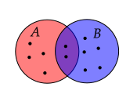
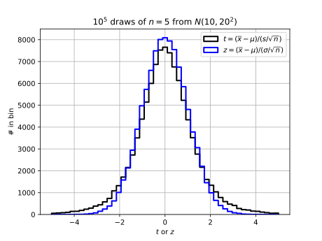

# Probability

## Definition of Probability

> The term probability refers to the study of randomness and uncertainty. In any situation in which one of a number of possible outcomes may occur, the discipline of probability provides methods for quantifying the chances, or likeli- hoods, associated with the various outcomes. (Devore p 50)

> Given an experiment and a sample space $\mathcal{S}$, the objective of probability is to assign to each event $A$ a number $P(A)$, called the probability of the event $A$, which will give a precise measure of the chance that $A$ will occur. (Devore p 55)

## Experiment

> An experiment is any activity or process whose outcome is subject to uncertainty. ...
>
> Thus experiments that may be of interest include tossing a coin once or several times, selecting a card or cards from a deck, weighing a loaf of bread, ascertaining the commuting time from home to work on a particular morning, obtaining blood types from a group of individuals, or measuring the compressive strengths of different steel beams. (Devore p 51)

> An experiment is any process, real or hypothetical, in which the possible outcomes can be identified ahead of time. (DeGroot p 5)

## Sample Space, $\mathcal{S}$ (or Event Space)

> ... the set of all possible outcomes of an experiement. (Devore p 51)

The outcomes in a sample space are noted using the shorthand
  
$\mathcal S = ${outcome 1, outcome 2, ...}
  
For example, if the experiment is tossing a coin twice and counting the number of heads and tails, the three simple events are ${1H1T, 2T, 2H}$, and the sample space is

$\mathcal S = $ {$1H1T$, $2T$, $2H$}

If the experiment is tossing a coin twice and writing down the result of the first toss in box 1 and the result of the second toss in box 2,

$\mathcal S = $ {$HH$, $HT$, $TH$, $TT$}

We can define a compound event: $A$ is the outcome of the experiment yielding one tail.

## Event

> An event is any collection (subset) of outcomes contained in the sample space $\mathcal{S}$. An event is simple if it consists of exactly one outcome and compound if it consists of more than one outcome. (Devore p 52)

> An event is just a set. (Devore p 53)

> An event is a well-defined set of possible outcomes of the experiment. (DeGroot p 5)

Can we also say a sample space is the set of all possible simple events?

## Set Operations

### Compliment

"Not $A$" is represented by four symbols: $A^\prime$ $\quad$ $\overline{A}$ $\quad$ ~$A$ $\quad$ $\neg A$

> The complement of an event $A$, denoted by $A'$, is the set of all outcomes in $\mathcal{S}$ that are not contained in $A$. (Devore p 53)

### Difference

(Rozanov p 14): $A-B$ means the event in which $A$ occurs but not $B$.

### Subset

(Rozanov p 15): $A\subset B$ means the set $A$ is a subset of $B$.

### Union

"Or" (union; inclusive or) is typically represented by $\cup$

> The union of two events $A$ and $B$, denoted by $A \cup B$ "$A$ or $B$" is the event consisting of all outcomes that are _either in_ $A$ _or in_ $B$ _or in both events_ (so that the union includes outcomes for which both $A$ and $B$ occur as well as outcomes for which exactly one occurs) -- that is, all outcomes in at least one of the events. (Devore p 53)

### XOR

XOR -- "Exclusive or": $A \oplus B$ means the event that is in $A$ or $B$, but not both.

### Intersection

"And" (intersect) is represented by four symbols: $\cap$ $\quad$ & $\quad$ $\,$ $\quad$ $$

> The intersection of two events $A$ and $B$, denoted by $A \cap B$ and read "$A$ and $B$," is the event consisting of all outcomes that are in _both_ $A$ _and_ $B$. (Devore p 53)

## Null Event

> Let $\varnothing$ denote the null event (the event consisting of no outcomes whatsoever). When $A\cap B = \varnothing$, $A$ and $B$ are said to be mutually exclusive or disjoint events. (Devore p 54)

## Mutually Exclusive

Defined in Null Event definition. Also referred to as "pairwise disjoint".

## Axioms of Probability

(Devore p 56); Often referred to as Kolmogorov's Axioms

1. For any event $A$, $P(A) \ge 0$.
2. $P(\mathcal{S})=1$
3. If $A_1$, $A_2$, ... is an infinite collection of disjoint events, then
     
   $$P(A_1 \cup A_2 ....) = P\left(\bigcup_{i=1}^\infty A_i\right) = \sum_{i=1}^\infty P(A_i)$$

   Corallary

   $$P(A_1 \cup A_2 .... \cup A_k) = \sum_{i=1}^k P(A_i)$$

   Note that many textbooks give the third axiom in terms of a sum over two events instead of a sum over an infinite set of events.

> Axioms do not completely determine an assignment of probabilities to events. The axioms serve only to rule out assignments inconsisten with our intuitve notions of probability. (Devore p 57)

## Geometric Series

$$a + ar + ar^2 + ... = \frac{a}{1-r}$$

In an experiment where the event is either true (with probability $1-p$) or false (with probability $p$) and we run experiments until we get a false, the sample space of all experiments is
  $E_1=F$, $E_2=TF$, $E_3=TTF$, ... and by Axiom 3.

$1 = P(E_1) + P(E_2) + P(E_3) + ....$

and we will learn later why $P(E_1)=p$, $P(E_2)=(1-p)p$, $P(E_3)=(1-p)^2p$, ...

This is a geometric series with $a=p$ and $r=1-p$ and thus

$1 = P(E_1) + P(E_2) + P(E_3) + ....$

## Relative Frequency and Interpretation of Proability

> ... most frequently used an most easily understood is based on the notation of relative frequencies. (Devore p 57)

Repeat experiment $n$ times (each repetition is called a "replication"). If event $A$ occurs $n(A)$ times in $n$ replications, then relative frequency is $n(A)/n$.

> The _objective interpretation of probability_ identifies this limiting relative frequency to $P(A)$. (Devore p 57)

Said another way,
  
$$P(A) = \lim_{n\rightarrow \infty}\frac{n(A)}{n}$$

If exeriment is not repeatable, prior information must be used to determine $P(A)$ and not everyone may conclude the same $P(A)$; in this case $P(A)$ has a subjective interpretation. See DeGroot 2012 and [Ross 2022](https://bookdown.org/kevin_davisross/bayesian-reasoning-and-methods/interpretations-of-probability.html) for a discussion of interpretations of probability.

Python example of Figure 2.2 Devore:
  
```python
import random

a = [0, 1]
  
# Experiment: Randomly select an element from the list a
result = random.choice(a)

# Repeat the experiment n times
n = 2
results = []
for exp in range(1, n+1):
  result = random.choice(a)
  results.append(result)

print(f"n = {n} experiments:")
print(f"  Results: {results}")
print(f"  rf(0) = {results.count(0) / n}")
print(f"  rf(1) = {results.count(1) / n}")
```

## Law of Compliments

(Devore does not use this, however)

> For any event $A$, $P(A)+P(A')=1$, from which $P(A)=1-P(A')$. (Devore p 59)

## Corallary to Axiom 3

(Devore only calls this a proposition) 

> For any event $A$, $P(A)\le 1$. (Devore p 59)

## Law of Addition

(Devore does not use this, however)

For any two events $A$ and $B$ that are mutually exclusive,
  
$P(A\cup B) = P(A) + P(B)$

## General Law of Addition

(Devore does not use this, however)

> For any two events $A$ and $B$,
>
> $P(A\cup B) = P(A) + P(B) - P(A\cap B)$

> For any three events $A$, $B$, and $C$,
>
> $P(A\cup B\cup C) = P(A) + P(B) + P(C) - P(A\cap B) - P(A\cap C) - P(B\cap C) + P(A\cap B\cap C)$

**Visual proof for two events**

Imagine overlapping targets $A$ and $B$ and darts are thrown towards target.

Viusally, the number of ways $A$ or $B$ occured: $n(A \cup B) = n(A) + n(B) - n(A \text{ and } B)$
  
Divide by the total number of dots, $n$, use the relative frequency interpretation of probability, and use $\cap$ in place of "and":

$P(A \cup B) = P(A) + P(B) - P(A \cap B)$

**Example**

If you are in a firing line and two people have guns that shoot a real bullet instead of a blank with probability of 1/3, what is the probability that you get shot (assuming the marksmen never miss?)  D draw a tree diagram and a Venn diagram to explain the answer.

*Answer*

$P(A \text{ or } B) = 1/3 + 1/3 - 1/9 = 5/9$

or, $P(\overline{A\text{ or } B}) = (2/3)(2/3) = 4/9$

Check: $P(\overline{A\text{ or } B}) = 1 - P(A \text{ or } B)$

**Example** (Devore Chapter 2, problem 12)
  
Consider randomly selecting a student at a certain university, and let $A$ denote the event that the elected individual has a Visa credit card and $B$ be the analogous event for a MasterCard. Suppose that $P(A) = 0.5$, $P(B)=0.4$, and $P(A\cap B) = 0.25$.
  
1. Compute the probability that the selected individual has at least one of the two types of card (i.e., the probability of the event $A\cup B$).
2. What is the probability that the selected individual has neither type of card?
3. Describe, in terms of $A$ and $B$, the event that the selected student has a Visa card but not a MasterCard, and then compute the probability of this event.
  
_Answers_:
1. $P(A\cup B)=P(A)+P(B)-P(A\cap B) = 0.5+0.4-0.25=0.65$
2. $P(A'\cap B') = 1-P(A\cup B) = 0.35$ (Based on visual derivation)
3. $P(A \cup B') = P(A) - P(A\cap B) = 0.5-0.25=0.25$ (Based on visual derivation)

## Product Rule (or Law of Multiplication)

(Devore does not name but gives as proposition on p 65)

> If the first element or object of an ordered pair can be selected in $n_1$ ways, and for each of these $n_1$ ways the second element of the pair can be selected in $n_2$ ways, then the number of pairs is $n_1n_2$. (Devore p 65)

## Tree Diagram

Use for visually justifying product rule and counting permutations (Devore p 66)

## Tuple

A "$k$--tuple" is an ordered collection of $k$ objects. (Devore p 66)

## General Product Rule (or Product Rule for $k$-Tuples)

> Suppose a set consists of ordered collections of $k$ elements ($k$-tuples) and that there are $n_1$ possible choices for the first element; for each choice of the first element, there are $n_2$ possible choices of the second element; ...; for each possible choice of the first $k-1$ elements, there are $n_k$ choices of the $k$th element. Then there are $n_1n_2...n_k$ possible $k$-tuples. (Devore p 66).

Note that "elements" is used here, but in definition of tuple, objects is used.

## Permutation

An ordered arrangement of distinct objects, where each arrangement has no duplicate objects. Usually relevant in problems that involve "without replacement".

Suppose you have $n$ distinct objects and you want to put them in boxes labeled $1$, $2$, ..., $k$. You select one object and put it in the first box. You select a second object from the remaining $n-1$ objects and put it in box $2$, ....
  
The number of ways to do this is denoted $P_{k,n}$ (or $_nP_k$) and is
  
$$P_{k,n}=\frac{n!}{(n-k)!} = n\cdot (n-1) ... \cdot (n-k)=\frac{n\cdot (n-1) \cdot (n-2) ... \cdot (n-k) \cdot (n-k-1) ... 1}{\phantom{n\cdot (n-1) \cdot (n-2) ... \cdot}(n-k)\cdot(n-k-1) ... 1}$$

Do see this, consider
  
$$6\cdot 5\cdot 4=\frac{6\cdot 5\cdot 4\cdot 3\cdot 2\cdot 1}{\phantom{6\cdot 5\cdot 4\cdot}3\cdot 2\cdot 1}$$

## Combination (un-ordered subset)

The number of unique $k$--tuples if $k$--tuples with the same elements (but in a different order) are treated as the same. In the team picking example, there are $3$ team combinations. 

Each permutation can be regarded as group of $k$. If we regard a group as equivalent if they have the same elements, then there are fewer groups than permuations. For example, if the two permutations

$(1,2)$

$(2,1)$

are regarded as equivalent, then there is only one group containing the numbers $1$ and $2$. To determine the number of possible orderings of each permutation, ask how many ways a set of $k$ elements can be arranged. The answer is $k!$.

So, to find the number of combinations, divide the number of permutations by $k!$.

$$C_{n,k}=\frac{P_{n,k}}{k!}=\frac{\ds\frac{n!}{(n-k)!}}{k!}=\frac{n!}{k!(n-k)!}$$

$C_{n,k}$ is often called a binomial coefficient and the denoted by $\ds{N\choose k}$ and referred to as "$n$ choose $k$".

## Conditional Probability

We want to know the probability of event $A$ given event $B$ occured. One way to do this is by counting writing down how we expect the number of times $A$ occured given event $B$ occured in terms of set operations.

$$
n(A|B) = \frac{n(A\cap B)}{n(A\cap B) + n(A'\cap B)}
$$

The numerator is the number of times $A$ and $B$ occured.

The denominator is the number of times $B$ occured - it can occur when $A$ did not did not occur.

Note that $A\cap B$ + $A'\cap B$ are mutually exclusive, so  $(A\cap B) \cup (A'\cap B) = B$, so we can also write

$$
n(A|B) = \frac{n(A\cap B)}{n(B)}
$$

Dividing all terms by $n$ and using the definition of probability in terms of relative frequency gives

$$
P(A|B) = \frac{P(A\cap B)}{P(B)}
$$

We were given that the probability of a student having a Visa is 0.5; the the probability of a student having a MasterCard is 0.4; and the probability that they have both is 0.25.

We were asked to find the probability that the student has a Visa but not MasterCard.

How is this different from the statement "given the student has a Visa, what is the probability that they do not have a MasterCard?"

"The probability that the student has a Visa but not MasterCard" can be written in terms of a conditional probability: $P(M'|V)$; based on the statement, we know the student has a Visa, so we are given that $V$ is true. We want to find the probability that the student does not have a MasterCard.

Using 

$$P(A|B) = \frac{P(A\cap B)}{P(B)}$$

we need to compute the right-hand side of

$$P(M'|V) = \frac{P(M'\cap V)}{P(V)}$$

Based on the Venn diagram, we know $P(M'\cap V)=0.25$ and we were given $P(V)=0.5$, so

$$P(M'|V) = \frac{1}{2}$$

## Bayes' Rule

$$
P(A|B) = P(A)\cdot\frac{P(B|A)}{P(B)}
$$

Also called "Bayes' Law" and "Bayes' Theorem". Different forms are also used.

https://www.cebm.ox.ac.uk/news/views/the-prosecutors-fallacy

https://www.sciencedirect.com/science/article/pii/S073567572030543X

https://www.mcgrayne.com/disc.htm


### Simple Derivation

Definition of conditional probability for two events:

$$P(A|B) = \frac{P(A\cap B)}{P(B)}$$

Swapping letters gives

$$P(B|A) = \frac{P(B\cap A)}{P(A)}$$

The numerators are identical because $A\cap B =B\cap A$. Combining these two equations gives Bayes' rule.

### Terminology

$$
P(A|B) = P(B|A)\frac{P(A)}{P(B)}
$$

* Posterior: $P(B|A)$ (probability after knowing $B$ occured)
* Prior: $P(A)$ (probability prior to knowing $B$ occured)
* Marginal probability: $P(B)$ ([why "marginal"](https://math.stackexchange.com/questions/1339666/why-do-we-refer-to-the-denominator-of-bayes-theorem-as-marginal-probability)?)
* Likelihood: conditional probability on right--hand side, $P(B|A)$
* Odds ratio or relative likelihood: $P(A)/P(B)$

Other forms of Bayes include

posterior = odds $\bfcdot$ prior

and the proportionality

posterior $\sim$ liklihood $\bfcdot$ prior

See also [Understanding Bayes Theorem with Ratios](https://betterexplained.com/articles/understanding-bayes-theorem-with-ratios/), which uses 

original odds $\bfcdot$ evidence adjustment = new odds

In medical terminology (see also [Wikipedia](https://en.wikipedia.org/wiki/Sensitivity_and_specificity); [notes by ekamperi](https://ekamperi.github.io/mathematics/2020/01/19/bayes-theorem-likelihood-ratios.html); and Covid examples: [1](https://www.anesi.com/bayes.htm) | [2](https://www.sciencedirect.com/science/article/pii/S073567572030543X) | [3](https://pmc.ncbi.nlm.nih.gov/articles/PMC7269418/)),

* Sensitivity, $S_e$ (true positive rate):

   $P(T^+|D^+)$  = (number of true positives)/(n true positives + n false negatives)
   
   $P(T^+|D^+)$ = (true positives)/(total number with disease)

   where $T^+$ is a positive test result and $D^+$ means "disease present"

* Specificity, $S_p$ (true negative rate):

   $P(T^-|D^-)$ = (number of true negatives)/(number of true negatives + number of false positives)

   $P(T^-|D^-)$ = (number of true negatives)/(total number without disease).

   where $T^-$ is a negative test result and $D^-$ means "disease present"

* Likelihood ratio: (See also [The likelihood ratio and its graphical representation](https://pmc.ncbi.nlm.nih.gov/articles/PMC6457916/)): $LR(r) = P(r|D^+)/P(r|D^-)$, where $r$ is the test result (could be a continuous variable such as "HDL colesterol") Then

   Post-test odds of $D^+$ = LR(r) $\bfcdot$ Pre-test odds of $D^+$
   
   If $r$ is dichotomous (test result is positive or negative), then
   
   $LR^+ = P(T^+|D^+)/P(T^+|D^-)= S_e/(1-S_p)$
   
   and
   
   $LR^- = P(T^-|D^+)/P(T^-|D^-) = (1-S_e)/Sp$

### Visual Derivation



**Figure 1**

**Question:** What is $n(A \text{ and } B)$ in Figure 1?  That is, how many dots have labels of both $A$ and $B$?  (Give a number)

**Answer**: 2

**Question:** What is $n(B \text{ and } A)$ in Figure 1?  That is, how many dots have labels of both $A$ and $B$?  (Give a number)

**Answer**: 2

----

**Question:** In terms of $n(A), n(B), n(A \text{ and } B)$, what is $n(A \text{ or } B)$ in Figure 1?  That is, how many dots have labels of $A$ or $B$?

**Answer**: $n(A \text{ or } B) = n(A) + n(B) - n(A \text{ and } B)$

**Question:** In terms of $n(B)$ and $P(A|B)$, what is $n(A \text{ and } B)$ in Figure 1?

$$n(A \mbox{ and } B) = n(B)\cdot P(A|B)$$

**Question:** In terms of $n(A)$ and $P(B|A)$, what is $n(B \text{ and } A)$ in Figure 1?

$n(B \mbox{ and } A) = n(A)\cdot P(B|A)$


**Figure 2**

**Question:** In terms of $n(A), n(B), n(X), P(X|A)$, and $P(A|X)$, what is $n(A \text{ and } X)$ in Figure 2?

$$n(A \mbox{ and } X) = n(A)\cdot P(X|A)$$

**Question:** In terms of $n(A), n(B), n(X), P(X|A)$, and $P(A|X)$, what is $n(X \text{ and } A)$ in Figure 2?

**Answer:**
$n(X \mbox{ and } A) = n(X)\cdot P(A|X)$

**Question:** In reference to Figure 2, what is $P(A|B)$ in terms of $n(A), n(B), n(A \text{ and } B)$, and $n(B \text{ and } A)$?

$$P(A|B) = \frac{n(A \mbox{ and } B)}{n(B)}$$

**Question**: In reference to Figure 2, what is 

$$\frac{n(A \mbox{ and } B)}{n(B \mbox{ and } A)}$$

in terms of$ n(A), n(B), P(A|B)$, and $P(B|A)$? 

**Answer:**

$$\frac{n(A \mbox{ and } B)}{n(B \mbox{ and } A)} = 1 = \frac{n(A)\cdot P(B|A)}{n(B)\cdot P(A|B)}$$

or

$$
n(B) = n(A)\cdot\frac{P(B|A)}{P(A|B)}
$$

or

$$
P(B) = P(A)\cdot\frac{P(B|A)}{P(A|B)}
$$

**Question:** In reference to Figure 2, what is 

$$\frac{n(A \mbox{ and } X)}{n(X \mbox{ and } A)}$$

in terms of $n(A), n(X), P(A|X)$, and $P(X|A)$? 

**Answer**

$$\frac{n(A \mbox{ and } X)}{n(X \mbox{ and } A)} = 1 = \frac{n(A)\cdot P(X|A)}{n(X)\cdot P(A|X)}$$

or

$$
n(X) = n(A)\cdot\frac{P(X|A)}{P(A|X)}
$$

or

$$
P(X) = P(A)\cdot\frac{P(X|A)}{P(A|X)}
$$

check

$$
\frac{5}{13} = \frac{7}{13}\cdot\frac{\frac{2}{7}}{\frac{2}{5}}
$$

## Law of Total Probability

> Let $A_1$, ... , $A_k$ be mutually exclusive and exhaustive events. Then for any other event $B$,
>
> $P(B) = P(B|A_1)P(A_1) + ... + P(B|A_k)P(A_k)$

Explain this using a table and a Venn diagram.

Consider a square partitioned by three non-overlapping rectangles. Draw $B$ as a rectangle inside the square. We can count the number of elements in $B$ using conditional counts:

$n(B) = n(B|A_1) + n(B|A_2) + n(B|A_3)$

Using $P(B|A_1) = n(B|A_1)/n(A_1)$, etc., we have

$n(B) = P(B|A_1)n(A_1) + P(B|A_2)n(A_2) + n(B|A_3)n(A_3)$

Divide both sides by $n$ to arrive at the result.

## Multiplication Rule for $P(A\cap B)$

$P(A\cap B) = \frac{P(A|B)P(B)}$

## General Bayes' Rule

When $A_1, ..., $A_k$ are mutually exclusive and exhaustive and $P(B)>0$, we can write

$$
P(A_j|B) = \frac{P(B|A_j)P(A_j)}{P(B|A_1)P(A_1) + ... + P(B|A_k)P(A_k)}
$$

# Set Operations in Python

See [Python notes](python.html#sets)

# Counting

Three types of problems:

1. Product Rule:

   A. Given $k$ ordered boxes and $n_1$ choices for first box, $n_2$ for the second, ...

   B. Given $k$ ordered boxes and $n$ choices for first box, $n$ for second, ...

2. Permutations: Given **one** set of length $n$, how many distinct _ordered_ sets with no duplicates of $k$ elements can be created? (e.g., set = {a, b}, permutations are {a, b}, {b, a}. Similar to a product rule B. problem where $n_1=n$, $n_2=n-1$, ....

3. Combinations: Same as 2. except counting all sets with the same elements as equivalent. (e.g., if set = {a, b} only one combination is possible: {a, b}).

## Product rule examples

One can use a tree diagram, table, or $x$--$y$ plot to prove.

If there are $n_1$ ways of doing operation $1$ and  $n_2$ ways of doing operation 2, then both operations can be performed in $n_1n_2$ ways.  

**Example**

Take two steps, each step is North, South, East or West. 

Put one of N, S, E, W in first box and same for second box. Result is $16$ unique step pairs.

Tree diagram.

Equivalent problem: Sample with replacement from set {N, S, E, W}. 

**Example**:

If operation 1 is moving north, south, east, or west and operation 2 is moving up or down, then there are 8 possible operations of length $2$.

**Example**:

Two teams of twelve players each. How many unique handshakes between members of opposing teams?

*Answer*: $n_a=12$, $n_b=12$, $N=12\cdot 12=144$.

Demonstrate method computing using loops in Python.

Tree diagram

**Example**: Roll a die five times. How many $5$-tuples? Create a five boxes. There are six possible "choices" for first box, six possible choices for second box, ..... So there are $6^5$ possible $k$--tuples.

**Example**: Flip a coin 2 times. There number of $2$--tuples is $2\cdot 2$. (Think of two boxes and you put either a $H$ or $T$ in the first box and a $H$ or $T$ in the secon box.)
  
**Example**: Given three circles of different diameter and four squares of different side length, put a circle in the first box and a square in the second. The number of $2$--tuples is $3\cdot 4$.

**Example**: Each clinic has two $O$ doctors and three $P$ doctors and you must select two doctors from the same clinic. How many possible pairs of $O$s and $P$s are there?
  
In the first box, put one of the four $O$s. For each $O$, there are $3$ $P$s to choose from and put in the second box. So $n=4\cdot 3$.
  
If each clinic also has three $I$s and two $G$s, how many possible choices for four doctors?
  
In the third box, put one of the three $I$s; in the fourth box, put one of the three $G$s. Then $n=4\cdot 3\cdot 3\cdot 2$.

**Example**: Suppose you want to pick a team of two tennis players from $3$ players, $A$, $B$, and $C$. The number of ways you can pick the team is $3\cdot 2$: $AB$, $AC$, $BA$, $BC$, $CA$, and $CB$.

This is not the list possible teams because $AB$ is the same as $BA$ (That is, order is not important.). The list of possible teams is $3$, by inspection.

## Permutation examples

**Example**

Step {N, S, E, W}. Then take another step, but not in the same direction as first.

*Answer*: $4\cdot 3 = 12$

**Example**:

You have stickers labled $1$, ..., $6$ that are used to form a license plate.

How many unique license plates of length $6$ can you form? *Answer*: $6\cdot 5\cdot 4\cdot 3\cdot 2\cdot 1$

How many unique license plates of length $2$ can you form? *Answer*: $6\cdot 5 = 30$

**Example**

A four-volume work is placed in random order on a bookshelf. What is the probability of the volumes being in proper order (1, 2, 3, 4)?

_Answer_: $1/4!$

*Example*

A subway train made up of $n$ cars is boarded by $r$ passengers ($r\le n$), each entering a car completely at random. 

1. What is the number of ways the passengers can board?
2. What is the probability of the passengers all ending up in different cars?

_Answer_:

1. Consider list of $r$ passengers and each can be assigned number $1, ...n$: $n^r$ 
2. Have $n$ choices for first passenger, $n-1$, for second, ... $n-r-1$ for the last: $\ds\frac{n(n-1)...(n-r-1)}{n^r}$

## Combination examples

**Example**

Select two players from a list of three.

1. Assign one as captain. How many unique teams?
2. If there is no assignment of a captain, how many unique teams?

**Example**:
* How many unique ordered hands of size $5$ can be formed using a $52$-card deck?

   *Answer*: This is a permutation problem: $52\cdot 51\cdot 50\cdot 49\cdot 48$ permutations.
* How many hands of size $5$ can be formed using a $52$-card deck?

   *Answer*: Each permutation can be rearranged in $5!$ ways. So the number of hands (combinations) is $52\cdot 51\cdot 50\cdot 49\cdot 48/(5\cdot 4\cdot 3\cdot 2\cdot 1)$

# Statistics

## Definitions

### Population

"All" of the data is called the population. A population can be finite or infinite. An example of a finite population is all US citizens. An example of an infinite population are values from a continuous probability density function. (Technically, when you draw a value from a continuous probability distribution, you are actually drawing from a discrete distribution, because there are finite number of values that can be represented as 64--bit floating point numbers.)

### Statistic

> A statistic is any quantity whose value can be calculated from sample data. Prior to obtaining data, there is uncertainty as to what value of any particular statistic will result. Therefore, a statistic is a random variable and will be denoted by an uppercase letter; a lowercase letter is used to represent the calculated or observed value of the statistic. (Devore p 214)

Note that the sample can contain all data, so alternatively, a statistic is a quantity computed based on values in population (the population mean is a statistic).

### Population statistic

A computation based on all values in a population.

### Sample statistic

A computation based on a sample from a population that gives an estimate of the equivalent value that would be obtained if the same computation was performed on the population (see also Devore p214).

### Random Samples

By random samples, we mean a value drawn from a population with a certain probability distribution. In general **random samples** implies "independent and identically distributed random variables" (often abbreviated iid). 

### Sampling Distribution

When we take a sample from a population and compute a statistc, for example the sample mean, we want to know the uncertainty in the statistic. That is, we want to know the probability distribution of the means. That is, if we repeated the experiment many times, what would be the distribution of the sample means for all experiments. The probability distribution of the test statistic is the sampling distribution.

If the sampling distribution is known, we use it to compute error bars on a test statistic. Sampling distributions are also needed for hypothesis testing.

In [HW 2.3](hw.html#hw-1), we derived a sampling distribution numerically. It was found that when $n$ values of $X$ were drawn from a Gaussian distribution with mean $\mu$ and standard deviation $\sigma$ and the statistic 

$$\overline{X} = \frac{1}{n}\sum_{i=1}^nX_i$$

was computed $10,000$ times, 95% of the time the range

$$\left[\overline{X}-1.96\frac{\sigma}{\sqrt{n}}\text{ },\text{ } \overline{X}+1.96\frac{\sigma}{\sqrt{n}}\right]$$

included $\mu$. (We say that this range "traps" $\mu$ 95% of the time.) We actually did not need to do the numerical experiement when $n$ is large. We know the expected result from the Central Limit Theorem.

<details><summary>It's a trap</summary>

</details>

The sampling distribution of a test statistic depends on the equation for the test statistic and the population distribution. There are a limited number of test statistic/population distributions for which we know the exact sampling distribution of the test statistic. Simulation can be used in other cases.

### Sampling Distribution Simulation

See [sampling_dists.py](notes/code/sampling_dists.py)

#### Parametric Simulation

Values are drawn from a population with known pdf and pdf parameters and a sample statistic is computed. This process is repeated many times to create a pdf of the sample statistic.

This procedure was used in HWs 2.3, 2.4, and 3.3.

Example: Draw $n$ values from $\mathcal{N}(0,1)$ and compute $\overline{x}$. Repeat $n_s$ and plot the pdf or histogram of the $n_s$ $\overline{x}$ values.

This method does not have practical value -- if you know the distribution and its parameters, you can simply use the analytical equation for the pdf. I generally have students use a parametric simulation to reinforce the idea of the meaning of the sampling distribution of a test statistic -- that it is a hypothetical distribution that would result if you could do many repeated experiments.

#### Bootstrap

[The definition](https://www.oxfordlearnersdictionaries.com/us/definition/english/bootstrap_2?q=bootstrapping) of the idiom "bootstrapping" is "get (oneself or something) into or out of a situation using existing resources." 

#### Parametric Bootstrap

Values are drawn from a population with known pdf and unknown pdf parameters and a sample statistic is computed. The parameters of the population pdf are estimated using the sample. The process is to draw $n$ values from a population and compute a sample statistic. Resample the $n$ values with replacement and compute sample statistic again. Repeat the resampling step $n_b$ times.

For small $n$, "clustering" can occur because a given value can appear more than once in a bootstrap sample. One way to address this is to add a small random value to each value in the bootstrap sample.

Example: Draw $n$ values from $\mathcal{N}(0,1)$ and compute $\overline{x}$ and $s$. Next, draw $n$ values from $\mathcal{N}(\overline{x},s)$ and compute $\overline{x}^*$ and repeat this process $n_b$ times.

#### Non-parametric bootstrap

Values are drawn from a population with unknown pdf (both functional form and its parameters) and a sample statistic is computed.

Example: Draw $n$ values from $\mathcal{N}(0,1)$ and compute $\overline{x}$ and $s$. Next, create a new sample of size $n$ by resampling the $n$ values with replacement and compute $\overline{x}^*$; repeat the resampling process $n_b$ times.

This procedure was used in HW 4.2.

### Random Variable

* Discrete
* Continuous

### Probability Mass Distribution

### Probability Density Distribution

### Distribution Notation

### Cumulative Distribution Function

### Expectation Value

### Uncorrelated

See James p27

### Independent

See James p27

### Bernoulli Trial

### Type I and II Errors

## Law of Large Numbers

* [Orloff and Bloom, Reading 6b](https://ocw.mit.edu/courses/mathematics/18-05-introduction-to-probability-and-statistics-spring-2014/readings/MIT18_05S14_Reading6b.pdf)
* [Bulmer, Chapter 6](https://drive.google.com/file/d/1IuANm_ZxtuY75c9Caguv3cdG8JbmkADi/view?usp=sharing★★★★★remove★★★★★)
* [DeGroot, Chapter 6](https://drive.google.com/file/d/1FtvQS1303P_GA4aM3ZbQIGPbThTXmfpq/view?usp=sharing★★★★★remove★★★★★)

The _weak law of large numbers_ [Rozanov, p 69](https://drive.google.com/file/d/1ROIF0mLquDcoMGJtj5Oz93On_ATCcfmc/view?usp=drive_link★★★★★remove★★★★★): given a $\delta > 0$ and $\epsilon > 0$, there is an integer $n$ for which the quantity $\overline{X}\equiv (1/n)(X_1+...+X_n)$ (with $X$ iid) will be in a small window centered on $\mu$ with a probability greater than $1-\delta$, that is,

$$\mu-\epsilon\le \overline{X} \le \mu + \epsilon$$

or, equivalently,

$|\overline{X}-\mu| \le \epsilon$


with a probability greater than $1-\delta$. This means we can choose very small $\epsilon$ and $\delta$ values and there will always be a value of $n$ for which the constraints are satisfied.


The Law of Large Numbers tells us that as $n\rightarrow \infty$ the sample average defined by

$$\overline{X}\equiv\frac{1}{n}\sum_{i=1}^n X_i$$

will be near the population average $\mu$ with a given probability. Given $n$ samples from a population, we don't expect $\overline{X}$ to exactly match $\mu$. The Law of Large Numbers allows us to make a statement about the difference $\overline{X}-\mu$. Specifically, the statement involves the probability that $|\overline{X}-\mu|$ is smaller that a certain value.

To answer the following questions, you do not need to understand the Law of Large Numbers. However, if you are interested, more formal definitions and proofs are given in

* [Orloff and Bloom, Reading 6b](https://ocw.mit.edu/courses/mathematics/18-05-introduction-to-probability-and-statistics-spring-2014/readings/MIT18_05S14_Reading6b.pdf)
* [Bulmer, Chapter 6](https://drive.google.com/file/d/1IuANm_ZxtuY75c9Caguv3cdG8JbmkADi/view?usp=sharing★★★★★remove★★★★★)
* [DeGroot, Chapter 6](https://drive.google.com/file/d/1FtvQS1303P_GA4aM3ZbQIGPbThTXmfpq/view?usp=sharing★★★★★remove★★★★★)
* [Rozanov, p 69](https://drive.google.com/file/d/1ROIF0mLquDcoMGJtj5Oz93On_ATCcfmc/view?usp=drive_link★★★★★remove★★★★★)


## Central Limit Theorem

See also Devore p 225.

The Law of Large Numbers tells use that if we require $\overline{X}$ to fall in range that we specify around $\mu$ with a probability that we specify, we can find an $n$ value to satisfy our requirement. The central limit theorem says that for large $n$, $\overline{X}$ is Gaussian-distributed with mean $\mu$ and standard deviation $\sigma/\sqrt{n}$.

With the Central Limit theorem, we can make statements such as "I took a sample of $n$ values and computed $\overline{X}$. If I took many samples and computed many $\overline{X}s$, 95\% of the time the range $[\overline{X}-1.96\sigma/\sqrt{n},\overline{X}+1.96\sigma/\sqrt{n}]$ would include ("trap") $\mu$.

The Central Limit Theorem says that for large $n$, $\overline{X}\equiv\frac{1}{n}\sum_{i=1}^n X_i$ is Gaussian-distributed with mean $\mu$ and standard deviation $\sigma/\sqrt{n}$.

Important: this theorem (usually) applies even if the distribution of the values used in computing 
$\overline{X}$ are not Gaussian--distributed.

With the Central Limit theorem, we can make statements such as "I took a sample of $n$ values and computed $\overline{X}$. If I took many samples and computed many $\overline{X}s$, 95\% of the time the range $[\overline{X}-1.96\sigma/\sqrt{n},\overline{X}+1.96\sigma/\sqrt{n}]$ would include ("trap") $\mu$.

The above statements are consistent with typical textbook statements such as

Rozanov p 79

> Roughly speaking, the central limit theorem asserts that the distribution of the sum of a large number of independent identically distributed random variables is approximately normal.

Bulmer p 109
> The real reason for the importance of the normal distribution lies in the central limit theorem which states that the sum of a large number of independent random variables will be approximately normally distributed almost regardless of their individual distributions; any random variable which can be regarded as the sum of a large number of small, independent contributions is thus likely to follow the normal distribution approximately.

However, technically, they are not consistent with the mathematical statement of the CLT, which is

> DEFINITION. Given a sequence of random variables $\xi_k$, $k = 1, 2, ...$ with finite means $a_k = E[\xi_k]$ and variances $\sigma^2_k = D[\xi_k]$, consider the "normalized sum"
>
> $$S^*=\frac{S_n - E[S_n]}{\sqrt{D[S_n]}}$$
>
> where
> 
> $$S_n =\sum_{k=1}^n\xi_k$$
>
> Then the sequence $\xi_k$, $k = 1, 2, ...$ is said to satisfy the central limit theorem if
>
> $$\lim_{n\rightarrow \infty} P (x' < S^{*} < x'') = \frac{1}{\sqrt{2\pi}}\int_{x'}^{x''}e^{-x^2/2}dx$$

Note that $D[S_n]\equiv\sum_{k=1}^n\sigma^2_k$

Also, Degroot p 361,

> Central Limit Theorem (Lindeberg and Le'vy). If the random variables $X_1$, ..., $X_n$ form a random sample of size $n$ from a given distribution with mean $\mu$ and variance $\sigma^2$ ($0 < \sigma^2 < \infty)$, then for each fixed number $x$,
>
> $$\lim_{n\rightarrow \infty} P \left(\frac{\overline{X}_n-\mu}{\sigma/\sqrt{n}}\right) = \Phi(x)$$
>
> where $\Phi$ denotes the c.d.f. of the standard normal distribution.

Neither forms of the CLT state that for large $n$, the sampling distribution of $X_n$ is Gaussian. It states that if you compute $\overline{X}_n$ many times, the probability that $\overline{X}_n$ is in the range $[x',x'']$ will be the same as that for the Gaussian in the limit that $n\rightarrow \infty$. It suggests that the difference between $P (x' < S^{\*} < x'')$ and that expected from a Gaussian decreases as $n$ increases, which is why we say, inaccurately, "the sampling distribution of $\overline{X}_n$ is approximately Gaussian for large $n$". This statement is inaccurate because "large" and "approximately" is not defined. Also, the CLT not state that the difference $\left|P (x' < S^{\*} < x'') - \int_{x'}^{x''}e^{-x^2/2}dx\right|$ is monotonically decreasing for all $n$. 

* See also https://online.stat.psu.edu/stat414/book/export/html/750
https://www.bmj.com/rapid-response/2011/11/01/note-correct-interpretation-central-limit-theorem

## Probability Distributions

[Univariate Distribution Relationships](https://www.math.wm.edu/~leemis/chart/UDR/UDR.html)

In the experiments done in the homework, the $X_i$ values are **random samples** from a **probability distribution** with **expectation values** for the mean and variance defined by $E[X]\equiv\mu$ and $E[(X-\mu)^2]\equiv\sigma^2$.

The probability distribution of the $\overline{X}$s, each computed using $n$ samples, is called the **sampling distribution**.

### pdf (two versions) and pmf

Probability Distribution Functions: Continuous (e.g., Gaussian) or Discrete (e.g., Binomial)

pdf can mean probability **distribution** function (dimensionless) or probability **density** function (has units of 1/$\delta x$)

$p(x) = e^{-x^2/2}/\sqrt{2\pi}$ is a probability distribution function. Suppose that $x$ is a length in $m$.

pmf means probability **mass** function. Its sum is $1$. A pmf is a probability **distribution** function

Continuous probability distribution functions must sum to $1$.

### Discrete

   Devore (p 97) calls the discrete case a "probability mass function" and I've been using the variable $P$. If $x$ is a discrete variable, then

   $$1 = \sum_{\text{all x}}P(x)$$

   and

   $$P(x)\ge 0$$

   An example probability mass function that we've used is $P(0)=0.5$, $P(1)=0.5$, which can be used to simulate the outcome of a fair coin toss, where $x=0$ represents tails and $x=1$ represents heads. The Binomial Distribution is another discrete probability distribution.

   To compute a probability mass function from a histogram, scale the histogram heights by the total number of observations.

   ```Python
   # src=notes/code/pmf.py
   ```

   

#### Binomial

[Bulmer, Chapter 6](https://drive.google.com/file/d/1IuANm_ZxtuY75c9Caguv3cdG8JbmkADi/view?usp=sharing★★★★★remove★★★★★) has good derivation of Binomial using a heads/tails example.

Unique approach in [Chapter 1 of Kittel and Kroemer](https://drive.google.com/file/d/1aajSApC9pyBzxWvCuAoW4JlJStqWm19g/view?usp=sharing★★★★★remove★★★★★)

[Mean and variance derivation](https://personal.math.ubc.ca/~feldman/m302/binomial.pdf)

#### Geometric

#### Hypergeometric

#### Negative Binomial

#### Poisson

References

* The original Possion paper is in French but is covered in English by [Stigler 1982](https://jhanley.biostat.mcgill.ca/statbook/StiglerPoisson.pdf). Possion used limit of Binomial distribution and Stigler notes De Moivre derived a related approximation to the Poisson formula.
* Derived independently by Bateman using a differential equation approach in [Rutherford, Geiger, and Bateman, 1910](https://jhanley.biostat.mcgill.ca/Rutherford/RutherfordGeigerBateman1910.pdf)
* [An simple derivation in lecture notes by D.S.G. Pollock](https://www.le.ac.uk/users/dsgp1/COURSES/LEISTATS/poisson.pdf)
* How used in physics lab experiments using Geiger counters: [1](https://pages.uoregon.edu/dlivelyb/phys391/labs/lab3_391.pdf), [2](https://wanda.fiu.edu/boeglinw/courses/Modern_lab_manual3/counting_statistics.html), [3](https://122.physics.ucdavis.edu/sites/default/files/files/Nuclear%20Decay/Counting%20Statistics.pdf)

If

1.  in a sufficiently short amount of time, $\Delta t$, only 0 or 1 event can occur (two or more simultaneous events are impossible);
2.  the probability of exactly 1 event occurring in $\Delta t$ is equal to $\lambda \Delta t$, where $\lambda$ is a constant; and
3.  any non-overlapping intervals of length $\Delta t$ are independent Bernoulli trials,

the probability of $k$ events occurring in the time interval $t=N\Delta t$ is

$$P(k)=\frac{(\lambda t)^k e^{-\lambda t}}{k!}$$

for sufficiently large $N$.


There were quite a few questions about this problem. It may make more sense to derive it without reference to time and then insert the time dependence at the end. 

If $p$ is the probability of event in time $\Delta t$, and, by definition, $\lambda \equiv p/\Delta t$, then

$$P(k)=\frac{(p\frac{t}{\Delta t})^k e^{-p \frac{t}{\Delta t}}}{k!}$$

Next, using the definition $t\equiv N\Delta t$,

$$P(k)=\frac{(p N)^k e^{-p N}}{k!}$$

The interpretation is that if the probability of a success in a trial is $p$, then the probability of $k$ successes in $N$ trials is $P(k)$. 

A common use case for this equation is when an event takes a certain amount of time $\Delta t$ to occur (e.g., a hurricane or large solar flare). In this case, it makes sense to define a rate parameter which is the number events per unit time, which is $\lambda=p/\Delta t$, where $p$ is the probability of an event in $\Delta t$. This variable corresponds with how we would describe the probability of an event, e.g., on average 0.01 hurricanes occur per day or in 100 days, 1 hurricane will occur.

It also make sense to talk not about the number of "trials", but rather the number of $\Delta t$s, where each $\Delta t$ corresponds to a trial. In this case, we can define a time as $t=N\Delta t$. This definition allows us to say "given 0.01 hurricanes occur per day, what is the probability that 2 hurricanes occur in a month".


### Continuous

   See also the [lecture notes by Orloff and Bloom](https://ocw.mit.edu/courses/mathematics/18-05-introduction-to-probability-and-statistics-spring-2014/readings/MIT18_05S14_Reading5b.pdf)

   The discrete case is called the "probability density function", and I've been using the variable $p$. The requirements are

   $$1 = \int_{-\infty}^\infty p(x)dx$$

   and

   $$p(x)\ge 0$$

   In the continuous case, the probability that $x$ is a given value is $p(x)dx$, which is a differential. As a result, it only makes sense to talk about the probability that $x$ is in a range, e.g.,

   $$P(a\le x\le b) = \int_a^bp(x)dx$$

   An example of a continuous distribution is the Gaussian or Normal:
    
   $$p(x)=\frac{1}{\sigma\sqrt{2\pi}} e^{{-(x-\mu)^2}/{2\sigma^2}}$$
    
   which satisfies $p(x)\ge 1$ and

   $$\int_{-\infty}^\infty p(x)dx=1$$

   You are already familiar with statements such as "95% of the time a value of $x$ drawn a Gaussian will be in the range $[\mu-1.96\sigma,\mu+1.96\sigma]$, or

   $$P(\mu-1.96\sigma\le x\le \mu+1.96\sigma) = 0.95 = \int_{\mu-1.96\sigma}^{\mu+1.96\sigma}p(x)dx$$

   To compute a probability density from a histogram, divide the height of each histogram bar by the total number of obervations and the width of each bar. The sum of the resulting bar heights will be unity.

#### Normal

Can be derived from Binomial [1](https://probability.oer.math.uconn.edu/wp-content/uploads/sites/2187/2018/01/prob3160ch9.pdf); [2](https://openpress.usask.ca/introtoappliedstatsforpsych/chapter/5-2-the-normal-distribution-as-a-limit-of-binomial-distributions/)

The "Standard Normal" is the **sampling distribution** of the quantity

$$z = \frac{\overline{X}-\mu}{\sigma/\sqrt{n}}$$

**Constraint**: $X$ is a random variable with mean $\mu$ and standard deviation $\sigma$ and $n\rightarrow \infty$ (unless the random variable is normally distributed, which case any $n$)

A standardized variable will have a histogram that is centered on the origin and a standard deviation of unity.

If $X$ is a random variable from _almost any_ probability distribution with mean $\mu$ and standard deviation $\sigma$, the sampling distribution of $z$ is the Standard Normal as $n\rightarrow\infty$

#### $t$

The "Student $t$" distribution is the **sampling distribution** of the quantity

$$t = \frac{\overline{X}-\mu}{S/\sqrt{n}}$$

where

$$S = \sqrt{\frac{1}{n-1}\sum_{i=1}^n (X-\overline{X})^2}$$

**Constraint**: $X$ is a Gaussian--distributed random variable. Both the numerator and denominator of $t$ will vary from sample to sample and so we expect that the histogram of 

$$t=\frac{\overline{X}-\mu}{S/\sqrt{n}}$$

to be "fatter" or have "fatter tails" than

$$z=\frac{\overline{X}-\mu}{\sigma/\sqrt{n}}$$

The $t$ distribution is actually a family of distributions that depend on $n$ and so "$t$ distribution" is ambiguous. We usually discuss "a $t$ distribution with $\nu$" degrees of freedom, where $\nu \equiv n-1$.



#### $\chi^2$

The Chi-square ($\chi^2$) distribution is the sampling distribution of the quantity $e^2$ (think "error" as in the sum--of--square error) 

$e^2 = X_1^2 + ... + X_n^2$

**Constraint**: $X$ is a Gaussian--distributed random variable.

Similar to the $t$ distribution, the $\chi^2$ distribution is actually a family of distributions that depends on $n$.

We use the $\chi^2$ distribution deriving error bars and confidence intervals for mean-square errors and power spectra.

#### Exponential

[Can be derived from Poisson](https://neurophysics.ucsd.edu/courses/physics_171/exponential.pdf)

## Expectation values

The general definition of the expectation operator $E[\cdot]$ is, for discrete $x$,

$$E \left[X\right] = \sum_{\text{all }x}xP(x)$$

or, for continuous $x,$

$$E\left[X\right] = \int_{x}xp(x)dx$$

By definition, $\mu=E\left[X\right]$. That is $\mu$ is the average of $X$ over the population. The variance of a population is defined as

$$\sigma^2=E\left[(X-\mu)^2\right]$$

When we invent a statistic (a quantity computed from a sample) that is intended to be used as an estimate of a similar quantity from a population, we want the statistic to be unbiased. That is, the expectation value of the statistic should equal the population value. Two statistics that were considered are the mean and variance.

## Point Estimates

> A point estimate of a parameter $\theta$ is a single number that can be regarded as a sensible value for $\theta$. A point estimate is obtained by selecting a suitable statistic and computing its value from the given sample data. The selected statistic is called the point estimator of $\theta$. (Devore p 243)

$\hat{\theta}$ is usually a point estimate of a population statistic $\theta$ based on a sample of the population. (Why "point"? Probably because we get a single value.)

## Point Estimate Sampling Distribution

## Unbiased Point Estimator

> A point estimator $\hat{\theta}$ is said to be an unbiased estimator of $\theta$ if $E[\hat{\theta}]$ for every possible value of $\theta$. If $\hat{\theta}$ is not unbiased, the difference $E[\hat{\theta}] - \theta$ is called the bias of $\hat{\theta}$.

Examples: If $n$ values drawn from $b(n, p)$ and $x$ are `1`, then $\hat{p}=x/n$ is is unbiased estimator of $p$ (Devore p 244, but stated in different way).

Devore p 246

> If $X_1$, $X_2$, ..., $X_n$ is a random sample from a distribution with mean $\mu$, then $\overline{X}$ is an unbiased estimator of $\mu$. If in addition the distribution is continuous and symmetric, then $\widetilde{X}$ and any trimmed mean are also unbiased estimators of $\mu$.

### Un-biased point estimator of $\mu$: $\overline{X}$

Proof that the point estimator $\overline{X}$ is an unbiased estimator of $\mu$.

$$\overline{X}=\frac{1}{n}\sum_{i=1}^n X_i$$

Taking the expectation, we have

$$E[\overline{X}]=E\left[\frac{1}{n}\sum_{i=1}^n X_i\right]$$

Note that 

$$E\left[X\right] = \sum_{\text{all }x}xP(x)$$

which means the right-hand side is a double sum. We can swap the order of the sum, giving

$$E[\overline{X}]=\frac{1}{n}\sum_{i=1}^n E[X_i] = E[X_1] + E[X_2] + ...$$

The term $E[X_1]$ means the expectation value of all possible first-selected values from the sample. All possible first-selected values from the sample is the same as all possible values of $X$. Thus, $E[X_1]=E[X]$. Using the definition, $\mu=E\left[X\right]$, we have

$$E[\overline{X}]=\frac{1}{n}\sum_{i=1}^n E[X_i] = \frac{1}{n}(E[X_1] + E[X_2] + ... ) = \frac{1}{n}(\mu + \mu + ...) = \frac{1}{n}(n\mu) = \mu$$

### Un-biased point estimator of $\sigma^2$: $S^2$

$\ds S^2 = \frac{1}{n-1}\sum_{i=1}^n (X_i-\overline{X})^2$

See [HW 4.4](hw.html#proof-that-s_b-2-is-a-biased-estimator-of-sigma-2)

### Un-biased point estimator of slope in linear regression

In your physics labs, you use the equation

$$b = \frac{\displaystyle \sum_{i=1}^{n}x_iy_i-n\bar{x}\bar{y}}{\displaystyle\sum_{i=1}^{n}x_i^2-n\bar{x}^2} = \frac{\displaystyle\sum_{i=1}^{n}(x_i-\bar{x})(y_i-\bar{y})}{\displaystyle\sum_{i=1}^{n}(x_i-\bar{x})^2}$$

as an estimate of the population parameter $\beta$ in the model equation
    
$$y_i = \beta x_i + \alpha + \epsilon_i$$
    
were $\epsilon_i$ are independent and randomly distributed values from a Gaussian distribution with zero mean and standard deviation $\sigma$.

Note that $x_i-\bar{x}$ is not a random variable because $x_i$ values are given, so it can be treated as a constant. Thus

$$E[b]
=E\left[\frac{\displaystyle\sum_{i=1}^{n}(x_i-\bar{x})(y_i-\bar{y})}{\displaystyle\sum_{i=1}^{n}(x_i-\bar{x})^2}\right]
=\frac{E\left[\displaystyle\sum_{i=1}^{n}(x_i-\bar{x})(y_i-\bar{y})\right]}{\displaystyle\sum_{i=1}^{n}(x_i-\bar{x})^2}
$$

and

$$
E[b] = \frac{\displaystyle\sum_{i=1}^{n}(x_i-\bar{x})E\left[(y_i-\bar{y})\right]}{\displaystyle\sum_{i=1}^{n}(x_i-\bar{x})^2}
$$

$$E\left[y_i-\bar{y}\right]=E\left[\beta x_i+
\alpha+\epsilon_i-\bar{y}\right]=E\left[\beta x_i] +
E[\alpha]+E[\epsilon_i]-E[\bar{y}\right]
$$

$$E\left[y_i-\bar{y}\right]=\beta x_i+\alpha - E[\overline{y}]$$

$$E[\overline{y}] = E[\beta \overline{x} + \alpha + \overline{\epsilon}] = \beta \overline{x} + \alpha + E[\overline{\epsilon}] = \beta \overline{x} + \alpha$$

Thus,

$$E\left[y_i-\bar{y}\right]=\beta(x_i-\overline{x})$$

and so

$$E[b]=\beta$$

## Confidence Intervals

Devore p 267

> An alternative to reporting a single sensible value for the parameter being estimated is to calcu- late and report an entire interval of plausible values—an interval estimate or confidence interval (CI). A confidence level of 95% implies that 95% of all samples would give an interval that includes m, or whatever other parame- ter is being estimated, and only 5% of all samples would yield an erroneous interval. The most frequently used confidence levels are 95%, 99%, and 90%. The higher the confidence level, the more strongly we believe that the value of the parameter being estimated lies within the interval (an interpretation of any particular confidence level will be given shortly).

Devore p 270

> it is tempting to conclude that $\mu$ is within this fixed interval with probability .95. ... It is therefore incorrect to write the statement P($\mu$ lies in (79.3, 80.7)) = .95.

Another way of rebutting $P(\mu \text{ lies in }(CI_l, CI_u)) = 1-\alpha$ is to consider two experiments. If experiment $a$ yields a 95% CI of $(1,2)$ and we conclude

$P(\mu \text{ lies in }(1, 2)) = 0.95$

and experiment $b$ yields

$P(\mu \text{ lies in }(2, 3)) = 0.95$

Visually, the confidence intervals for experiment $a$ and $b$ are
```
0      1       2      3        4
       aaaaaaaabbbbbbbb
```

The above statements are $\mu$ is in range $(1,2)$ with probability $0.95$ and $\mu$ is in the range $(2,3)$ with probability $0.95$. This implies that $\mu$ is in the range $(1,3)$ with probability of $0.95+0.95$, which is greater than $1$. Clearly the interpretation of confidence intervals as $P(\mu \text{ lies in }(CI_l, CI_u)) = 1-\alpha$ cannot be correct.


Devore Equation 7.5

>A $100(1-\alpha)$% confidence interval for the mean $\mu$ of a normal population when the value of $\sigma$ is known is given by
>
>$$\left(\overline{x}-z_{\alpha/2}\frac{\sigma}{\sqrt{n}}, \quad \overline{x}+z_{\alpha/2}\frac{\sigma}{\sqrt{n}}\right)$$

Devore Equation 7.9 

>Suppose $\hat{\theta}$ is an estimator satisfying the following properties: (1) It has approximately a normal distribution; (2) it is (at least approximately) unbiased; and (3) an expression for $\sigma_{\hat{\theta}}$, the standard deviation of $\hat{\theta}$, is avaialable. Then
>
>$$P\left(-z_{\alpha/2} < \frac{\hat{\theta}-\theta}{\sigma_{\hat{\theta}}} < z_{\alpha/2}\right)\simeq 1-\alpha$$

Devore Equation 7.10
>

Devore Equation 7.15

>Let $\overline{x}$ and $s$ be the sample mean and the sample deviation computed from the results of a random sample from a normal population with a mean $\mu$. Then a $100(1-\alpha)$% confidence interval for the mean $\mu$ is
>
>$$\left(\overline{x}-t_{\alpha/2, n-1}\frac{s}{\sqrt{n}}, \quad \overline{x}+t_{\alpha/2, n-1}\frac{s}{\sqrt{n}}\right)$$

Devore Equation 7.17

>$$P\left(\chi^2_{1-\alpha/2, n-1} < \frac{(n-1)S^2}{\sigma^2} < -\chi^2_{\alpha/2, n-1}\right) = 1-\alpha$$
>
>A $100(1-\alpha)$% confidence interval for the variance $\sigma^2$ of a normal population is
>
>$$\left( \frac{(n-1)s^2}{\chi^2_{\alpha/2, n-1}}, \quad\frac{(n-1)s^2}{\chi^2_{1-\alpha/2, n-1}}\right)$$
>
>where
>
>$$s^2=\frac{1}{n-1}\sum_{i=1}^n(x_i-\overline{x})^2$$

Note that $\chi^2_{\alpha/2, n-1}$ corresponds to the value of $\chi^2_{n-1}$ such that the area _to the right_ is $\alpha/2$. This is opposite of $|z_{\alpha/2}|$, which is $|z|$ such that the area _to the left_ is $\alpha/2$.

It is best to always think of the $\alpha/2$ values as corresponding to a small area.

## Hypothesis Test

Devore p 301
> The null hypothesis, denoted by $H_0$, is the claim that is initially assumed to be true (the “prior belief” claim). The alternative hypothesis, denoted by $H_a$, is the assertion that is contradictory to $H_0$.
> 
> The null hypothesis will be rejected in favor of the alternative hypothesis only if sample evidence suggests that $H_0$ is false. If the sample does not strongly contradict $H_0$, we will continue to believe in the plausibility of the null hypothesis. The two possible conclusions from a hypothesis-testing analysis are then reject $H_0$ or fail to reject $H_0$.
>

Devore p 302
> $H_0$ will generally be stated as an equality claim. If $\theta$ denotes the parameter of interest, the null hypothesis will have the form $H_0$: $\theta = \theta_0$, where $\theta_0$ is a specified number called the null value of the parameter (value claimed for $\theta$ by the null hypothesis). 

Devore p 303
> A test procedure is specified by the following:
> 1. A test statistic, a function of the sample data on which the decision (reject $H_0$ or do not reject $H_0$) is to be based [example $\overline{x}$]
> 2. A rejection region, the set of all test statistic values for which $H_0$ will be rejected
>
> The null hypothesis will then be rejected if and only if the observed or computed test statistic value falls in the rejection region.


Devore p 304
> A type I error consists of rejecting the null hypothesis $H_0$ when it is true.
>
> A type II error involves not rejecting $H_0$ when $H_0$ is false.

> The conclusion drawn from a two-tailed confidence interval is usually the same as the conclusion drawn from a two-tailed hypothesis test. In other words, if the the 95% confidence interval contains the hypothesized parameter, then a hypothesis test at the 0.05 level will almost always fail to reject the null hypothesis. If the 95% confidence interval does not contain the hypothesize parameter, then a hypothesis test at the 0.05 level will almost always reject the null hypothesis.
>
> https://online.stat.psu.edu/stat200/lesson/6/6.6

**Summary of Algorithm**

1. Choose a population parameter, $\theta$ that you want to subject to an equality claim ("null hypothesis", $H_0$) of the form $\theta=\theta_0$, where $\theta_0$ is the "null value".
   
   For example, suppose we want to test the claim that the mean of a population is 1.0; then $\theta=\mu$ and $\theta_0 = 1.0$ and $H_0$ is $\mu=1.0$.

2. Choose an alternative hypothesis, $H_a$. For example $\mu\ne 1.0$. The "rejection region" described below depends on the alternative hypothesis.

2. Find the equation for $\hat{\theta}$, an unbiased estimator of $\theta$.
   
   For example if we want to test the claim that $\mu=1.0$, and unbiased estimator of $\mu$ is $\overline{x}$, so $\hat{\theta}=\overline{x}$.

3. Determine the sampling distribution of $\hat{\theta}$. This sampling distribution will depend on the population distribution (which is rarely known). In most textbook examples, the exact sampling distribution is known because the population distribution is assumed to be known. Also, textbook sampling distributions for $\hat{\theta}$ are usually from a short list of common distributions: $\mathcal{N}$, $t$, $\chi^2$, $F$.
  
  Example: If population is $\mathcal{N}(\mu, \sigma)$, the sampling distribution of $\hat{\theta}=\overline{x}$ is $\mathcal{N}(\mu, \sigma/\sqrt{n})$

  Example: If population is $\mathcal{N}(\mu, \sigma)$, the sampling distribution of $\hat{\theta}=s^2$ is $\frac{\sigma^2}{n-1}\chi^2_{n-1}$

4. Choose a rejection region in the sampling distribution. If the value of $\hat{\theta}$ from the sample, $\hat{\theta}_{\text{sample}}$, is in this region, the equality claim will be rejected. The rejection region has associated with it an area, $\alpha$. If $H_a$ is $\theta \ne \theta_o$, the rejection region is values of $\hat{\theta}$ in the the lower $\alpha/2$ and upper $\alpha/2$ region of the sampling distribution.

   Example:
   
   If we assume population is $\mathcal{N}(\mu=0, \sigma=1)$ and execute an experiment of drawing $n$ values from it and compute $\overline{x}_\text{sample}$, we reject the null that $\mu=0$ if $\overline{x}_\text{sample}$ is in the "rare" region of the sampling distribution for $\overline{x}$. We do not reject the null hypothesis otherwise.
   
   Based on the assumptions about the population distribution and the fact that the sampling distribution of $\overline{x}$ is $\mathcal{N}(\mu=0, \sigma=1/\sqrt{n})$ if these assumptions are true, we exect $|\overline{x}_\text{sample}|>1.96\sigma/\sqrt{n}$ to occur in 5% of hypothetical experiments.

   Based on this example, when we reject, we are claiming "if we could repeat the experiment many times and compute many $\overline{x}_\text{sample}$ values, values in my selected rejection region are rare, so I'll reject the hypothesis if an expeirment yields an $\overline{x}_\text{sample}$ is in the rejection region; otherwise, I won't reject the null hypothesis". Notice that the statements don't involve claims that $H_0$ is true or false. They only involve statements about whether the observation is likely or not. In a similar way, a jury's conclusion of "guilty of murder" is a usually a statement that "not guilty" is unlikely given the information they were presented. The jury rarely has undisputable evidence that the defendent murdered someone; they usually only have information about motive, means, and opportunity.

   In summary, a hypotheis test has the logic: Given claim + experimental observation, if a given observation is unlikely based what we know about the probability of every possible experimental observation that could occur, reject claim; otherwise, don't reject claim (it is tempting to say "accept claim", but that is equivalent to making a statement that the claim is true).
   
   See also https://online.stat.psu.edu/stat500/lesson/6a/6a.1

A confidence interval can be framed as a hypothesis test (See also Bulmer p 169). Consider the test

* $H_0$: $\theta=\theta_o$
* $H_a$: $H_0\ne \theta_o$

1. Test statistic: $\hat{\theta}$, which is an unbiased estimate of $\theta$.
2. Rejection region: $\hat{\theta}$ of sample outside the CI. For a 95% CI, the region is the values of $\hat{\theta}$ associated with the left tail of area $0.025$ and the right tail area of $0.975$

We can repeat the above hypothesis test for any $\theta_0$ inside the CI. We will not reject $H_0$ for any $\theta_0$ in the rejection region.

* $H_0$: Population parameter $\theta$ is inside the CI of $\hat{\theta}_\text{sample}$ (so $\theta_0$ is any value in the CI).
* $H_a$: Population parameter $\theta$ is outside the CI of $\hat{\theta}_\text{sample}$.

**Interpretaion**

* "Rejecting $H_0$" does not mean $H_0$ is false. It means $H_0$ is unlikely, where the unlikelyness threshold is determined by the confidence interval width.

* Bulmer, p 165
  > The rejection of a hypothesis at the 5% level does not imply that the probability that the hypothesis is false is 95%; it merely implies that the observed result belongs to a class of results whos overall probability of occurrence, if the null hypothesis is true, is 5%. This provides good reason, in the sense of a rational degreee of belief, for supposing the hypothesis to be false, but no numerical value can be placed upon this degree of belief.

* [Sawilowsky, 2011, Statistal Fallacies](https://drive.google.com/file/d/13w5qqFfhgmf1K02WEsBMdPOeV0Y3nEUC/view?usp=sharing★★★★★remove★★★★★)
  > Confidence intervals have recently been promoted over the use of hypothesis tests for a litany of unsupported reasons. (a) Among its supposed benefits is the assertion that confidence intervals provide more confidence than do hypothesis tests. This is based on the fallacy that confidence intervals are based on some system of probability theory other than that of hypothesis tests, when in fact they
are the same. (b) Another prevalent misconception is confidence intervals must be symmetric.
* [Statistical tests, P values, confidence intervals, and power: a guide
to misinterpretations](https://pmc.ncbi.nlm.nih.gov/articles/PMC4877414/pdf/10654_2016_Article_149.pdf)

## $p$ value

Devore p 328:

> Using the rejection region method to test hypotheses entails first selecting a significance level $\alpha$. Then after computing the value of the test statistic, the null hypothesis $H_0$ is rejected if the value falls in the rejection region and is otherwise not rejected. We now consider another way of reaching a conclusion in a hypothesis testing analysis. This alternative approach is based on calculation of a certain probability called a $P$-value. One advantage is that the $P$-value provides an intuitive measure of the strength of evidence in the data against $H_0$.

Devore p 329:

> The $P$-value is the probability, calculated assuming that the null hypothesis is true, of obtaining a value of the test statistic at least as contradictory to $H_0$ as the value calculated from the available sample.

Devore p 329:

> Beware: The $P$-value is not the probability that $H_0$ is true, nor is it an error probability!