# Probability

## Experiment

> An experiment is any activity or process whose outcome is subject to uncertainty. ...
>
> Thus experiments that may be of interest include tossing a coin once or several times, selecting a card or cards from a deck, weighing a loaf of bread, ascertaining the commuting time from home to work on a particular morning, obtaining blood types from a group of individuals, or measuring the compressive strengths of different steel beams. (Devore p 51)

> An experiment is any process, real or hypothetical, in which the possible outcomes can be identified ahead of time. (DeGroot p 5)

Note that different experiments can be assigned to an activity:

* Experiment: Flip a coin 2x and record the result of each flip. Can ask what fraction of experiments had a head on the first flip.
* Experiment: Flip a coin 2x and record the number of heads and tails. Can ask what fraction of experiments had one head.

## Outcome

The result of part of an experiment or the result of the full experiment. (Not generally defined; the first definition implies it is the result of the full experiment, which is inconsistent with the implicit definition in the first definition.)

## Sample Space, $\mathcal{S}$ (or Event Space)

> ... the set of all possible outcomes of an experiment. (Devore p 51)

> The collection of all possible outcomes of an experiment is called the _sample space_ of the experiment. (DeGroot p 6)

The outcomes in a sample space are noted using the shorthand
  
$\mathcal S = $ {outcome 1, outcome 2, ...}
  
For example, if the experiment is tossing a coin twice and writing down the result of the first toss in box 1 and the result of the second toss in box 2,

$\mathcal S = $ {$HH$, $HT$, $TH$, $TT$}

If the experiment is tossing a coin twice and counting the total number of heads and tails, the three simple events are ${1H1T, 2T, 2H}$, and the sample space is

$\mathcal S = $ {$1H1T$, $2T$, $2H$}

We can define a compound event (event defined next) for both experiments: $A$ is the outcome of the experiment yielding one tail.

_Question_: Experiment: Each day, shoot free throws until you miss. What are the outcomes that make up $\mathcal{S}$?

**Demonstration**

Simulate the experiment of shooting a free throw 10 times. Assume you make 80\% of your free throws.

_Question_: How would you use the simulation to estimate the chances that you get $10$ in a row? Start with the sample code that follows.

Partial answer to a simpler problem.
```python
# Simulate the experiment of shooting a free throw 2 times.
# Assume you make 50% of your free throws.

# How would you use the simulation to estimate the chances that you get 10 in a row?
# Start with native Python library. Will consider better options later.
import random
#a = [1, 1, 1, 1, 1, 1, 1, 1, 0, 0]
a = [0, 1]
# Randomly select an element from the list a
result = random.choice(a)
n_e = 100000 # Number of experiments
n_t = 2 # Number of tosses per experiment

m = 0 # Number of experiments when we make all shots
for experiment in range(n_e):
  n = 0
  for toss in range(n_t):
    result = random.choice(a)
    if result == 1:
      n = n + 1
  if n == n_t:
    m = m + 1
    print(f"Experiment {experiment+1:d}: {n_t} in a row")

print(m/n_e)
```

%import numpy as np
%rng = np.random.default_rng()
%elements = [10, 20, 30, 40]
%probabilities = [0.1, 0.6, 0.2, 0.1]  # Must sum up to exactly 1.0
%print(rng.choice(elements, p=probabilities))
%print(rng.choice(elements, size=10, p=probabilities))

_Question_: How many exprimental outcomes are in $S$? If you execute this number of experiments with your code, will all experimental outcomes in $S$ have been generated?

_Question_: Describe how you would use a program to print all outcomes.

% See notes/code/sample_space.py

## Event

> An event is any collection (subset) of outcomes contained in the sample space $\mathcal{S}$. An event is simple if it consists of exactly one outcome and compound if it consists of more than one outcome. (Devore p 52)

> An event is a well-defined set of possible outcomes of the experiment. (DeGroot p 5)

_Question_: Can we also say a sample space is the set of all possible simple events?

## Set 

> The sample space of an experiment can be thought of as a _set_, or a collection, of different possible outcomes; and each outcome can be thought of as a _point_, or an _element_, in the sample space. Similarly, events can be thought of as subsets of the sample space. (DeGroot p 6)

## _Problem_

Describe an activity that requires the use of the terms "Experiment", "Outcome", "Sample Space", and "Event". Bonus for not using coin tosses. Double bonus if funny.

## _Demonstration and Prelude to Error Bars and Hypothesis Tests_

The following program draws $10$ random numbers to form list $x$ and $10$ random numbers to form list $y$ and plots the results. Ordinary least squares regression is used to find the line of best fit. We are interested in the outcome that the best fit slope is greater than $0.1$.

```python
```

_Question_: What is the experiment? What are outcomes in $\mathcal S$? What are the events?

Code. We will do many such experiments on homework.

```python
import numpy as np
import matplotlib.pyplot as plt

# Generate random data on interval [0, 1]
x = np.random.rand(10)
print(x)
y = np.random.rand(10)
print(y)

# Perform ordinary least squares regression
# We'll cover this later in the semester.
# Solve y = Ax + b for the best-fit line parameters m and c
A = np.vstack([x, np.ones(len(x))]).T
print(A)

fit = np.linalg.lstsq(A, y, rcond=None)
print(fit)

m, c = fit[0]

# Discuss issues with this plot and my expectations for homework submissions.
plt.scatter(x, y, label='Data points')
plt.plot(x, m*x + c, 'r', label='Best fit line')
plt.xlabel('x')
plt.ylabel('y')
plt.legend()
plt.show()
```

%We can define an experiment to be the determination if the slope is greater than $0.1$. In this case, $\mathcal{S} =${$m_{>}, m_{\le}$}.

## Definition of Probability

> The term probability refers to the study of randomness and uncertainty. In any situation in which one of a number of possible outcomes may occur, the discipline of probability provides methods for quantifying the chances, or likelihoods, associated with the various outcomes. (Devore p 50)

> Given an experiment and a sample space $\mathcal{S}$, the objective of probability is to assign to each event $A$ a number $P(A)$, called the probability of the event $A$, which will give a precise measure of the chance that $A$ will occur. (Devore p 55)

> A statistical probability is thus the limiting value of the relative frequency
with which some event occurs. (Bulmer p 4)

> Probability will be the way that we quantify how likely something is to occur (in the sense of one of the interpretations in Sec. 1.2. [Frequency Interpretation, Classical Interpretation, and Subjective Interpretation]). (DeGroot p 5)

## Replication

A repetition of an experiment.

## Relative Frequency and Interpretation of Probability

> The interpretation [of probability] most frequently used and most easily understood is based on the notation of relative frequencies. (Devore p 57)

Repeat the experiment $n$ times (each repetition is called a "replication"). If event $A$ occurs $n(A)$ times in $n$ replications, then relative frequency is $n(A)/n$.

> The _objective interpretation of probability_ identifies this limiting relative frequency to $P(A)$ (Devore p 57)

Said another way,
  
$$P(A) = \lim_{n\rightarrow \infty}\frac{n(A)}{n}$$

If an experiment is not repeatable, prior information must be used to determine $P(A)$ and not everyone may conclude the same $P(A)$; in this case, $P(A)$ has a subjective interpretation. See DeGroot 2012 and [Ross 2022](https://bookdown.org/kevin_davisross/bayesian-reasoning-and-methods/interpretations-of-probability.html) for a discussion of interpretations of probability.

Python example of Figure 2.2 Devore:
  
```python
import random

a = [0, 1]
  
# Experiment: Randomly select an element from the list a
result = random.choice(a)

# Repeat the experiment n times
n = 2
results = []
for exp in range(1, n+1):
  result = random.choice(a)
  results.append(result)

print(f"n = {n} experiments:")
print(f"  Results: {results}")
print(f"  rf(0) = {results.count(0) / n}")
print(f"  rf(1) = {results.count(1) / n}")
```

## Set Operators

### Compliment

"Not $A$" is represented by four symbols: $A^\prime$ $\quad$ $\overline{A}$ $\quad$ ${\sim}A$ $\quad$ $\neg A$

> The complement of an event $A$, denoted by $A'$, is the set of all outcomes in $\mathcal{S}$ that are not contained in $A$. (Devore p 53)

### Difference

$A-B$ means the events in which $A$ occurs but not $B$.

### Subset (or containment)

$A\subset B$ means the set $A$ is a subset of $B$.

### Union

"Or" (union; inclusive or) is typically represented by $\cup$

> The union of two events $A$ and $B$, denoted by $A \cup B$ "$A$ or $B$" is the event consisting of all outcomes that are _either in_ $A$ _or in_ $B$ _or in both events_ (so that the union includes outcomes for which both $A$ and $B$ occur as well as outcomes for which exactly one occurs) -- that is, all outcomes in at least one of the events. (Devore p 53)

### XOR

XOR -- "Exclusive or": $A \oplus B$ means the event that is in $A$ or $B$, but not both.

### Intersection

"And" (intersect) is represented by three symbols: $\cap$ $\quad$ & $\quad$ $,$ $\quad$

> The intersection of two events $A$ and $B$, denoted by $A \cap B$ and read "$A$ and $B$," is the event consisting of all outcomes that are in _both_ $A$ _and_ $B$. (Devore p 53)

### In Python

See [Python notes](python.html#sets)

## Null Event

> Let $\varnothing$ denote the null event (the event consisting of no outcomes whatsoever). When $A\cap B = \varnothing$, $A$ and $B$ are said to be mutually exclusive or disjoint events. (Devore p 54)

## Mutually Exclusive

Defined implicitly in Null Event definition. Also referred to as "pairwise disjoint".

## Venn Diagrams

Venn diagrams are useful for visually describing set operators. It is debatable if they are the best option for describing the relationships between sets for much else.

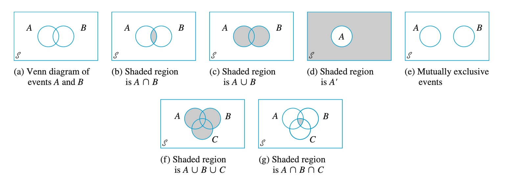

Drawing the Venn diagram for an experiment with 2 flips where $A$ is one or more heads and $B$ is one or more tails.

Use set notation to describe the region of $A$ that is not shaded in Figure (b).

Use set notation to desribe the region outside of $A$ and $B$ in Figure (a).

## Axioms of Probability

> Often referred to as Kolmogorov's Axioms
>
>1. For any event $A$, $P(A) \ge 0$.
>2. $P(\mathcal{S})=1$
>3. If $A_1$, $A_2$, ... is an infinite collection of disjoint events, then
>
>   $$P(A_1 \cup A_2 ....) = P\left(\bigcup_{i=1}^\infty A_i\right) = \sum_{i=1}^\infty P(A_i)$$
>
> Corollary
>
>   $$P(A_1 \cup A_2 .... \cup A_k) = \sum_{i=1}^k P(A_i)$$
>
>   Note that many textbooks give the third axiom in terms of a sum over two events instead of a sum over an infinite set of events.
>
> (Devore p 56)

> Axioms do not completely determine an assignment of probabilities to events. The axioms serve only to rule out assignments inconsistent with our intuitive notions of probability. (Devore p 57)

Corollary to Axiom 3 (Devore p 59 calls this a proposition):

> For any event $A$, $P(A)\le 1$

**Example**

In a trial where the result is either true (with probability $1-p$) or false (with probability $p$), and we run trials until we get a false, the sample space of all experiments is $\mathcal S = $ {$A_1$, $A_2$, $A_3$, ...}, where
 
  $A_1=F$, $A_2=T,F$, $A_3=T,T,F$, ...
  
By Axioms 2 and 3, we expect

$P(A_1) + P(A_2) + P(A_3) + ....$

to equal $1$ because the $A_i$s are disjoint. We will learn later why $P(A_1)=p$, $P(A_2)=(1-p)p$, $P(A_3)=(1-p)^2p$, ... 

Using this, we have

$P(A_1) + P(A_2) + P(A_3) + .... = p + (1-p)p + (1-p)^2p + ...$

Recall the formula for an infinite geometric series:

$\displaystyle a + ar + ar^2 + ... = \frac{a}{1-r}$ $\qquad |r|<1$

With $a=p$ and $r=1-p$, we conclude

$P(A_1) + P(A_2) + P(A_3) + .... = 1$

See also Devore Example 2.12.

## Law of Complements

(Devore does not use this term, however)

> For any event $A$, $P(A)+P(A')=1$, from which $P(A)=1-P(A')$. (Devore p 59)


## Law of Addition

(Devore does not use this term, however)

For any two events $A$ and $B$ that are mutually exclusive,
  
$P(A\cup B) = P(A) + P(B)$

## General Law of Addition

(Devore does not use this term, however)

> For any two events $A$ and $B$,
>
> $P(A\cup B) = P(A) + P(B) - P(A\cap B)$

> For any three events $A$, $B$, and $C$,
>
> $P(A\cup B\cup C) = P(A) + P(B) + P(C) - P(A\cap B) - P(A\cap C) - P(B\cap C) + P(A\cap B\cap C)$

**Visual proof for two events**

Imagine overlapping targets $A$ and $B$, and darts are thrown towards the targets.

Viusally, the number of ways $A$ or $B$ occured: $n(A \cup B) = n(A) + n(B) - n(A \text{ and } B)$
  
Divide by the total number of dots, $n$, use the relative frequency interpretation of probability, and replace $\cap$ with "and":

$P(A \cup B) = P(A) + P(B) - P(A \cap B)$

**Example** (Devore Chapter 2, problem 12)
  
Consider randomly selecting a student at a certain university, and let $A$ denote the event that the elected individual has a Visa credit card and $B$ be the analogous event for a MasterCard. Suppose that $P(A) = 0.5$, $P(B)=0.4$, and $P(A\cap B) = 0.25$.
  
1. Compute the probability that the selected individual has at least one of the two types of card (i.e., the probability of the event $A\cup B$).
2. What is the probability that the selected individual has neither type of card?
3. Describe, in terms of $A$ and $B$, the event that the selected student has a Visa card but not a MasterCard, and then compute the probability of this event.

Provide both visual "proofs" or mathematical calculations.

<details><summary>Answers:</summary>

1. $P(A\cup B)=P(A)+P(B)-P(A\cap B) = 0.5+0.4-0.25=0.65$
2. $P(A'\cap B') = 1-P(A\cup B) = 0.35$ (Based on visual derivation)
3. $P(A \cup B') = P(A) - P(A\cap B) = 0.5-0.25=0.25$ (Based on visual derivation)

Typically, we don't do mathematical proofs on sets -- demonstrations with Venn diagrams are usually sufficient.
</details>

## DeMorgan's Laws

(Not covered)

$(A\cup B)' = A' \cap B'$

$(A \cap B)' = A' \cup B'$

[Proofs](https://en.wikipedia.org/wiki/De_Morgan%27s_laws)

## Conditional Probability and the Multiplication Rule


We want to know the probability of event $A$ given event $B$ occurred. One way to do this is to count and write down how we expect the number of times $A$ occurred, given that event $B$ occurred, in terms of set operations. First, consider the fraction

$$
F(A \text { given } B) = \frac{n(A\cap B)}{n(A\cap B) + n(A'\cap B)}
$$

The numerator is the number of times $A$ and $B$ occurred.

The denominator is the number of times $B$ occurred -- it can occur when $A$ did or did not occur.

Note that $A\cap B$ and $A'\cap B$ are mutually exclusive, so  $(A\cap B) \cup (A'\cap B) = B$, so we can also write

$$
F(A\text { given }B) = \frac{n(A\cap B)}{n(B)}
$$

which is also visually obvious from a diagram.

Dividing all terms on the right-hand side by $n$, using the definition of probability in terms of relative frequency and introducing the symbol "$|$" gives the definition of conditional probability:

$$
P(A|B) = \frac{P(A\cap B)}{P(B)}
$$

We were given that the probability of a student having a Visa is 0.5; the probability of a student having a MasterCard is 0.4; and the probability of a student having both is 0.25.

We were asked to find the probability that the student has a Visa but not a MasterCard.

How is this different from the statement "given the student has a Visa, what is the probability that they do not have a MasterCard?"

<details><summary>Answer</summary>
In the first case, we don't know anything about any of the students. In the second case, we are told to only consider a subset of all students. Our new sample space contains only the $B$ part of the original sample space.
</details>

"The probability that the student has a Visa but not MasterCard" can be written in terms of a conditional probability: $P(M'|V)$; based on the statement, we know the student has a Visa, so we are given that $V$ is true. We want to find the probability that the student does not have a MasterCard.

Using 

$$P(A|B) = \frac{P(A\cap B)}{P(B)}$$

we need to compute the right-hand side of

$$P(M'|V) = \frac{P(M'\cap V)}{P(V)}$$

Based on the Venn diagram, we know $P(M'\cap V)=0.25$ and we were given $P(V)=0.5$, so

$$P(M'|V) = \frac{1}{2}$$

$P(A\cap B) = P(A|B)P(B)$ is sometimes called the multiplication rule

**Example**

If you are in a firing line and two people have guns that shoot a real bullet instead of a blank with probability of 1/3, what is the probability that you get shot (assuming the marksmen never miss)?

*Answer*

$P(A \text{ or } B) = P(A) + P(B) - P(A\cap B)$

$P(A\cap B) = P(A|B)P(B)$

If $A$ and $B$ are independent, $P(A|B)=P(A)$, so

$P(A\cap B) = P(A)P(B)$. Thus

$P(A \text{ or } B) = 1/3 + 1/3 - (1/3)(1/3) = 5/9$

or, $P(\overline{A\text{ or } B}) = (2/3)(2/3) = 4/9$

Check: $P(\overline{A\text{ or } B}) = 1 - P(A \text{ or } B)$

## Law of Total Probability

> Let $A_1$, ... , $A_k$ be mutually exclusive and exhaustive events. Then for any other event $B$,
>
> $P(B) = P(B|A_1)P(A_1) + ... + P(B|A_k)P(A_k)$

Explain this using a table and a Venn diagram.

Consider a square partitioned by three non-overlapping rectangles. Draw $B$ as a rectangle inside the square. We can count the number of elements in $B$ using conditional counts:

$n(B) = n(B|A_1) + n(B|A_2) + n(B|A_3)$

Using $P(B|A_1) = n(B|A_1)/n(A_1)$, etc., we have

$n(B) = P(B|A_1)n(A_1) + P(B|A_2)n(A_2) + n(B|A_3)n(A_3)$

Divide both sides by $n$ to arrive at the result.
</details>

## Bayes' Rule

$$
P(A|B) = P(A)\cdot\frac{P(B|A)}{P(B)}
$$

Also called "Bayes' Law" and "Bayes' Theorem".

Further reading: [The Prosecutor's Fallacy](https://www.cebm.ox.ac.uk/news/views/the-prosecutors-fallacy); [The Sally Clark Case](https://www.mcgrayne.com/disc.htm); [Bayes' theorem, COVID19, and screening tests](https://www.sciencedirect.com/science/article/pii/S073567572030543X); [Fooling Juries](https://blogs.cornell.edu/info2040/2012/10/29/bayes-rule-meadows-law-and-fooling-juries/)

**Simple Derivation**

Definition of conditional probability for two events:

$$P(A|B) = \frac{P(A\cap B)}{P(B)}$$

Swapping letters gives

$$P(B|A) = \frac{P(B\cap A)}{P(A)}$$

The numerators are identical because $A\cap B =B\cap A$. Combining these two equations gives Bayes' rule.

<details><summary>Visual Derivation/Exploration</summary>

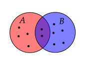

**Figure 1**

**Question:** What is $n(A \text{ and } B)$ in Figure 1?  That is, how many dots have labels of both $A$ and $B$?  (Give a number)

**Answer**: 2

**Question:** What is $n(B \text{ and } A)$ in Figure 1?  That is, how many dots have labels of both $A$ and $B$?  (Give a number)

**Answer**: 2

----

**Question:** In terms of $n(A), n(B), n(A \text{ and } B)$, what is $n(A \text{ or } B)$ in Figure 1?  That is, how many dots have labels of $A$ or $B$?

**Answer**: $n(A \text{ or } B) = n(A) + n(B) - n(A \text{ and } B)$

**Question:** In terms of $n(B)$ and $P(A|B)$, what is $n(A \text{ and } B)$ in Figure 1?

$$n(A \mbox{ and } B) = n(B)\cdot P(A|B)$$

**Question:** In terms of $n(A)$ and $P(B|A)$, what is $n(B \text{ and } A)$ in Figure 1?

$n(B \mbox{ and } A) = n(A)\cdot P(B|A)$


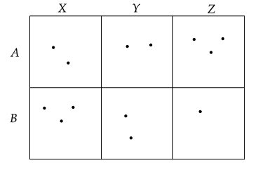

**Figure 2**

**Question:** In terms of $n(A), n(B), n(X), P(X|A)$, and $P(A|X)$, what is $n(A \text{ and } X)$ in Figure 2?

$$n(A \mbox{ and } X) = n(A)\cdot P(X|A)$$

**Question:** In terms of $n(A), n(B), n(X), P(X|A)$, and $P(A|X)$, what is $n(X \text{ and } A)$ in Figure 2?

**Answer:**
$n(X \mbox{ and } A) = n(X)\cdot P(A|X)$

**Question:** In reference to Figure 2, what is $P(A|B)$ in terms of $n(A), n(B), n(A \text{ and } B)$, and $n(B \text{ and } A)$?

$$P(A|B) = \frac{n(A \mbox{ and } B)}{n(B)}$$

**Question**: In reference to Figure 2, what is 

$$\frac{n(A \mbox{ and } B)}{n(B \mbox{ and } A)}$$

in terms of$ n(A), n(B), P(A|B)$, and $P(B|A)$? 

**Answer:**

$$\frac{n(A \mbox{ and } B)}{n(B \mbox{ and } A)} = 1 = \frac{n(A)\cdot P(B|A)}{n(B)\cdot P(A|B)}$$

or

$$
n(B) = n(A)\cdot\frac{P(B|A)}{P(A|B)}
$$

or

$$
P(B) = P(A)\cdot\frac{P(B|A)}{P(A|B)}
$$

**Question:** In reference to Figure 2, what is 

$$\frac{n(A \mbox{ and } X)}{n(X \mbox{ and } A)}$$

in terms of $n(A), n(X), P(A|X)$, and $P(X|A)$? 

**Answer**

$$\frac{n(A \mbox{ and } X)}{n(X \mbox{ and } A)} = 1 = \frac{n(A)\cdot P(X|A)}{n(X)\cdot P(A|X)}$$

or

$$
n(X) = n(A)\cdot\frac{P(X|A)}{P(A|X)}
$$

or

$$
P(X) = P(A)\cdot\frac{P(X|A)}{P(A|X)}
$$

check

$$
\frac{5}{13} = \frac{7}{13}\cdot\frac{\frac{2}{7}}{\frac{2}{5}}
$$
</details>

### Example

A cab was involved in a hit-and-run accident at night. Two cab companies, the Green and the Blue, operate in the city. You are given the following data:

   * 85% of the cabs in the city are Green, and 15% are Blue. A witness identified the cab as Blue. The court tested the reliability of the witness under the circumstances that existed on the night of the accident and concluded that the witness correctly identified each one of the two colors 80% of the time and failed 20% of the time.

What is the probability that the cab involved in the accident was Blue rather than Green?  Use the two approaches (equation- and diagram- based).

**Answer**

**Method 1**

Consider 1000 recreations of the incident in which 850 vehicles are Green, and 150 vehicles are Blue. Based on a correct identification of 80\% the expected number for each possible witness claim is shown in the last column.

```
                        850*0.80 = 680 - Is Green, claims Green
       850 Are Green 
                        850*0.20 = 170 - Is Green, claims Blue
1000
                        150*0.80 = 120 - Is Blue, claims Blue
       150 Are Blue
                        150*0.20 = 30  - Is Blue, claims Green
```

We want to know the probability the cab is Blue when the witness claimed Blue. The number of times in the last column where the witness claimed Blue is $170+120$ (middle two rows). The number of times this claim is correct is $120$.

So the probability the cab is Blue given the witness claimed Blue is

$$P(B|W_B) = \frac{120}{120+170}\approx 0.41$$

**Method 2**

The following is an alternative visualization of the tree diagram of **Method 1**.

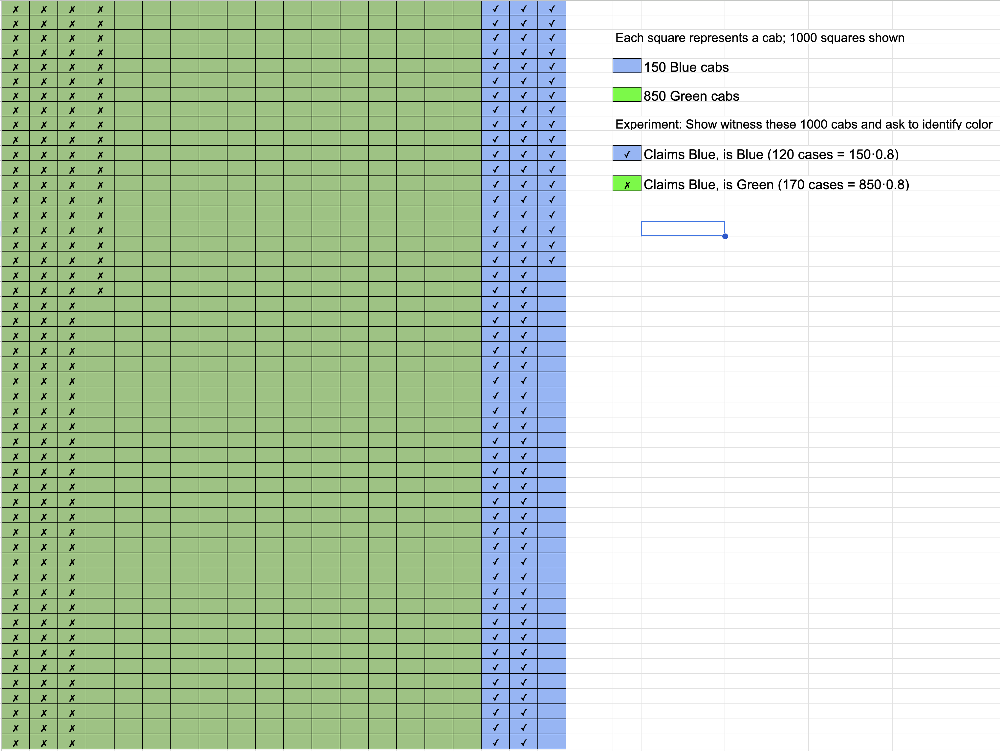

**Method 3**

To use Bayes' theorem, we start by writing the given probabilities

* $P(G) = 0.85$ (Probability a cab is Green)
* $P(B) = 0.15$ (Probability a cab is Blue)
* $P(W_B|B) = 0.80$ (Probability witness claims Blue when Blue)
* $P(W_B|G) = 0.20$ (Probability witness claims Blue when Green)

$$
P(B|W_B) = P(W_B|B)\frac{P(B)}{P(W_B)}
$$

The denominator is $P(W_B)=P(B)P(W_B|B) + P(G)P(W_B|G) = 0.15\cdot 0.80 + 0.85\cdot 0.20 = 0.12 + 0.17$. Thus,

$$
P(B|W_B) = 0.80\frac{0.15}{0.15\cdot 0.80 + 0.85\cdot 0.20} = \frac{0.12}{0.12 + 0.17}
$$

Multiplying the numerator and the denominator by $1000$ gives the same equation for **Method 1**.

$$
P(B|W_B) = \frac{120}{120 + 170} \approx 0.41
$$

A plot of $P(B|W_B)$ vs reliability is given below. If the witness is less than 50\% reliable, $P(B|W_B)$ is less than the $P(B)$, meaning that the probability that they are correct is less than the fraction of cabs that are Blue; in this case, the witness testimony is not useful; a better estimate of the probability that the cab was Blue is the faction of Blue cabs in the city.

What should the threshold for witness reliability be for "reasonable doubt" if the jury only had the witness testimony?

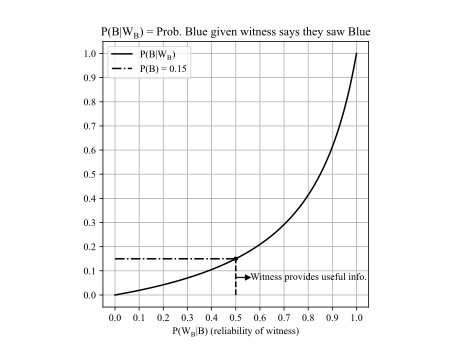

### Terminology

(Not covered yet -- will need in future.)

$$
P(A|B) = P(B|A)\frac{P(A)}{P(B)}
$$

* Posterior: $P(A|B)$ (probability after knowing $B$ occured)
* Prior: $P(A)$ (probability prior to knowing $B$ occured)
* Marginal probability: $P(B)$ ([why "marginal"](https://math.stackexchange.com/questions/1339666/why-do-we-refer-to-the-denominator-of-bayes-theorem-as-marginal-probability)?)
* Likelihood: conditional probability on right--hand side, $P(B|A)$
* Odds ratio or relative likelihood: $P(A)/P(B)$

Other forms of Bayes include

posterior = odds $\bfcdot$ prior

and the proportionality

posterior $\sim$ liklihood $\bfcdot$ prior

See also [Understanding Bayes Theorem with Ratios](https://betterexplained.com/articles/understanding-bayes-theorem-with-ratios/), which uses 

original odds $\bfcdot$ evidence adjustment = new odds

<details><summary>More Terminology</summary>
In medical terminology (see also [Wikipedia](https://en.wikipedia.org/wiki/Sensitivity_and_specificity); [notes by ekamperi](https://ekamperi.github.io/mathematics/2020/01/19/bayes-theorem-likelihood-ratios.html); and Covid examples: [1](https://www.anesi.com/bayes.htm) | [2](https://www.sciencedirect.com/science/article/pii/S073567572030543X) | [3](https://pmc.ncbi.nlm.nih.gov/articles/PMC7269418/)),

* Sensitivity, $S_e$ (true positive rate):

   $P(T^+|D^+)$  = (number of true positives)/(n true positives + n false negatives)
   
   $P(T^+|D^+)$ = (true positives)/(total number with disease)

   where $T^+$ is a positive test result and $D^+$ means "disease present"

* Specificity, $S_p$ (true negative rate):

   $P(T^-|D^-)$ = (number of true negatives)/(number of true negatives + number of false positives)

   $P(T^-|D^-)$ = (number of true negatives)/(total number without disease).

   where $T^-$ is a negative test result and $D^-$ means "disease present"

* Likelihood ratio: (See also [The likelihood ratio and its graphical representation](https://pmc.ncbi.nlm.nih.gov/articles/PMC6457916/)): $LR(r) = P(r|D^+)/P(r|D^-)$, where $r$ is the test result (could be a continuous variable such as "HDL colesterol") Then

   Post-test odds of $D^+$ = LR(r) $\bfcdot$ Pre-test odds of $D^+$
   
   If $r$ is dichotomous (test result is positive or negative), then
   
   $LR^+ = P(T^+|D^+)/P(T^+|D^-)= S_e/(1-S_p)$
   
   and
   
   $LR^- = P(T^-|D^+)/P(T^-|D^-) = (1-S_e)/Sp$
</details>

## General Bayes' Rule

When $A_1$, ..., $A_k$ are mutually exclusive and exhaustive and $P(B)>0$, we can write

$$
P(A_j|B) = \frac{P(B|A_j)P(A_j)}{P(B|A_1)P(A_1) + ... + P(B|A_k)P(A_k)}
$$

# Counting

Three types of problems:

1. Product Rule:

   A. Given $k$ ordered boxes and $n_1$ choices for first box, $n_2$ for the second, ...

   B. Given $k$ ordered boxes and $n$ choices for first box, $n$ for second, ...

2. Permutations: Given **one** set of length $n$, how many distinct _ordered_ sets with no duplicates of $k$ elements can be created? (e.g., set = {a, b}, permutations are {a, b}, {b, a}. Similar to a product rule B. problem where $n_1=n$, $n_2=n-1$, ....

3. Combinations: Same as 2. except counting all sets with the same elements as equivalent. (e.g., if set = {a, b} only one combination is possible: {a, b}).


<details><summary>Stirling's Approximation</summary>

You will often encounter $N!$ in counting problems. It is useful to know Stirling's approximation to estimate $N!$ for large $N$:

$\ln N!\simeq N\ln N - N$

or 

$\ln N!\simeq N\ln N - N + \ln\sqrt{2\pi N}$

From this form, it follows that

$N! \simeq N^N e^{-n} \sqrt{2\pi N}$

I recommend remembering the first form $\ln N!\simeq N\ln N - N$ for a rough approximation, but note that the longer equation is an approximation that converges to the exact value for large $N$. See [stirling.py](notes/code/stirling.py).

$N=10$

$N! \simeq 3.63\cdot 10^6$

$e^{N\ln(N) - N}  \simeq 4.54\cdot 10^5$

$e^{N\ln(N) - N  + \ln\sqrt{2\pi N}}  \simeq 3.60\cdot 10^6$


$N=100$

$N! \simeq 9.33\cdot 10^{157}$

$e^{N\ln(N) - N}  \simeq 3.72\cdot 10^{156}$

$e^{N\ln(N) - N  + \ln\sqrt{2\pi N}}  \simeq 9.32\cdot 10^{157}$
</details>

### Product Rule (or Law of Multiplication)

(Devore does not name it but gives it as a proposition on p 65)

> If the first element or object of an ordered pair can be selected in $n_1$ ways, and for each of these $n_1$ ways the second element of the pair can be selected in $n_2$ ways, then the number of pairs is $n_1n_2$.

One can use a tree diagram, table, or $x$--$y$ plot to justify.

**Tree Diagram**

Use for visually justifying the product rule and counting permutations (Devore p 66)

**Tuple**

A "$k$--tuple" is an ordered collection of $k$ objects. (Devore p 66)

***General Product Rule***

AKA Product Rule for $k$-Tuples

> Suppose a set consists of ordered collections of $k$ elements ($k$-tuples) and that there are $n_1$ possible choices for the first element; for each choice of the first element, there are $n_2$ possible choices of the second element; ...; for each possible choice of the first $k-1$ elements, there are $n_k$ choices of the $k$th element. Then there are $n_1n_2...n_k$ possible $k$-tuples. (Devore p 66)

Note that "elements" is used here, but in the definition of a tuple, objects is used.

**Example**

Take two steps; each step is North, South, East, or West. 

Put one of N, S, E, W in the first box and the same for the second box. Result is $16$ unique step pairs.

Tree diagram.

Equivalent problem: Sample with replacement from set {N, S, E, W}. 

**Example**:

If operation 1 is moving north, south, east, or west and operation 2 is moving up or down, then there are 8 possible operations of length $2$.

**Example**:

Two teams of twelve players each. How many unique handshakes between members of opposing teams?

Use a tree diagram for teams of $3$ first, then generalize.

<details><summary>Answer</summary>
$n_a=12$, $n_b=12$, $N=12\cdot 12=144$.
</details>

**Example**: Roll a die five times. How many $5$-tuples? 

<details><summary>Answer</summary>
Create five boxes. There are six possible "choices" for the first box, six possible choices for the second box, ..... So there are $6^5$ possible $5$--tuples.
</details>

**Example**: Flip a coin 2 times.

<details><summary>Answer</summary>
There number of $2$--tuples is $2\cdot 2$. (Think of two boxes and you put either a $H$ or $T$ in the first box and a $H$ or $T$ in the second box.)
</details>
  
**Example**: Each clinic has two $O$ doctors and three $P$ doctors, and you must select two doctors from the same clinic. How many possible pairs of $O$s and $P$s are there?

<details><summary>Answer</summary>
In the first box, put one of the four $O$s. For each $O$, there are $3$ $P$s to choose from and put in the second box. So $n=4\cdot 3$.
</details>
  
If each clinic also has three $I$s and two $G$s, how many possible choices for four doctors?
  
<details><summary>Answer</summary>
In the third box, put one of the three $I$s; in the fourth box, put one of the three $G$s. Then $n=4\cdot 3\cdot 3\cdot 2$.
</details>

**Example**: Suppose you want to pick a team of two tennis players from $3$ players, $A$, $B$, and $C$. 

<details><summary>Answer</summary>
The number of ways you can pick the team is $3\cdot 2$: $AB$, $AC$, $BA$, $BC$, $CA$, and $CB$.

This is not the list of possible teams because $AB$ is the same as $BA$ (that is, order is not important). The list of possible teams is $3$, by inspection.
</details>

### Permutation

An ordered arrangement of distinct objects, where each arrangement has no duplicate objects. Usually relevant in problems that involve "without replacement".

**Example**:

You have stickers labeled $1$, ..., $6$ that are used to form a license plate.

How many unique license plates of length $4$ can you form?

<details><summary>Answer</summary>
$6\cdot 5\cdot 4$
</details>

To see relationship to $P_{k,n}$ formula given next, consider
  
$$6\cdot 5\cdot 4=\frac{6\cdot 5\cdot 4\cdot 3\cdot 2\cdot 1}{\phantom{6\cdot 5\cdot 4\cdot}3\cdot 2\cdot 1}$$

Suppose you have $n$ distinct objects and you want to put them in boxes labeled $1$, $2$, ..., $k$. You select one object and put it in the first box. You select a second object from the remaining $n-1$ objects and put it in box $2$, ....
  
The number of ways to do this is denoted $P_{k,n}$ (or $_nP_k$) and is
  
$$P_{k,n}=\frac{n!}{(n-k)!} = n\cdot (n-1) ... \cdot (n-k)=\frac{n\cdot (n-1) \cdot (n-2) ... \cdot (n-k) \cdot (n-k-1) ... 1}{\phantom{n\cdot (n-1) \cdot (n-2) ... \cdot}(n-k)\cdot(n-k-1) ... 1}$$

**Example**

Step {N, S, E, W}. Then take another step, but not in the same direction as first.

<details><summary>Answer</summary>
$4\cdot 3 = 12$
</details>

**Example**

A four-volume work is placed in random order on a bookshelf. What is the probability of the volumes being in proper order (1, 2, 3, 4)?

<details><summary>Answer</summary>
$1/4!$
</details>

**Example**

A subway train made up of $n$ cars is boarded by $r$ passengers ($r\le n$), each entering a car completely at random. 

1. What is the number of ways the passengers can board?
2. What is the probability of the passengers all ending up in different cars?

<details><summary>Answer</summary>
1. Consider list of $r$ passengers and each can be assigned number $1, ...n$: $n^r$ 
2. Have $n$ choices for first passenger, $n-1$, for second, ... $n-r-1$ for the last: $\ds\frac{n(n-1)...(n-r-1)}{n^r}$
</details>

### Combination (un-ordered subset)

The number of unique $k$--tuples if $k$--tuples with the same elements (but in a different order) are treated as the same. In the tennis team-picking example, there are $3$ possible team combinations. 

Each permutation can be regarded as a group of $k$. If we regard groups as equivalent if they have the same elements, then there are fewer groups than permutations. For example, if the two permutations

$(1,2)$

$(2,1)$

are regarded as equivalent, then there is only one group containing the numbers $1$ and $2$. To determine the number of possible orderings of each permutation, ask how many ways a set of $k$ elements can be arranged. The answer is $k!$.

So, to find the number of combinations, divide the number of permutations by $k!$.

$$C_{n,k}=\frac{P_{n,k}}{k!}=\frac{\ds\frac{n!}{(n-k)!}}{k!}=\frac{n!}{k!(n-k)!}$$

$C_{n,k}$ is often called a binomial coefficient and the denoted by $\ds{N\choose k}$ and referred to as "$n$ choose $k$".

**Example**

Select two players from a list of three.

1. Assign one as captain. How many unique teams?
2. If there is no assignment of a captain, how many unique teams?

**Example**:

How many unique ordered hands of size $5$ can be formed using a $52$-card deck?

<details><summary></summary>
This is a permutation problem: $52\cdot 51\cdot 50\cdot 49\cdot 48$ permutations.
</details>

**Example**:

How many hands of size $5$ can be formed using a $52$-card deck?

<details><summary></summary>
Each permutation can be rearranged in $5!$ ways. So the number of hands (combinations) is $52\cdot 51\cdot 50\cdot 49\cdot 48/(5\cdot 4\cdot 3\cdot 2\cdot 1)$
</details>

# Random Variables and Distributions

> For a given sample space $\mathcal{S}$ of some experiment, a random variable (rv) is any rule that associates a number with each outcome in $\mathcal{S}$. In mathematical language, a random variable is a function whose domain is the sample space and whose range is the set of real numbers. (Devore p 93)

Example: $\mathcal{S} = \{T,F\}$ with $X(T)=1$ and $X(F)=0$ defines the discrete random variable $X$ that maps events in $\mathcal{S}$ to a number.

Example: If an experiment is to flip a coin until a $H$ is encountered, $\mathcal{S} = \{H, TH, TTH, ...\}$ and $X(H)=1$, $X(TH)=2$, $X(TTH)=3$ defines the random variable $X$ as the number of flips until a $T$ is encountered.

> Any random variable whose only possible values are 0 and 1 is called a Bernoulli random variable. (Devore p 94)

## Discrete

### Random Variables

> A **discrete** random variable is an rv whose possible values either constitute a finite set or else can be listed in an infinite sequence in which there is a first element, a second element, and so on ("countably" infinite).
>
> A random variable is **continuous** if both of the following apply:
> 1. Its set of possible values consists either of all numbers in a single interval on the number line (possibly infinite in extent, e.g., from $-\infty$ to $\infty$) or all numbers in a disjoint union of such intervals (e.g., [0, 10] $\cup$ [20, 30]).
>
> 2. No possible value of the variable has positive probability, that is, $P(X = c) = 0$ for any possible value $c$.
>
> (Devore p 95)

A countably infinite set means one can match each element in the set to a natural number (0, 1, 2, ...). A non-countable set is the real numbers in the interval $[0, 1]$, as proved by [Cantor](https://en.wikipedia.org/wiki/Cantor%27s_diagonal_argument).

### PMF Definition

> The probability distribution or probability mass function (pmf) of a discrete rv is defined for every number $x$ by $p(x) = P(X=x) = P(\text{all } s \in \mathcal{S}: X(s)=x)$. 

$p(x)\ge 0$ and $\sum_xp(x)=1$ are required for any pmf.

A cumulative distribution function (cdf) is the running sum of the pmf. The notation $P(X\le x)$ is used to describe. Its interpretation is the probability that the observed value $X$ will be at most $x$.

$$P(X\le x) = \sum_{y\le x}p(y)$$

Example: $P(X=1) = 0.2$, $P(X=2) = 0.3$, $P(X=3)=0.5$ defines a pmf for random variable $X$ that can take on values 1, 2, and 3. It has a cdf of

$P(X \le 1) = 0.2$

$P(X \le 2) = 0.2 + 0.3 = 0.5$

$P(X \le 3) = 0.2 + 0.3 + 0.5 = 1$

### Plotting

Code for generating these plots: [pmf.py](notes/code/pmf.py).

----
Bad example. Bin width is misleading.
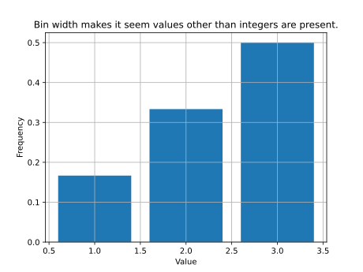

----
Bad example. Bins are not centered on integers.
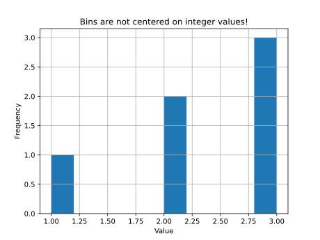

----
PMF showing relative frequency.
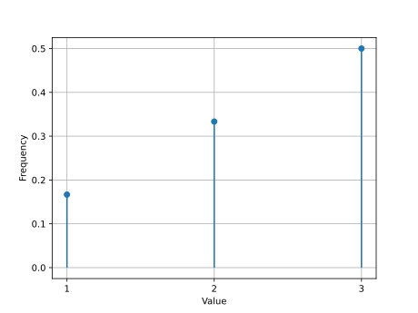

----
Same as above, but using thin bars.
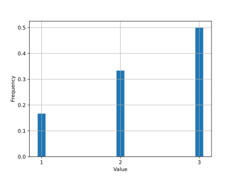

----
PMF showing counts.
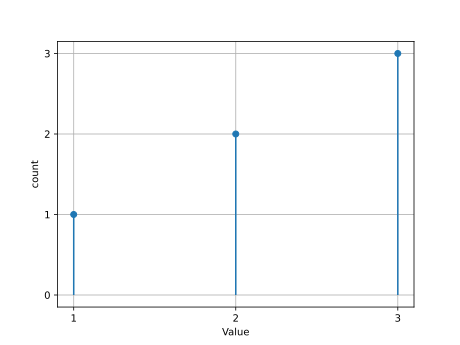

----
An option for plotting two PMFs
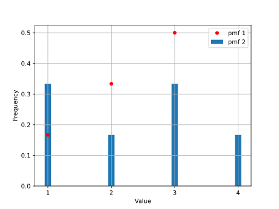


### Expectation Values

$E(h(X))$ or $E[h(x)]$ is the notation.

> If the random variable $X$ has a set of possible values $D$ and pmf $p(x)$, then the expected value of any function $h(X)$, denoted by $E[h(X)]$ or $\mu_{h(X)}$, is computed by
>
> $$E[h(X)] = \sum_D h(x) p(x)$$
>
> (Devore p 109)

Example:

$E[X^2]$ where $X$ is the random variable with pmf of $P(X=1) = 0.2$, $P(X=2) = 0.3$, $P(X=3)=0.5$ is

$E[X^2] = 1^2\cdot 0.2 + 2^2\cdot 0.3 + 3^2\cdot 0.5 = 10.9$

#### Mean

$h(x)=x$ and we define $\mu$ according to $E[X]=\mu$

#### Variance

$h(x)=(x-\mu)^2$ and we define $V$ and $\sigma_X$ according to $V(X)=\sigma_X^2 = E[(X-\mu)^2]$.

We also define the standard deviation as $\sigma_X=\sqrt{\sigma^2_X}$.

It can be shown that

$V(X) = E[(x-\mu)^2] = E[X^2] - (E[X])^2$

or equivalently

$V(X)  = E[X^2] - \mu^2 = \sum_D x^2 p(x) - \mu^2$

We will use this result later when we consider estimating $V$ by taking random samples from a population (instead of using the full population).

<details><summary>Justification</summary>

$E[(X-\mu)^2] = E[X^2 - 2\mu X + \mu^2] = E[X^2] - E[2\mu X] + E[\mu^2]$

Using

$E[2\mu X] = 2\mu E[X] = 2\mu^2$ gives

$E[(X-\mu)^2] = E[X^2] - \mu^2$
</details>

### Important PMFs

There are several key probability mass functions. For each distribution, we want to know properties such as its mean and variance.

#### Binomial

> There are many experiments that conform either exactly or approximately to the following list of requirements:
> 1. The experiment consists of a sequence of $n$ smaller experiments called trials, where $n$ is fixed in advance of the experiment.
> 2. Each trial can result in one of the same two possible outcomes (dichotomous
trials), which we generically denote by success (S) and failure (F).
> 3. The trials are independent, so that the outcome on any particular trial does not influence the outcome on any other trial.
> 4. The probability of success $P(S)$ is constant from trial to trial; we denote this probability by $p$.
> An experiment for which Conditions 1-4 are satisfied is called a binomial experiment. (Devore p 114)

> The binomial random variable $X$ associated with a binomial experiment consisting of $n$ trials is defined as
>
> $X$ = the number of $S$’s among the $n$ trials
>
> (Devore p 114)

The pmf of a binomial random variable is

$$b(x; n,p) = {n\choose x}p^x(1-p)^{n-x}$$

Notation: for any pmf that has a name, we sometimes write, e.g., 

$$X \sim b(x; n,p)$$

To mean the random variable $X$ has a pmf given by $b$.

#### Derivation of Binomial Coefficients

General problem: Given $n$ objects, $x$ of one type and $n-x$ of another, how many combinations, $C_{n,x}$ are possible?

Use the label $p$ for the $x$ objects and $q$ for the $n-x$ objects. Suppose $n=3$. All possible permutations are listed. The ones that satisfy $x=2$ are indicated with a $*$. Thus, $C_{3,2}=3$. 

```
ppp
ppq *
pqp *
pqq
qpp *
qpq
qqp
qqq
```

Also, by inspection, $C_{3,0}=1$, $C_{3,1}=3$, and $C_{3,3}=1$. In summary

$C_{3,0}=1$, $C_{3,1}=3$, $C_{3,2}=3$, $C_{3,3}=1$

We want a general formula for computing $C_{n,x}$.

**Method I**

A mathematical shortcut for finding $C_{n,x}$ is to note that the above table can be generated using $(p + q)^3$, which has $8$ terms when expanded, corresponding to the rows in the table. However, it simplifies to

$(p + q)^3 = p^3 + 3p^2q + 3pq^2 + q^3$

The simplified form contains a list of unique combinations, which is what we want.

(Note that the coefficients of $1, 3, 3, 1$ are in the third row of [Pascal's triangle](https://en.wikipedia.org/wiki/Pascal%27s_triangle). See also Larson p46 for derivation of rule that relates rows in Pascal's triangel.

We happen to have an equation that gives us the simplified form. The binomial theorem is

$$(p + q)^n = \sum_{x=0}^n {n \choose k} p^xq^{n-x}$$

where

$${n \choose k} = \frac{n!}{x!(n-x)!}$$

Therefore, we conclude

$$C_{n,x}={n \choose x}$$

**Method II**

See [Bulmer, Chapter 6](https://drive.google.com/file/d/1IuANm_ZxtuY75c9Caguv3cdG8JbmkADi/view?usp=sharing★★★★★remove★★★★★) and [Chapter 1 of Kittel and Kroemer](https://drive.google.com/file/d/1aajSApC9pyBzxWvCuAoW4JlJStqWm19g/view?usp=sharing★★★★★remove★★★★★).

General problem: Given $n$ objects, $x$ of one type and $n-x$ of another, what is the probability of each $C_{n,x}$?

Recall the table

```
ppp
ppq
pqp
pqq
qpp
qpq
qqp
qqq
```

If we regard $p$ as a probability and define $q=1-p$, then the probability of each row is obtained multiplication. But some rows result in the same value with multiplication. For examples, $pqq = qpq = qqp$. Based on this, we can conclude that

$C_{3,0}$ has probability $p^3$

$C_{3,1}$ has probability 3$pq^2=3p(1-p)^2$

$C_{3,2}$ has probability 3$p^2q=3p^2(1-p)$

$C_{3,3}$ has probability $q^3=(1-p)^3$

or

$$P(x)={n \choose x} p^x(1-p)^{n-k}$$

We write the probability in a more specific form as

$$b(x; n,p) = {n\choose x}p^x(1-p)^{n-x}$$

where the values after the semicolon are constants.

#### Mean and Variance

[Derivation](https://personal.math.ubc.ca/~feldman/m302/binomial.pdf)


#### Hypergeometric

#### Negative Binomial

#### Poisson Distribution and Poisson Process

References

* The original Possion paper is in French but is covered in English by [Stigler 1982](https://jhanley.biostat.mcgill.ca/statbook/StiglerPoisson.pdf). Possion used limit of Binomial distribution and Stigler notes De Moivre derived a related approximation to the Poisson formula.
* Derived independently by Bateman using a differential equation approach in [Rutherford, Geiger, and Bateman, 1910](https://jhanley.biostat.mcgill.ca/Rutherford/RutherfordGeigerBateman1910.pdf)
* A simple derivation in [lecture notes by D.S.G. Pollock](https://www.le.ac.uk/users/dsgp1/COURSES/LEISTATS/poisson.pdf)
* How used in physics lab experiments using Geiger counters: [1](https://pages.uoregon.edu/dlivelyb/phys391/labs/lab3_391.pdf), [2](https://wanda.fiu.edu/boeglinw/courses/Modern_lab_manual3/counting_statistics.html), [3](https://122.physics.ucdavis.edu/sites/default/files/files/Nuclear%20Decay/Counting%20Statistics.pdf)

The Poisson probability distribution function is

$$P(x)=\frac{\mu^xe^{-\mu}}{x!}$$

The symbol $\mu$ was chosen because $E[X]=\mu$ for the Poisson. This distribution can be derived from the Binomial distribution in the limit $n\rightarrow \infty$ with $x$ and $\mu\equiv np$ fixed. That is, we let $n$ become large at the same rate that $p$ becomes small. So this corresponds to a Binomial experiment where the probability of a success is small. 

The Poisson process is a process that satisfies

1.  in a sufficiently short amount of time, $\Delta t$, only 0 or 1 event can occur (two or more simultaneous events are impossible);
2.  the probability of exactly 1 event occurring in $\Delta t$ is equal to $\lambda \Delta t$, where $\lambda$ is a constant; and
3.  any non-overlapping intervals of length $\Delta t$ are independent Bernoulli trials,

the probability of $k$ events occurring in the time interval $t=n\Delta t$ is

$$P(k)=\frac{(\lambda t)^k e^{-\lambda t}}{k!}$$

for sufficiently large $n$.

If $p$ is the probability of event in time $\Delta t$, and, by definition, $\lambda \equiv p/\Delta t$, then

$$P(x)=\frac{(p\frac{t}{\Delta t})^k e^{-p \frac{t}{\Delta t}}}{x!}$$

Next, using the definition $t\equiv n\Delta t$,

$$P(x)=\frac{(p n)^x e^{-p n}}{x!}$$

The interpretation is that if the probability of a success in a trial is $p$, then the probability of $x$ successes in $N$ trials is $P(x)$. 

A common use case for this equation is when an event takes a certain amount of time $\Delta t$ to occur (e.g., a hurricane or large solar flare). In this case, it makes sense to define a rate parameter which is the number events per unit time, which is $\lambda=p/\Delta t$, where $p$ is the probability of an event in $\Delta t$. This variable corresponds with how we would describe the probability of an event, e.g., on average 0.01 hurricanes occur per day or in 100 days, 1 hurricane will occur.

It also makes sense to talk not about the number of "trials", but rather the number of $\Delta t$s, where each $\Delta t$ corresponds to a trial. In this case, we can define a time as $t=n\Delta t$. This definition allows us to say "given 0.01 hurricanes occur per day, what is the probability that 2 hurricanes occur in a month?".

## Continuous

### Random Variables

> A random variable is **continuous** if both of the following apply:
> 1. Its set of possible values consists either of all numbers in a single interval on the number line (possibly infinite in extent, e.g., from $-\infty$ to $\infty$) or all numbers in a disjoint union of such intervals (e.g., [0, 10] $\cup$ [20, 30]).
>
> 2. No possible value of the variable has positive probability, that is, $P(X = c) = 0$ for any possible value $c$.
>
> (Devore p 95)

### PDF Definition

The probability _density_ function (pdf) of a continuous random variable $X$ is a function $f(x)$ such that

$$P(a\le x\le b) = \int_a^bf(x)dx$$

Important: $f(x)$ is a density so it has units of [units of x]$^{-1}$.

To be a pdf, it must have $f(x)\ge 0$ for all $x$ and $\int_{-\infty}^{\infty}f(x)dx =1$.

### Plotting 

A PDF is a continuous function. We approximate it by computing a histogram of data and as a piecewise continuous function.

Code for generating these plots: [pdf.py](notes/code/pdf.py).

----
Example of a bad Empirical PDF. Bins are not centered on "nice" numbers.
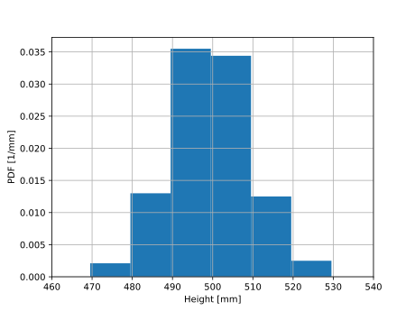

----

Example of a good PDF. Bins are centered on "nice" number, and bin width is a "nice" number, so I can read off PDF value for $500\pm 5$ mm. Note that the vertical axis is not a probability - if I add the heights of the rectangles, I won't get $1.0$ unless the bin width happens to be $1.0$.


----

Same as previous, but using `stairs()` plot. This is useful if you are comparing multiple PDFs.
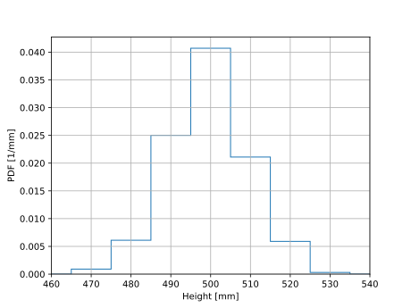

----

Same as previous, but converted to probability in bin by muliplying by bin width.
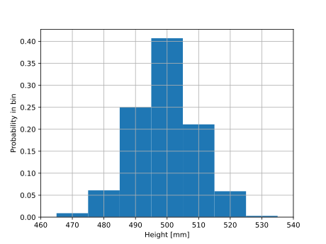

----
Same as above, but converted to histogram by multiplying y values by number of measurements.
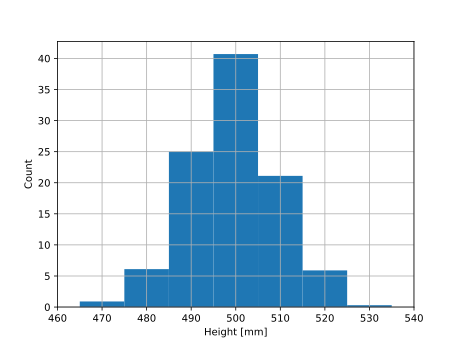

### Expectation Values

$$E[h(X)] = \int_{-\infty}^{\infty}h(x)f(x)dx$$

### Important PDFs

#### Uniform

$f(x) = 1/(b-a)$ if $a\le x\le b$

$f(x) = 0$ otherwise

**Example**

Find $E[X^2]$ for Uniform distribution.

<details><summary>Answer</summary>
$h(x)=x^2$, so 

$$E[X^2] = \int_{-\infty}^{\infty}x^2f(x)dx$$

$$E[X^2] = \int_{a}^{b}x^2f(x)dx=\int_{a}^{b}x^2dx=(b^3-a^3)/3$$
</details>

#### Gaussian or Normal

$$f(x) = \frac{1}{\sqrt{2\pi\sigma}}e^{(x-\mu)^2/2\sigma^2}$$

The "standard normal" is

$$f(z) = \frac{1}{\sqrt{2\pi}}e^{-z^2/2}$$

can be obtained by defining $z=(x-\mu)/\sigma$.

**Limiting case of Binomial**

As $n\rightarrow \infty$, and for $x \approx np$,

$$b(x; n,p) = {n\choose x}p^x(1-p)^{n-x} \rightarrow \frac{1}{\sqrt{2\pi n p q}} e^{-(x-np)^2/2npq}$$

where $q = 1-p$. Identifying $\sigma^2=npq$ and $\mu=np$ gives

$${n\choose x}p^x(1-p)^{n-x} \rightarrow \frac{1}{\sqrt{2\pi\sigma}}e^{(x-\mu)^2/2\sigma^2}$$

in the given limits.

<details><summary>Derivation</summary>
Key steps for $p=1/2$ to show the approximation:

1. Recast as a random walk problem. Let $n$ be the total number of steps, $x=n_\text{r}$ the number of right steps, and $n_\text{l}$ the number of left steps.
2. Consider the difference $\Delta=n_\text{r}-n_\text{l}$, which corresponds to the distance from the initial position, and assume $\Delta/n \ll 1$. With this definition,

   $$n_\text{r}=\frac{n+\Delta}{2}=\frac{n}{2}\left(1+\frac{\Delta}{n}\right)$$

   and

   $$n_\text{l}=\frac{n-\Delta}{2}=\frac{n}{2}\left(1-\frac{\Delta}{n}\right)$$
3. Use Stirling's approximation $\ln z!\simeq z\ln z - z + \ln\sqrt{2\pi z}$
4. Use $\ln(1+\epsilon)\simeq \epsilon-\displaystyle\frac{\epsilon^2}{2}$ for $\epsilon \ll 1$

Recasting the problem using 3.,

$$\ln{n\choose x} = \ln\frac{n!}{n_\text{l}!\,n_\text{r}!} = \ln n! - \ln n_\text{l}! - \ln n_\text{r}!$$

Stirling's approximation on each term is

$$
\begin{aligned}
\phantom{-}\ln n! &= \phantom{-}\ln\sqrt{2\pi n} + n\ln n - n\\
-\ln n_\text{r}! &= -\ln\sqrt{2\pi n_\text{r}} - n_\text{r}\ln n_\text{r} + n_\text{r}\\
-\ln n_\text{l}! &= -\ln\sqrt{2\pi n_\text{l}} - n_\text{l}\ln n_\text{l} + n_\text{l}
\end{aligned}
$$

The linear terms cancel, since $-n+n_\text{r}+n_\text{l}=0$. The square-root terms, with $n_\text{r}\simeq n_\text{l}\simeq n/2$, add to

$$\ln\sqrt{2\pi n}-\ln\sqrt{\pi n}-\ln\sqrt{\pi n} = \ln\sqrt{\frac{2}{\pi n}}$$

The inner terms add to

$$
\begin{aligned}
n\ln n - n_\text{r}\ln n_\text{r} - n_\text{l}\ln n_\text{l} &= (n_\text{r}+n_\text{l})\ln n - n_\text{r}\ln n_\text{r} - n_\text{l}\ln n_\text{l}\\
&= n_\text{r}\ln n - n_\text{r}\ln n_\text{r} + n_\text{l}\ln n - n_\text{l}\ln n_\text{l}\\
&= -n_\text{r}\ln\frac{n_\text{r}}{n} - n_\text{l}\ln\frac{n_\text{l}}{n}
\end{aligned}
$$

Using

$\displaystyle n_\text{r}=\frac{n}{2}\left(1+\frac{\Delta}{n}\right)$ and
$\displaystyle n_\text{l}=\frac{n}{2}\left(1-\frac{\Delta}{n}\right)$

gives

$$n_\text{r}\ln\frac{n_\text{r}}{n}+n_\text{l}\ln\frac{n_\text{l}}{n} = \frac{n}{2}\left(1+\frac{\Delta}{n}\right)\ln\left[\frac{1}{2}\left(1+\frac{\Delta}{n}\right)\right] +
\frac{n}{2}\left(1-\frac{\Delta}{n}\right)\ln \left[\frac{1}{2}\left(1-\frac{\Delta}{n}\right)\right]$$

The first term

$$\frac{n}{2}\left(1+\frac{\Delta}{n}\right)\ln\left[\frac{1}{2}\left(1+\frac{\Delta}{n}\right)\right] = \frac{n}{2}\left(1+\frac{\Delta}{n}\right)\left[-\ln 2 + \ln \left(1+\frac{\Delta}{n}\right)\right]$$

The second term

$$\frac{n}{2}\left(1-\frac{\Delta}{n}\right)\ln\left[\frac{1}{2}\left(1-\frac{\Delta}{n}\right)\right] = \frac{n}{2}\left(1-\frac{\Delta}{n}\right)\left[-\ln 2 + \ln \left(1-\frac{\Delta}{n}\right)\right]$$

Adding, the $\ln 2$ terms gives $-n\ln 2$ and the rest gives

$$n_\text{r}\ln\frac{n_\text{r}}{n}+n_\text{l}\ln\frac{n_\text{l}}{n} = -n\ln 2 + \frac{n}{2}\left[\left(1+\frac{\Delta}{n}\right)\ln\left(1+\frac{\Delta}{n}\right) + \left(1-\frac{\Delta}{n}\right)\ln\left(1-\frac{\Delta}{n}\right)\right]$$

Using

$$\ln \left(1+\frac{\Delta}{n}\right)\simeq \frac{\Delta}{n} - \frac{\Delta^2}{2n^2}$$

and

$$\ln \left(1-\frac{\Delta}{n}\right)\simeq -\frac{\Delta}{n} - \frac{\Delta^2}{2n^2}$$

$$
n_\text{r}\ln\frac{n_\text{r}}{n}+n_\text{l}\ln\frac{n_\text{l}}{n} \simeq -n\ln 2 +
\frac{n}{2}\left[\left(1+\frac{\Delta}{n}\right)\left(\frac{\Delta}{n} - \frac{\Delta^2}{2n^2}\right) +
\left(1-\frac{\Delta}{n}\right)\left(-\frac{\Delta}{n} - \frac{\Delta^2}{2n^2}\right)\right]
$$


the bracket reduces to $\Delta^2/n^2$ + terms of order $\Delta^3/n^3$ (if a full expansion was performed, we expect only terms of even order in $\Delta$, because the distribution is symmetric about $\Delta$). Thus,


$$n_\text{r}\ln\frac{n_\text{r}}{n}+n_\text{l}\ln\frac{n_\text{l}}{n} \simeq -n\ln 2 + \frac{\Delta^2}{2n}$$

and the inner terms, which carry the opposite sign, give $n\ln 2 - \dfrac{\Delta^2}{2n}$.

So finally

$$\ln{n\choose x} \simeq \ln\sqrt{\frac{2}{\pi n}} + n\ln 2 - \frac{\Delta^2}{2n}$$

$$\ln{n\choose x} \simeq \ln \left(2^n\sqrt{\frac{2}{\pi n}}e^{-\frac{\Delta^2}{2n}}\right)$$

$${n\choose x} \simeq 2^n\sqrt{\frac{2}{\pi n}}e^{-\frac{\Delta^2}{2n}}$$

Earlier we claimed

$${n\choose x}p^x(1-p)^{n-x} \rightarrow \frac{1}{\sqrt{2\pi n p q}} e^{-(x-np)^2/2npq}$$

Using $p=q=1/2$, so $npq=n/4$, gives

$${n\choose x}\frac{1}{2^n} \rightarrow \frac{1}{\sqrt{2\pi (n/4)}} e^{-(x-n/2)^2/(n/2)}$$

or

$${n\choose x} \rightarrow 2^n\sqrt{\frac{2}{\pi n}} e^{-(x-n/2)^2/(n/2)}$$

which agrees with the result above, since $\Delta = 2x-n$ makes $(x-n/2)^2/(n/2) = \Delta^2/2n$.

The derivation for the general case requires the assumption $(x-np)/n$ is small.
</details>

#### Student-t

#### $\chi^2$

# Moment Generating Function

(Not covered) A trick that allows one to quickly compute expection values of the form $E[X^k]$. Covered in Bulmer and Larson. The trick is to instead compute $E[e^{tX}]$. Once computed, it is easy to extract $E[X^k]$ from it.

Example:

Let $M(t)=E[e^{tX}]$. Then $dM/dt|_{t=0}=E[X]$,  $d^2 M/dt^2|_{t=0}=E[X^2]$, ....

For the binomial pmf

$$M(t)=E[e^{tX}]=\sum_{x=0}^{n} e^{xt} {n\choose x} p^x q^{n-x} = \sum_{x=0}^{n} {n\choose x} (pe^t)^x q^{n-x}$$

Using the identity

$$(a+b)^n = \sum_{x=0}^{n} {n\choose x} a^x b^{n-x}$$

with $a=pe^t$ and $b=q$ gives

$$M(t)=E\left[e^{tX}\right]=(pe^t + q)^b$$

$$E[X] = \left. \frac{dM}{dt}\right |_{t=0} = \left . n(pe^t + q)^{n-1}p\right|_{t=0} = np(p+q)^{n-1}=np$$

Higher order terms can be computed in a similar way, e.g.,

$$E[X^2] =  \left. \frac{d^2 M}{dt^2}\right |_{t=0}$$

To understand why this works, consider the Taylor series expansion of $e^{xt}$, which has terms of $xt$, $(xt)^2$, ....

# Point Estimation

## Definition

> A point estimate of a parameter $\theta$ is a single number that can be regarded as a sensible value for $\theta$. A point estimate is obtained by selecting a suitable statistic and computing its value from the given sample data. The selected statistic is called the point estimator of $\theta$. (Devore p 243)

$\hat{\theta}$ is usually a point estimate of a population statistic $\theta$ based on a sample of the population. (Why "point"? Probably because we get a single value.)

Some point estimates have a special name and the hat (`^`) notation is not used. For example, instead of writing $\hat{\mu}$, we use $\overline{X}$ and instead of $\hat{\sigma^2}$, we write $S^2$.

Point estimators have a sampling distribution -- to compute a point estimate, you draw $n$ values from a population (which has a population distribution). If you drawn $n$ values again at random, you will not always get the same value for the point estimate.

% Show diagram

% Go over plots for solution to hw.html#sampling-distribution

In the last homework, you numerically estimated sampling distribution of the point estimates based on samples of size $n$ from $\mathcal{N}(\mu, \sigma^2)$. For the point estimator

* $\overline{X}=(1/n)\sum_n (x-x_i)$, you found that its sampling distribution had
  * a mean close to $\mu$ (so it seemed unbiased), and
  * a variance that was approxmately $\sigma^2/n$ (so its variance decreases as $n$ increases).
* $S_b^2=(1/n)\sum_n (x-x_i)^2$, you found
   * a mean was not $\sigma^2$. When $n=9$, the mean was $S_b^2\approx 0.9\sigma^2$. If you re-run the experiment with larger $n$, you will find the the $S_b^2$ will be closer to $\sigma^2$; and
   * a variance was not computed.

In the previous homework you estimated the sampling distribution of the point estimate of $\mu$, $\overline{X}$, by drawing $n$ values from a $\mathcal{N}(\mu, \sigma^2)$ distribution and computing $\overline{X}$. You repeated this $10,000$ times. The mean of the $10,000$ $\overline{X}$s was close to zero. The variance of the histogram of the $10,000$ $\overline{X}$s was approximately $\sigma^2/n$.

In the previous homework you estimated the sampling distribution of the point estimate of $\sigma^2$, $S^2_b$, by drawing $n$ values from a $\mathcal{N}(\mu, \sigma^2)$ distribution and computing $S^2_b$. You repeated this $10,000$ times. The mean of the $10,000$ $S^2_b$s was not zero. We did not consider the variance of the histogram of the $10,000$ $S^2_b$.

## Some Point Estimators

For the proportion of a population that has a certain characteristic, and $x$ is he number in a sample of $n$ that have that characteristic, we estimate the population proporation, $p$, as

$$\displaystyle\hat{p}=\frac{x}{n}$$

For a sample of $n$ values taken from a population with mean $\mu$, there are several options for $\hat{\mu}$

* $\displaystyle \overline{X} \equiv \frac{1}{n}\sum_{i=1}^n x_i$
* $\widetilde{X} \equiv $ median (middle value when $n$ odd or average of two middle values when $n$ even)
* $X_e \equiv (\text{min}(x)+\text{max}(x))/2$ (average of extreme values from sample)
* $\overline{X}_{\text{tr}(m)} \equiv $ trimmed mean, the mean after removing the largest $m{\%}$ and smallest $m{\%}$ values from the sample.

For a sample of $n$ values taken from a population with variance $\sigma^2$, there are several "sensible" options for $\hat{\sigma^2}$

$$S_b^2 \equiv \frac{1}{n}\sum_{i=1}^n(x_i-\overline{X})^2$$

$$S^2 \equiv \frac{1}{n-1}\sum_{i=1}^n(x_i-\overline{X})^2$$

## Choosing a Point Estimate

A given population parameter may have more than one "sensible" point estimators.

We want point estimates (which are random variables, so they have a distribution) to have the properties:

1. Unbiased -- The expected value of the sampling distribution of the point estimate is zero.
2. Small variance -- The variance of the sampling distribution of the point estimate is small.

Formal definition of bias:

> A point estimator $\hat{\theta}$ is said to be an unbiased estimator of $\theta$ if $E[\hat{\theta}]=0$ for every possible value of $\theta$. If is not unbiased, the difference is called the bias of $\hat{\theta}$. (Devore p 243)

**Examples**:
* If $n$ values drawn from $b(n, p)$ and $x$ are `1`, then $\hat{p}=x/n$ is is unbiased estimator of $p$ (Devore p 244, but stated in different way).
* If $n$ values drawn from from _any_ distribution (continuous or discrete) with a mean $\mu$, $\overline{X}$ is an unbiased estimator of $\mu$ (based on Devore p 246).
* If $n$ values drawn from from _any_ distribution _continuous and symmetric_ distribution with a mean $\mu$, the median and any trimmed mean are unbiased estimators of $\mu$ (based on Devore p 246).

Given multiple senible point estimates exist, which to choose? It depends on the population distribution. In general, we prefer unbiased and small variance. However, sometimes an estimator is biased but has a small variance and we may prefer it over one that no bias but a large variance. See Example 6.7 of Devore.

For some distributions and some estimators we know the estimator that is both unbiased and has the smallest variance among _any_ possible choice of estimator. This is called the Minimum Variance Unbiased Estimate, **MVUE**. For example, if the population is gaussian (normal), $\overline{X}$ is unbiased and has the minimum variance among _all_ possible unbiased estimators. In general, we know MVUE for a limited set of possible population distributions and estimators.

## Point Estimate Bias and Variance

To compute an estimator, such as $\overline{X}$, we draw random values from a population, so the population is a random variable because each value we draw is random.

The estimator itself is a random variable because when we randomly choose a set of $n$ values and compute the estimator, we won't get the same result when we randomly choose another set of $n$ values. You demonstrated this on the last homework by plotting a histogram of 10,000 $\overline{X}$ values. This histogram represented the **sampling distribution** of $\overline{X}$.

We don't always know the sampling distribution of an estimator. We only know the analytical value for a few cases. For example if the population is gaussian distributed ($X\sim \mathcal{N}(\mu,\sigma^2)$), then the sampling distribution is normally distributed with a smaller variance ($\overline{X}\sim \mathcal{N}(\mu, \sigma^2/n))$. You demonstrated this numerically on the last homework.

In only a few cases can we can prove that an estimator is unbiased and compute its MVUE.

## Numerically Estimating Sampling Distribution

Numerically generate the sampling distribution of $\overline{X}_{\text{tr}(10)}$ and compare it to $\overline{X}$.

```python
```

## Computing Bias

### $\overline{X}$

We can show that $\overline{X}$ is an unbiased estimator, that is, $E[\overline{X}]=0$ of $\mu$ for any population distribution.

$$\overline{X}=\frac{1}{n}\sum_{i=1}^n X_i$$

Taking the expectation, we have

$$E[\overline{X}]=E\left[\frac{1}{n}\sum_{i=1}^n X_i\right]$$

Note that 

$$E\left[X\right] = \sum_{\text{all }x}xP(x)$$

which means the right-hand side is a double sum. We can swap the order of the sum, giving

$$E[\overline{X}]=\frac{1}{n}\sum_{i=1}^n E[X_i] = E[X_1] + E[X_2] + ...$$

The term $E[X_1]$ means the expectation value of all possible first-selected values from the sample. All possible first-selected values from the sample is the same as all possible values of $X$. Thus, $E[X_1]=E[X]$. Using the definition, $\mu=E\left[X\right]$, we have

$$E[\overline{X}]=\frac{1}{n}\sum_{i=1}^n E[X_i] = \frac{1}{n}(E[X_1] + E[X_2] + ... ) = \frac{1}{n}(\mu + \mu + ...) = \frac{1}{n}(n\mu) = \mu$$


### $S^2_b$

We can show that $E\left[S^2_b\right] = \sigma^2(n-1)/n$ for a population that as a variance $\sigma^2$.

In the following, I give a very verbose proof to help you understand the operations and concepts involved. Devore p 245 has a briefer proof that is given below and an alternative studen proof is also given.

#### Long proof

Starting with the definiton of $S^2_b$,

$$E\left[S^2_b\right] = E\left[ \frac{1}{n} \sum_{i=1}^n(X_i-\overline{X})^2 \right]$$

Expanding the square gives

$$E\left[S^2_b\right] = E\left[ \frac{1}{n} \sum_{i=1}^n(X_i^2-2X_i\overline{X}+\overline{X}^2) \right]$$

or, equivalently,

$$I.\qquad E\left[S^2_b\right] = E\left[ \frac{1}{n} \sum_{i=1}^nX_i^2-\frac{2}{n}\sum_{i=1}^nX_i\overline{X}+\frac{1}{n}\sum_{i=1}^n\overline{X}^2 \right]$$

The second term in the square braces in Equation $I.$ can be simplified by noting that $\overline{X}$ does not depend on $i$, so it can be factored out:

$$\frac{2}{n}\sum_{i=1}^nX_i\overline{X}=2\overline{X}\left(\frac{1}{n}\sum_{i=1}^nX_i\right)$$

Using this and the definition $\overline{X}\equiv (1/n)\sum_{i=1}^nX_i$, the second term in Equation $I.$ is

$$\frac{2}{n}\sum_{i=1}^nX_i\overline{X}=2\overline{X}^2$$

The third term is 

$$\frac{1}{n}\sum_{i=1}^n\overline{X}^2=\frac{1}{n}n\overline{X}^2=\overline{X}^2$$

Therefore, the second and third terms combine to be $-2\overline{X}^2+\overline{X}^2=-\overline{X}^2$ and Equation $I.$ simplifies to

$$E\left[S^2_b\right] = E\left[ \frac{1}{n} \sum_{i=1}^nX_i^2-\overline{X}^2\right]$$

Distributing the $E$ to each of the two terms by using $E[a+b]=E[a]+E[b]$ gives

$$E\left[S^2_b\right] = E\left[ \frac{1}{n} \sum_{i=1}^nX_i^2\right]-E\left[\overline{X}^2\right]$$

or

$$E\left[S^2_b\right] = \frac{1}{n}\left( E[X_1^2] + E[X_2]^2 + ...\right)-E\left[\overline{X}^2\right]$$

Note that $E[X_1^2]$ means "the expectation of the first value of the sample". The first value drawn can take on any value in the population, so $E[X_1^2]=E[X^2]$. Using this, we have

$$II.\qquad E\left[S^2_b\right] = E\left[X^2\right]-E\left[\overline{X}^2\right]$$

Both of the terms in Equation $II.$ can be re-written using $\mu$, $\sigma$, and $n$.

The first term simplifies to

$$E\left[X^2\right]=\mu^2+\sigma^2,$$

which follows from the definition

$\sigma^2 \equiv E\left[(X-\mu)^2\right]$, expanding the square and using $E[a+b]=E[a]+E[b]$ to give

$$\sigma^2 = E\left[X^2-2\mu X+\mu^2\right] = E\left[X^2\right]-2\mu E[X]+E[\mu^2]$$

Using the definition $\mu \equiv E[X]$ and the fact that $E[\mu^2]=\mu^2$ because $\mu$ is a constant, this simplifies to

$$\sigma^2 = E[X^2]-\mu^2$$

giving $E\left[X^2\right]=\mu^2+\sigma^2$ as claimed.

Therefore, the first term in Equation $II.$ is

$$\frac{1}{n}\sum_{i=1}^n E\left[ X_i^2 \right]=\frac{1}{n}\sum_{i=1}^n (\mu^2+\sigma^2)=\frac{1}{n}n(\mu^2+\sigma^2)=\mu^2+\sigma^2$$

The second term in Equation $II.$, $E[\overline{X}^2]$, can be rewritten as

$$E\left[\overline{X}^2\right]=E\left[\left(\frac{1}{n}\sum_{i=1}^nX_i\right)^2\right]=\frac{1}{n^2}E\left[\left(\sum_{i=1}^nX_i\right)^2\right]$$

The square of the sum,

$$\left(\sum_{i=1}^nX_i\right)^2=(X_1+X_2+...)(X_1+X_2+...)$$

expands to 

$X_1^2+X_1(X_2+X_3+...+X_n)+$

$X_2^2+X_2(X_1+X_3+X_4+...+X_n)+$

$...$

$X_n^2+X_n(X_1+X_2+...+X_{n-1})$

Let $X^\prime=X-\mu$. Then, the above can be written as 

$(X^{\prime}_1+\mu)^2+(X^{\prime}_1+\mu)(X^{\prime}_2+\mu+X^{\prime}_3+\mu+...+  X^{\prime}_n+\mu)$

$(X^{\prime}_2+\mu)^2+(X^{\prime}_2+\mu)(X^{\prime}_1+\mu+X^{\prime}_3+\mu+...+X^{\prime}_n+\mu)+$

$...$

$(X^{\prime}_n+\mu)^2+(X^{\prime}_n+\mu)(X^{\prime}_1+\mu+X^{\prime}_2+\mu+...+X^{\prime}_{n-1}+\mu)$

We are given that $E\left[X^\prime_iX^{\prime}_j\right]=0$ for $i\ne j$ because the values in the sample are uncorrelated.

**Problems**

1. Show that

   $E\left[X^\prime\right]=0$, 

   $E\left[X^{\prime 2}\right]=\sigma^2$.

2. Finish the proof that $E\left[S^2_b\right] = \sigma^2(n-1)/n$.

**Answer**

1.

   $E[X'] = E[X-\mu] = E[X] - \mu = \mu - \mu = 0$

   $E\left[X^{\prime 2}\right] = E\left[X^2 - 2\mu X - \mu^2\right] = E\left[X^2] - E[2\mu X] - E[\mu^2\right] = E[X^2] - 2\mu^2 - \mu^2=E[X^2] - \mu^2$
   
   Earlier it was shown that $E\left[X^2\right]=\mu^2+\sigma^2$, so substitution gives

   $E\left[X^{\prime 2}\right] = \sigma^2$

2. Consider the first row of the expansion of $\left(\sum_{i=1}^nX_i\right)^2$

   $(X^{\prime}_1+\mu)^2+(X^{\prime}_1+\mu)(X^{\prime}_2+\mu+X^{\prime}_3+\mu+...+  X^{\prime}_n+\mu)$

   $(X^{\prime}_2+\mu)^2+(X^{\prime}_2+\mu)(X^{\prime}_1+\mu+X^{\prime}_3+\mu+...+X^{\prime}_n+\mu)+$

$...$

$(X^{\prime}_n+\mu)^2+(X^{\prime}_n+\mu)(X^{\prime}_1+\mu+X^{\prime}_2+\mu+...+X^{\prime}_{n-1}+\mu)$

   Its first term, $(X^{\prime}_1+\mu)^2$, is $X_1^2$, which has an expectation value of $E[X]$, which was shown earlier to be $\mu^2+\sigma^2$.

   In the second term,

   $(X^{\prime}_1+\mu)(X^{\prime}_2+\mu+X^{\prime}_3+\mu+...+  X^{\prime}_n+\mu),$

   there are $n-1$ $\mu$ terms so it can be re--written as

   $$X^{\prime}_1X^{\prime}_2+X_1^\prime X^{\prime}_3+...\mu(n-1)\mu$$

   Becuase $E[X_i^\prime X_j^\prime] = 0$, 

   $$E\big[X^{\prime}_1X^{\prime}_2+X_1^\prime X^{\prime}_3+...+\mu^2(n-1)\big]=\mu^2(n-1)$$

   Thus,

   $E\left[(X^{\prime}_1+\mu)^2+(X^{\prime}_1+\mu)(X^{\prime}_2+\mu+X^{\prime}_3+\mu+...+  X^{\prime}_n+\mu)\right]=\mu^2+\sigma^2 + \mu^2(n-1) = \sigma^2+n\mu$

   We only considered one row. There are a total of $n$ rows, so

   $$E\left[\overline{X}^2\right]=\frac{1}{n^2}E\left[\left(\sum_{i=1}^nX_i\right)^2\right]=\frac{1}{n^2}(n\sigma^2+n^2\mu)=\mu^2+\sigma^2/n$$

In summary, we have shown that $E[X^2]=\mu^2+\sigma^2$ and $E[\overline{X}^2]=\mu^2+\sigma^2/n$. As a result, Equation $II.$ simplifies to

$$E[S_{b}^2] = E\left[ X^2 \right] - E\left[ \overline{X}^2 \right] =\mu^2+\sigma^2-\left( \mu^2+\sigma^2/n\right) = \sigma^2-\sigma^2 /n$$

or,

$$E[S_{b}^2] = \frac{n-1}{n}\sigma^2$$

with the interpretation that $S_b^2$ is downward biased by a factor of $(n-1)/n$.

This equation makes sense in one limit - suppose we draw a single sample from a distribution with variance $\sigma^2$. $S_b^2$ will always be zero, which is less than $\sigma^2$ for any nonzero $\sigma$.

It follows from the calculation above that an unbiased estimate of the variance of a population is

$$S^2=\frac{1}{n-1}\sum_{i=1}^n(X_i-\overline{X})^2$$

because $E[S^2]=\sigma^2$. Note that when $n=1$, $S^2$ is $0/0$, which indeterminate; this makes sense as -- we don't expect to be able to estimate the variance of a population with only one sample.

Recall that, in contrast, an unbiased estimate of $\mu$ is

$$\overline{X}=\frac{1}{n}\sum_{i=1}^n X_i$$

which has $n$ and not $n-1$.

#### Alternative proof 1. (Devore)

Devore on pg 245 starts with the observation that for the variance of random variable $Y$, $V(Y)$, can be written 

$$V(Y)=E[Y^2]-(E[Y])^2$$

or, rearranging,

$$A.\qquad E[Y^2]=V(Y)+(E[Y])^2,$$

which is stated without proof. The formula is also given on page 112, but a proof is not given.

Next, he states that it follows from the definition

$$S^2 = \frac{1}{n-1}\sum_{i=1}^n(X_i-\overline{X})^2$$

that

$$S^2 = \frac{1}{n-1}\left[\sum_{i=1}^nX_i^2-\frac{1}{n}\left(\sum_{i=1}^nX_i\right)^2\right].$$

Taking the expectation and moving it inside of the sum in the first term gives

$$E[S^2] = \frac{1}{n-1}\left(\sum_{i=1}^nE[X_i^2]-\frac{1}{n}E\left[\left(\sum_{i=1}^nX_i\right)^2\right]\right)$$

Using equation $A.$, which is $E[Y^2]=V(Y)+(E[Y])^2$, with $Y=X$ is $E[X^2]=V(X)+(E[X])^2=\sigma^2+\mu^2$ using the definitions of $\sigma$ and $\mu$. Using this, the above equation can be re-written as

$$E[S^2] = \frac{1}{n-1}\left(\sum_{i=1}^n(\sigma^2+\mu^2)-\frac{1}{n}E\left[\left(\sum_{i=1}^nX_i\right)^2\right]\right)$$

Using equation $A.$ again, which is $E[Y^2]=V(Y)+(E[Y])^2$, this time with $Y=\sum_{i=1}^n X_i$ gives

$$E\left[\left(\sum_{i=1}^n X_i\right)^2\right]=V\left(\sum_{i=1}^n X_i\right)+\left(E\left[\sum_{i=1}^n X_i\right]\right)^2=n\sigma^2+(n\mu)^2$$

so now

$$E[S^2] = \frac{1}{n-1}\left(\sum_{i=1}^n(\sigma^2+\mu^2)-\frac{1}{n}\left[n\sigma^2+(n\mu)^2\right]\right)$$

or

$$E[S^2] = \frac{1}{n-1}\left(n(\sigma^2+\mu^2)-\frac{1}{n}(n\sigma^2+n^2\mu^2)\right)=\sigma^2$$


#### Alternative proof 2. (from J.G.)

Start with

$$E\left[S^2_b\right] = E\left[ \frac{1}{n} \sum_{i=1}^n(X_i-\overline{X})^2 \right]$$

and replace $X_i$ with $X_i-\mu$ and $\overline{X}$ with $\overline{X}-\mu$, then expanding the square and using the definition of $\sigma^2$ gives

$$E\left[S^2_b\right] = E\left[ \sigma^2 - (\overline{X}-\mu)^2\right]$$

or

$$E\left[S^2_b\right] = \sigma^2 - E\left[(\overline{X}-\mu)^2\right]$$

Using the definition of variance, this is

$$E\left[S^2_b\right] = \sigma^2 - \text{Var}\left[\overline{X}\right]$$

Next, use

$$\text{Var}\left[\overline{X}\right]=\text{Var}\left[\frac{1}{n}\sum X_i\right] = \frac{1}{n^2}\text{Var}\left[\sum X_i\right]=\frac{1}{n^2}\text{Var}\left[\sum X_i\right]=\frac{1}{n^2}n\text{Var}\left[X\right]=\frac{1}{n}\sigma^2$$

giving

$$E\left[S^2_b\right] = \sigma^2 - \frac{1}{n}\sigma^2=\frac{n-1}{n}\sigma^2$$


### $S^2$

We can show that $S^2$ is an unbiased estimator of $\sigma^2$ for any population distribution using the result from $S_b^2$.


### $S$

Computing an unbiased estimator for $S=\sqrt{S^2}$ is more difficult than for $S^2$. With the restriction that the population is normally distributed with standard deviation $\sigma$, we have a formula discussed in Problem 37. on page 266 of Devore (I don't have a reference for the proof):

> 37. When the sample standard deviation $S$ is based on a random sample from a normal population distribution, it can be shown that
>
>    $$E[S] = \sigma\sqrt{\frac{2}{n-1}}\frac{\Gamma\left(\frac{n}{2}\right)}{\Gamma\left(\frac{n-1}{2}\right)}$$
>
>    Use this to obtain an unbiased estimator for $\sigma$ of the form $cS$. What is $c$ when $n=20$?

For integer $x$, the gamma function $\Gamma(x)=(x-1)!$, so $\Gamma(10)=9\cdot 8\cdot ...\cdot 1=362880$.

For non-integer $x$, one must solve an integral. Using a Gamma function calculator gives $\Gamma(9.5)\approx 119292.5$. Alternatively, for large $x$, $\displaystyle\Gamma(x+1)\sim\sqrt{2\pi x}\left(\frac{x}{e}\right)^x$. Using this gives $\Gamma(9.5)\approx 118129.2$.

To be unbiased, we want

$cE[S]-\sigma=0$. Solving for $c$ gives 

$$c = \sqrt{\frac{n-1}{2}}\frac{\Gamma\left(\frac{n-1}{2}\right)}{\Gamma\left(\frac{n}{2}\right)}$$

Plugging in values, 

$$c \approx \sqrt{9.5}\frac{119292.5}{362880}\approx 1.01$$

### Linear regression slope parameter

In your physics labs, you use the equation

$$b = \frac{\displaystyle \sum_{i=1}^{n}x_iy_i-n\bar{x}\bar{y}}{\displaystyle\sum_{i=1}^{n}x_i^2-n\bar{x}^2} = \frac{\displaystyle\sum_{i=1}^{n}(x_i-\bar{x})(y_i-\bar{y})}{\displaystyle\sum_{i=1}^{n}(x_i-\bar{x})^2}$$

as an estimate of the population parameter $\beta$ in the model equation
    
$$y_i = \beta x_i + \alpha + \epsilon_i$$
    
were $\epsilon_i$ are independent and randomly distributed values from a Gaussian distribution with zero mean and standard deviation $\sigma$.

Note that $x_i-\bar{x}$ is not a random variable because $x_i$ values are given, so it can be treated as a constant. Thus

$$E[b]
=E\left[\frac{\displaystyle\sum_{i=1}^{n}(x_i-\bar{x})(y_i-\bar{y})}{\displaystyle\sum_{i=1}^{n}(x_i-\bar{x})^2}\right]
=\frac{E\left[\displaystyle\sum_{i=1}^{n}(x_i-\bar{x})(y_i-\bar{y})\right]}{\displaystyle\sum_{i=1}^{n}(x_i-\bar{x})^2}
$$

and

$$
E[b] = \frac{\displaystyle\sum_{i=1}^{n}(x_i-\bar{x})E\left[(y_i-\bar{y})\right]}{\displaystyle\sum_{i=1}^{n}(x_i-\bar{x})^2}
$$

$$E\left[y_i-\bar{y}\right]=E\left[\beta x_i+
\alpha+\epsilon_i-\bar{y}\right]=E\left[\beta x_i] +
E[\alpha]+E[\epsilon_i]-E[\bar{y}\right]
$$

$$E\left[y_i-\bar{y}\right]=\beta x_i+\alpha - E[\overline{y}]$$

$$E[\overline{y}] = E[\beta \overline{x} + \alpha + \overline{\epsilon}] = \beta \overline{x} + \alpha + E[\overline{\epsilon}] = \beta \overline{x} + \alpha$$

Thus,

$$E\left[y_i-\bar{y}\right]=\beta(x_i-\overline{x})$$

and so

$$E[b]=\beta$$

Alternative:

Subsitution of

$$y_i = \beta x_i + \alpha + \epsilon_i$$

into
    
$$b = \frac{\displaystyle\sum_{i=1}^{n}(x_i-\bar{x})(y_i-\bar{y})}{\displaystyle\sum_{i=1}^{n}(x_i-\bar{x})^2}$$

gives
    
$$b = \frac{\displaystyle\sum_{i=1}^{n}(x_i-\bar{x})( \beta x_i + \alpha + \epsilon_i-\bar{y})}{\displaystyle\sum_{i=1}^{n}(x_i-\bar{x})^2}$$

Using

$$\overline{y} = \alpha + \beta \overline{x}$$
    
gives

$$b = \frac{\displaystyle\sum_{i=1}^{n}(x_i-\bar{x})\left[\beta (x_i - \overline{x}) - \epsilon_i\right]}{\displaystyle\sum_{i=1}^{n}(x_i-\bar{x})^2}$$

or

$$b = \frac{\displaystyle\sum_{i=1}^{n}\left[\beta (x_i - \overline{x})^2 - (x_i-\overline{x})\epsilon_i\right]}{\displaystyle\sum_{i=1}^{n}(x_i-\bar{x})^2} = \beta - \frac{\displaystyle\sum_{i=1}^{n}(x_i-\overline{x})^2\epsilon_i}{\displaystyle\sum_{i=1}^{n}(x_i-\bar{x})^2}$$

Finally, using

$$E\left[\frac{\displaystyle\sum_{i=1}^{n}(x_i-\overline{x})\epsilon_i}{\displaystyle\sum_{i=1}^{n}(x_i-\bar{x})^2}\right]=\frac{\displaystyle\sum_{i=1}^{n}(x_i-\overline{x})^2E[\epsilon_i]}{\displaystyle\sum_{i=1}^{n}(x_i-\bar{x})^2}$$

because the $x$ values are fixed and can be treated as constants, we can conclude that $E[b]=\beta$.

# Confidence Intervals

> An alternative to reporting a single sensible value for the parameter being estimated is to calculate and report an entire interval of plausible values—an interval estimate or confidence interval (CI). A confidence level of 95% implies that 95% of all samples would give an interval that includes m, or whatever other parame- ter is being estimated, and only 5% of all samples would yield an erroneous interval. The most frequently used confidence levels are 95%, 99%, and 90%. The higher the confidence level, the more strongly we believe that the value of the parameter being estimated lies within the interval (an interpretation of any particular confidence level will be given shortly). (Devore p 267)

Note that there are other intervals related to point estimates not covered in these notes: confidence bounds (p 282 of Devore), prediction intervals (Devore p 289), and tolerance intervals (Devore p 291).

## Deriving

Deriving a confidence interval requires deriving the sampling distribution of a point estimator. This is not covered in these notes.

## Computing

Requires

1. Assumption about distribution of population
2. Finding the approriate CI formula for the point estimator

Formulas depend on

1. Population distribution (e.g., $\sim \mathcal{N}$, $\sim\mathcal{t_{n}}$),
2. Know parameters of the population distribution, if any  (e.g., $\sigma$ known),
3. Number of samples, $n$
4. The "confidence level" $\alpha$

# Point Estimate Intervals

* Confidence Intervals
* Confidence Bounds (not covered)
* Prediction Intervals (not covered)
* Tolerance Levels (not covered)


## Common CIs

> A $100(1-\alpha)$% confidence interval for the mean $\mu$ of a normal population when the value of $\sigma$ is known is given by
>
> $$\left(\overline{x}-z_{\alpha/2}\frac{\sigma}{\sqrt{n}}, \quad \overline{x}+z_{\alpha/2}\frac{\sigma}{\sqrt{n}}\right)$$
>
> Devore Equation 7.5


**Example**

```python
import numpy as np
np.random.seed(0)
n = 10
μ = 0
σ = 2
x = np.random.normal(loc=μ, scale=σ, size=n)

print(x)
# [ 3.52810469  0.80031442  1.95747597  4.4817864   3.73511598 
   -1.95455576  1.90017684 -0.30271442 -0.2064377   0.821197  ]

print(np.mean(x))
# 1.4760463414576694

```

Compute 95\% CI for this $\overline{X}$.

This means $\alpha = 0.05$. First, find $z_{\alpha/2}=z_{0.025}$. The interpretation of $z_A$ is that an area of $A$ under the standard normal PDF is to the left of $-z_A$.

Standard Normal PDF

$$f(z) = \frac{1}{2\pi}e^{-z^2/2}$$

%First, standardize the point estimate

%$$Z=\frac{\overline{X}-\mu}{\sigma/\sqrt{n}}$$

%```
%Z = (np.mean(x)-μ)/(σ/np.sqrt(n))
%print(Z)
%```


> Suppose $\hat{\theta}$ is an estimator satisfying the following properties: (1) It has approximately a normal distribution; (2) it is (at least approximately) unbiased; and (3) an expression for $\sigma_{\hat{\theta}}$, the standard deviation of $\hat{\theta}$, is avaialable. Then
>
> $$P\left(-z_{\alpha/2} < \frac{\hat{\theta}-\theta}{\sigma_{\hat{\theta}}} < z_{\alpha/2}\right)\simeq 1-\alpha$$
>
> Devore Equation 7.9
 
Devore Equation 7.10 gives a complex formula for the CI for a population proportion, $p$. For large $n$, it is

> $\hat{p} \pm z_{\alpha/2}\sqrt{\hat{p}\hat{q}}$
>
> Devore page 280.

For small $n$, there are many complications. See discussion in Devore p 281 and [Brown et al., Interval Estimation for a Binomial Propotion, 2001](https://www.jstor.org/stable/2676784).

> Let $\overline{x}$ and $s$ be the sample mean and the sample deviation computed from the results of a random sample from a normal population with a mean $\mu$. Then a $100(1-\alpha)$% confidence interval for the mean $\mu$ is
>
>$$\left(\overline{x}-t_{\alpha/2, n-1}\frac{s}{\sqrt{n}}, \quad \overline{x}+t_{\alpha/2, n-1}\frac{s}{\sqrt{n}}\right)$$
>
> Devore Equation 7.15, p 288

**Example**
 

> A $100(1-\alpha)%$ confidence interval for the variance $\sigma^2$ of a normal population has a lower limit
>
> $$\quad S^2(n-1)/\chi^2_{\alpha/2, n-1}$$
>
> and an upper limit
>
> $$\quad S^2(n-1)/\chi^2_{1-\alpha/2, n-1}$$
>
> A confidence interval for $\sigma$ has lower and upper limits that are the square roots of the corresponding limits in the interval for $\sigma^2$.
>
> Devore page 295 (box on bottom of page)

Note that $\chi^2_{\alpha/2, n-1}$ corresponds to the value of $\chi^2_{n-1}$ such that the area _to the right_ is $\alpha/2$. This is opposite of $|z_{\alpha/2}|$, which is $|z|$ such that the area _to the left_ is $\alpha/2$.
 
It is best to always think of the $\alpha/2$ values as corresponding to a small area.

**Example**

