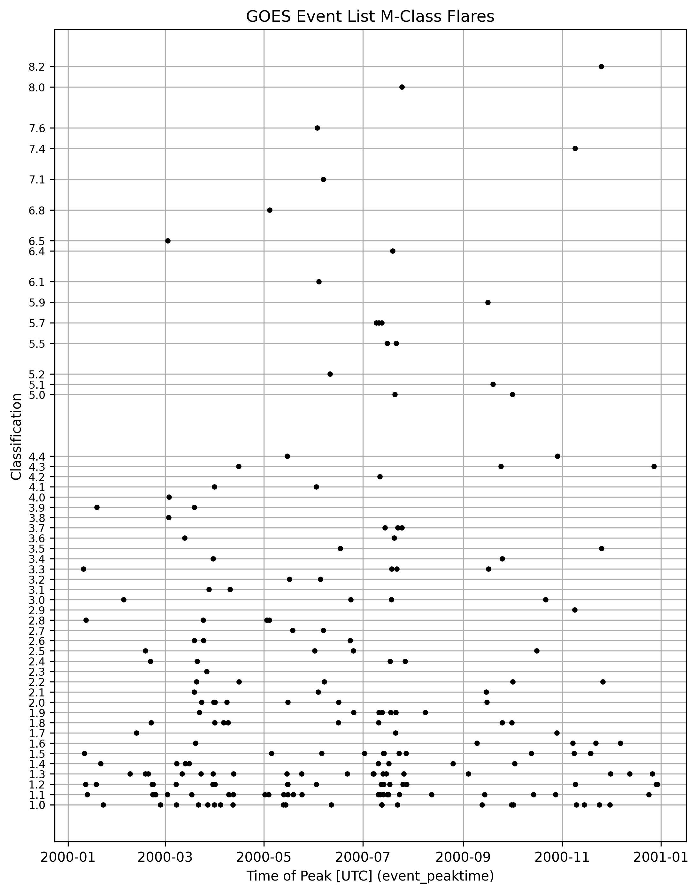

# Data

The data from my project is from two files

* [HW4_3.xray.txt](../HW4_3.xray.txt), which created by code in [csi763](https://github.com/rweigel/csi763/tree/main/flares).
* Data obtained using [download.py](data/download.py) in the `data` directory of this repository. The code uses SunPy, which downloads data from [HEK](https://www.lmsal.com/hek/). The provenance of the downloaded data from HEK [seems to be not publicly available](https://community.openastronomy.org/t/what-are-the-sunpy-hek-sources/1213). However, the information for the first two flares in year 2000 match the first two in [this file](https://www.ngdc.noaa.gov/stp/space-weather/solar-data/solar-features/solar-flares/x-rays/goes/xrs/goes-xrs-report_2000.txt) (see [header documentation](https://www.ngdc.noaa.gov/stp/space-weather/solar-data/solar-features/solar-flares/x-rays/goes/xrs/documentation/miscellaneous/software/xraydatareports.pro)).

# Exploratory Data Analysis

Figure 1: Time series of $M$-class flares in [querying_the_GOES_event_list.2000.csv](data/download.2000.csv)

# References

* [Wheatland, 2000](refs/Wheatland_2000_The_Origin_of_the_Solar_Flare_Waiting-Time_Distribution.pdf)

# TODO

* Look up more references using Google Scholar with query "GOES flare event list".

