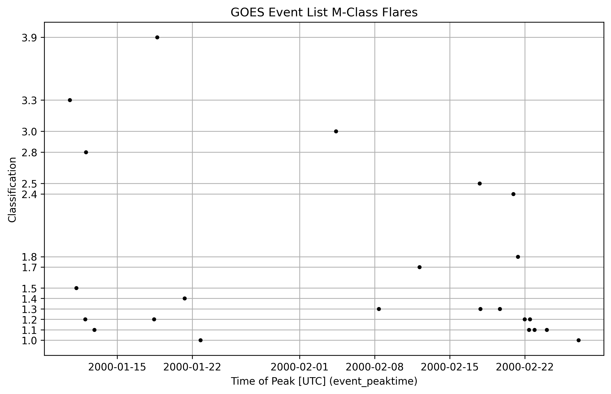

# Data

The data from my project is from two files

* [HW4_3.xray.txt](../HW4_3.xray.txt)
* Data obtained using [querying_the_GOES_event_list.py](data/querying_the_GOES_event_list.py) in the `data` directory of this repository.

# Exploratory Data Analysis

Figure 1: Time series of $M$-class flares in [querying_the_GOES_event_list.csv](data/querying_the_GOES_event_list.csv)

# References

* [Wheatland, 2000](refs/Wheatland_2000_The_Origin_of_the_Solar_Flare_Waiting-Time_Distribution.pdf)

